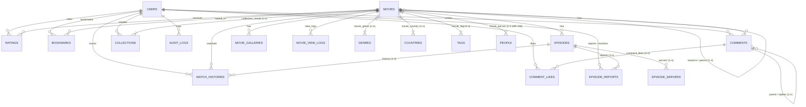

# Tài Liệu Kiến Trúc Cơ Sở Dữ Liệu (Database Schema Reference)

Tài liệu này mô tả chi tiết toàn bộ cấu trúc cơ sở dữ liệu (Database Schema), sơ đồ quan hệ thực thể (ERD), mối liên kết giữa các bảng và thông số kỹ thuật của từng trường dữ liệu trong hệ thống Web Phim.

---

## 1. Sơ Đồ Quan Hệ Thực Thể (Entity Relationship Diagram)

---

## 2. Tổng Quan Các Mối Quan Hệ (Relationships)

### 2.1. Phân Hệ Phim & Siêu Dữ Liệu (Movies & Metadata)
* **`movies` ↔ `movies` (1 - n Tự tham chiếu)**: Cột `parent_id` liên kết phần phim chính với các mùa / season tiếp theo (`seasons`).
* **`movies` ↔ `genres` (n - n qua `movie_genre`)**: Một phim có nhiều thể loại, một thể loại có nhiều phim.
* **`movies` ↔ `countries` (n - n qua `movie_country`)**: Một phim có thể do nhiều quốc gia hợp tác sản xuất.
* **`movies` ↔ `tags` (n - n qua `movie_tag`)**: Gắn các từ khóa tìm kiếm và phục vụ SEO cho phim.
* **`movies` ↔ `people` (n - n qua `movie_person`)**: Quản lý diễn viên, đạo diễn, biên kịch, nhà sản xuất. Bảng trung gian chứa thuộc tính bổ sung: `role` (actor, director, writer, producer), `character_name` (tên vai diễn), `sort_order`.
* **`movies` ↔ `movie_galleries` (1 - n)**: Quản lý thư viện hình ảnh (backdrop, poster, still) và video bổ trợ (trailer, teaser, hậu trường).

### 2.2. Phân Hệ Tập Phim & Phát Sóng (Episodes & Streaming)
* **`movies` ↔ `episodes` (1 - n)**: Một phim bao gồm nhiều tập phim (Tập 1, Tập 2,... hoặc Full).
* **`episodes` ↔ `episode_servers` (1 - n)**: Mỗi tập phim có nhiều máy chủ phát dự phòng / chất lượng cao (HLS m3u8, Embed iframe), hỗ trợ phân loại ngôn ngữ (`lang_type`: vietsub, thuyết minh, lồng tiếng) và phụ đề ngoài JSON (`subtitles`).

### 2.3. Phân Hệ Người Dùng & Tương Tác (Users & Social/Engagement)
* **`users` ↔ `ratings` ↔ `movies` (1 - n)**: Người dùng chấm điểm phim (1 đến 10). Ràng buộc UNIQUE `(user_id, movie_id)` đảm bảo mỗi người chỉ đánh giá 1 lần trên 1 phim.
* **`users` ↔ `bookmarks` ↔ `movies` (1 - n)**: Danh sách phim yêu thích (`favorite`), xem sau (`watchlater`), hoặc theo dõi (`following`). Ràng buộc UNIQUE `(user_id, movie_id, type)`.
* **`users` ↔ `watch_histories` ↔ `movies` / `episodes` / `episode_servers` (1 - n)**: Theo dõi tiến trình xem từng giây (`progress_seconds`), tỷ lệ hoàn thành (`is_completed`) và thời điểm xem (`watched_at`) để tiếp tục phát lại (Resume playback). Ràng buộc UNIQUE `(user_id, movie_id, episode_id)`.
* **`users` ↔ `comments` ↔ `movies` (1 - n)**: Bình luận trên trang phim. Hỗ trợ câu trả lời phân cấp lồng nhau (`parent_id` trỏ về `comments.id`), ghim bình luận (`is_pinned`), cảnh báo tiết lộ nội dung (`is_spoiler`).
* **`users` ↔ `comment_likes` ↔ `comments` (n - n)**: Người dùng thả tim/thích bình luận.

### 2.4. Phân Hệ Bộ Sưu Tập & Quản Trị (Collections & Administration)
* **`users` ↔ `collections` (1 - n qua `created_by`)**: Người dùng hoặc ban quản trị tạo các bộ sưu tập / danh sách tuyển tập phim.
* **`collections` ↔ `movies` (n - n qua `collection_movie`)**: Bộ sưu tập chứa danh sách phim theo thứ tự tùy chỉnh (`sort_order`).
* **`episode_reports`**: Báo cáo sự cố khi xem phim từ người dùng (lỗi video, sai sub, hỏng âm thanh) và lưu vết người giải quyết (`resolved_by`).
* **`movie_view_logs`**: Nhật ký lượt xem phân vùng theo tháng (MySQL Partitioning) hỗ trợ thống kê và khử trùng lặp lượt xem (Anti-spam IP).
* **`audit_logs`**: Lưu vết kiểm toán các thay đổi dữ liệu của quản trị viên (thao tác gì, bản ghi nào, JSON thay đổi).

---

## 3. Chi Tiết Cấu Trúc Từng Bảng (Table Schemas)

### 3.1. Bảng `movies` (Danh sách phim)
* **Model Eloquent**: `App\Models\Movie`
* **Khóa chính**: `id` (BIGINT UNSIGNED, Auto Increment)

| Cột | Kiểu Dữ Liệu | Nullable | Mặc Định | Mô Tả & Ràng Buộc |
| :--- | :--- | :---: | :--- | :--- |
| `id` | BIGINT UNSIGNED | ❌ | Auto Increment | Khóa chính định danh phim |
| `parent_id` | BIGINT UNSIGNED | ✅ | NULL | FK trỏ `movies(id)` ON DELETE SET NULL (Phần cha) |
| `name` | VARCHAR(500) | ❌ | | Tên tiếng Việt của phim |
| `origin_name` | VARCHAR(500) | ✅ | NULL | Tên gốc của phim (tiếng Anh/bản địa) |
| `slug` | VARCHAR(500) | ❌ | | Đường dẫn tĩnh (UNIQUE) |
| `content` | TEXT | ✅ | NULL | Tóm tắt / nội dung chi tiết phim |
| `type` | VARCHAR(20) | ❌ | | Phân loại phim (`single`, `series`, `tv-shows`, `hoathinh`) |
| `status` | VARCHAR(20) | ❌ | `'ongoing'` | Trạng thái (`ongoing`, `completed`, `trailer`) |
| `quality` | VARCHAR(20) | ✅ | `'HD'` | Chất lượng phim (`HD`, `FHD`, `4K`, `CAM`) |
| `lang` | VARCHAR(50) | ✅ | NULL | Định dạng tiếng (`Vietsub`, `Thuyết minh`, `Lồng tiếng`) |
| `age_rating` | VARCHAR(10) | ✅ | `'P'` | Giới hạn độ tuổi (`P`, `K`, `T13`, `T16`, `T18`, `C`) |
| `is_cinema` | BOOLEAN | ❌ | `false` | Phim chiếu rạp |
| `thumb_url` | VARCHAR(1000) | ✅ | NULL | Ảnh đại diện ngang (thumbnail) |
| `poster_url` | VARCHAR(1000) | ✅ | NULL | Ảnh áp phích dọc (poster) |
| `trailer_url` | VARCHAR(1000) | ✅ | NULL | Đường dẫn trailer |
| `duration` | VARCHAR(50) | ✅ | NULL | Thời lượng hiển thị dạng chữ (VD: "120 phút") |
| `duration_minutes` | SMALLINT UNSIGNED | ✅ | NULL | Thời lượng tính theo phút |
| `episode_current` | VARCHAR(50) | ✅ | NULL | Trạng thái tập (VD: "Tập 12", "Hoàn tất") |
| `episode_total` | VARCHAR(50) | ✅ | NULL | Tổng số tập dự kiến (VD: "24 Tập") |
| `episode_current_num`| SMALLINT UNSIGNED | ✅ | NULL | Số tập hiện tại dạng số nguyên |
| `episode_total_num`  | SMALLINT UNSIGNED | ✅ | NULL | Tổng số tập dạng số nguyên |
| `notify_schedule` | VARCHAR(255) | ✅ | NULL | Lịch phát sóng |
| `year` | SMALLINT UNSIGNED | ✅ | NULL | Năm phát hành (INDEX) |
| `imdb_rating` | DECIMAL(3,1) | ✅ | `0.0` | Điểm IMDb |
| `tmdb_rating` | DECIMAL(3,1) | ✅ | `0.0` | Điểm TMDB |
| `rating_avg` | DECIMAL(3,1) | ❌ | `0.0` | Điểm đánh giá trung bình từ người dùng (INDEX) |
| `rating_count` | INT UNSIGNED | ❌ | `0` | Tổng số lượt người dùng đánh giá |
| `view_count` | BIGINT UNSIGNED | ❌ | `0` | Tổng lượt xem phim |
| `comment_count` | INT UNSIGNED | ❌ | `0` | Tổng số bình luận |
| `is_featured` | BOOLEAN | ❌ | `false` | Đánh dấu phim nổi bật trên trang chủ |
| `is_active` | BOOLEAN | ❌ | `true` | Trạng thái hiển thị công khai |
| `tmdb_id` | VARCHAR(50) | ✅ | NULL | Mã phim trên TMDB (UNIQUE) |
| `imdb_id` | VARCHAR(50) | ✅ | NULL | Mã phim trên IMDb (UNIQUE) |
| `source_url` | VARCHAR(1000) | ✅ | NULL | Link nguồn crawl / đồng bộ |
| `last_synced_at` | TIMESTAMP | ✅ | NULL | Thời gian đồng bộ gần nhất |
| `meta_title` | VARCHAR(255) | ✅ | NULL | SEO Meta Title |
| `meta_description` | VARCHAR(500) | ✅ | NULL | SEO Meta Description |
| `meta_keywords` | VARCHAR(500) | ✅ | NULL | SEO Meta Keywords |
| `created_at` | TIMESTAMP | ✅ | NULL | Thời gian tạo |
| `updated_at` | TIMESTAMP | ✅ | NULL | Thời gian cập nhật |
| `deleted_at` | TIMESTAMP | ✅ | NULL | Thời gian xóa mềm (Soft Delete) |

* **Chỉ mục (Indexes)**:
  * `movies_slug_unique` (`slug`)
  * `movies_tmdb_id_unique` (`tmdb_id`)
  * `movies_imdb_id_unique` (`imdb_id`)
  * `movies_year_index` (`year`)
  * `movies_rating_avg_index` (`rating_avg`)
  * `movies_active_type_status_created_idx` (`deleted_at`, `is_active`, `type`, `status`, `created_at`)
  * `movies_active_type_views_idx` (`deleted_at`, `is_active`, `type`, `view_count`)
  * `movies_featured_home_idx` (`deleted_at`, `is_active`, `is_featured`, `created_at`)
  * `movies_active_rating_idx` (`is_active`, `deleted_at`, `rating_avg`)
  * `movies_fulltext_search` FullText (`name`, `origin_name`)

---

### 3.2. Bảng `genres` (Thể loại)
* **Model Eloquent**: `App\Models\Genre`
* **Khóa chính**: `id`

| Cột | Kiểu Dữ Liệu | Nullable | Mặc Định | Mô Tả |
| :--- | :--- | :---: | :--- | :--- |
| `id` | BIGINT UNSIGNED | ❌ | Auto Increment | Khóa chính |
| `name` | VARCHAR(100) | ❌ | | Tên thể loại (UNIQUE) |
| `slug` | VARCHAR(100) | ❌ | | Đường dẫn tĩnh (UNIQUE) |
| `meta_title` | VARCHAR(255) | ✅ | NULL | SEO Meta Title |
| `meta_description` | VARCHAR(500) | ✅ | NULL | SEO Meta Description |
| `created_at` / `updated_at` | TIMESTAMP | ✅ | NULL | Thời gian tạo / cập nhật |

---

### 3.3. Bảng `movie_genre` (Trung gian Phim & Thể loại)
* **Khóa chính kết hợp**: `(movie_id, genre_id)`

| Cột | Kiểu Dữ Liệu | Nullable | Mô Tả & Ràng Buộc |
| :--- | :--- | :---: | :--- |
| `movie_id` | BIGINT UNSIGNED | ❌ | FK trỏ `movies(id)` ON DELETE CASCADE |
| `genre_id` | BIGINT UNSIGNED | ❌ | FK trỏ `genres(id)` ON DELETE CASCADE (INDEX) |

---

### 3.4. Bảng `countries` (Quốc gia)
* **Model Eloquent**: `App\Models\Country`
* **Khóa chính**: `id`

| Cột | Kiểu Dữ Liệu | Nullable | Mặc Định | Mô Tả |
| :--- | :--- | :---: | :--- | :--- |
| `id` | BIGINT UNSIGNED | ❌ | Auto Increment | Khóa chính |
| `name` | VARCHAR(100) | ❌ | | Tên quốc gia (UNIQUE) |
| `slug` | VARCHAR(100) | ❌ | | Đường dẫn tĩnh (UNIQUE) |
| `meta_title` | VARCHAR(255) | ✅ | NULL | SEO Meta Title |
| `meta_description` | VARCHAR(500) | ✅ | NULL | SEO Meta Description |
| `created_at` / `updated_at` | TIMESTAMP | ✅ | NULL | Thời gian tạo / cập nhật |

---

### 3.5. Bảng `movie_country` (Trung gian Phim & Quốc gia)
* **Khóa chính kết hợp**: `(movie_id, country_id)`

| Cột | Kiểu Dữ Liệu | Nullable | Mô Tả & Ràng Buộc |
| :--- | :--- | :---: | :--- |
| `movie_id` | BIGINT UNSIGNED | ❌ | FK trỏ `movies(id)` ON DELETE CASCADE |
| `country_id` | BIGINT UNSIGNED | ❌ | FK trỏ `countries(id)` ON DELETE CASCADE (INDEX) |

---

### 3.6. Bảng `tags` (Thẻ từ khóa)
* **Model Eloquent**: `App\Models\Tag`
* **Khóa chính**: `id`

| Cột | Kiểu Dữ Liệu | Nullable | Mặc Định | Mô Tả |
| :--- | :--- | :---: | :--- | :--- |
| `id` | BIGINT UNSIGNED | ❌ | Auto Increment | Khóa chính |
| `name` | VARCHAR(100) | ❌ | | Tên thẻ tag (UNIQUE) |
| `slug` | VARCHAR(100) | ❌ | | Đường dẫn tĩnh (UNIQUE) |
| `description` | TEXT | ✅ | NULL | Mô tả nội dung thẻ tag |
| `meta_title` | VARCHAR(255) | ✅ | NULL | SEO Meta Title |
| `meta_description` | VARCHAR(500) | ✅ | NULL | SEO Meta Description |
| `created_at` / `updated_at` | TIMESTAMP | ✅ | NULL | Thời gian tạo / cập nhật |

---

### 3.7. Bảng `movie_tag` (Trung gian Phim & Thẻ tag)
* **Khóa chính kết hợp**: `(movie_id, tag_id)`

| Cột | Kiểu Dữ Liệu | Nullable | Mô Tả & Ràng Buộc |
| :--- | :--- | :---: | :--- |
| `movie_id` | BIGINT UNSIGNED | ❌ | FK trỏ `movies(id)` ON DELETE CASCADE |
| `tag_id` | BIGINT UNSIGNED | ❌ | FK trỏ `tags(id)` ON DELETE CASCADE (INDEX) |

---

### 3.8. Bảng `people` (Nghệ sĩ / Nhân sự làm phim)
* **Model Eloquent**: `App\Models\Person`
* **Khóa chính**: `id`

| Cột | Kiểu Dữ Liệu | Nullable | Mặc Định | Mô Tả |
| :--- | :--- | :---: | :--- | :--- |
| `id` | BIGINT UNSIGNED | ❌ | Auto Increment | Khóa chính |
| `name` | VARCHAR(255) | ❌ | | Tên nghệ sĩ / nhân vật |
| `slug` | VARCHAR(255) | ❌ | | Đường dẫn tĩnh (UNIQUE) |
| `other_names` | VARCHAR(500) | ✅ | NULL | Tên khác / tên phiên âm |
| `avatar_url` | VARCHAR(1000) | ✅ | NULL | Đường dẫn ảnh chân dung |
| `gender` | VARCHAR(10) | ✅ | NULL | Giới tính (`male`, `female`, `other`) |
| `birthday` | DATE | ✅ | NULL | Ngày tháng năm sinh |
| `place_of_birth` | VARCHAR(255) | ✅ | NULL | Nơi sinh |
| `biography` | TEXT | ✅ | NULL | Tiểu sử chi tiết |
| `tmdb_id` | VARCHAR(50) | ✅ | NULL | ID nhân vật trên TMDB (INDEX) |
| `created_at` / `updated_at` | TIMESTAMP | ✅ | NULL | Thời gian tạo / cập nhật |

* **FullText Index**: `people_fulltext_search` trên (`name`, `other_names`).

---

### 3.9. Bảng `movie_person` (Trung gian Phim & Nhân sự)
* **Khóa chính kết hợp**: `(movie_id, person_id, role)`

| Cột | Kiểu Dữ Liệu | Nullable | Mặc Định | Mô Tả & Ràng Buộc |
| :--- | :--- | :---: | :--- | :--- |
| `movie_id` | BIGINT UNSIGNED | ❌ | | FK trỏ `movies(id)` ON DELETE CASCADE |
| `person_id` | BIGINT UNSIGNED | ❌ | | FK trỏ `people(id)` ON DELETE CASCADE (INDEX) |
| `role` | VARCHAR(20) | ❌ | | Vai trò: `actor`, `director`, `writer`, `producer` (INDEX) |
| `character_name` | VARCHAR(255) | ✅ | NULL | Tên nhân vật đảm nhiệm trong phim |
| `sort_order` | SMALLINT UNSIGNED | ❌ | `0` | Thứ tự sắp xếp hiển thị |

---

### 3.10. Bảng `movie_galleries` (Bộ sưu tập Ảnh & Video của Phim)
* **Model Eloquent**: `App\Models\MovieGallery`
* **Khóa chính**: `id`
* **Khóa ngoại**: `movie_id` → `movies(id)` ON DELETE CASCADE

| Cột | Kiểu Dữ Liệu | Nullable | Mặc Định | Mô Tả |
| :--- | :--- | :---: | :--- | :--- |
| `id` | BIGINT UNSIGNED | ❌ | Auto Increment | Khóa chính |
| `movie_id` | BIGINT UNSIGNED | ❌ | | ID phim (INDEX) |
| `media_type` | VARCHAR(20) | ❌ | `'image'` | Phân loại tệp: `image` hoặc `video` |
| `type` | VARCHAR(30) | ❌ | `'still'` | Thể loại: `trailer`, `teaser`, `behind_the_scenes`, `still`, `backdrop`, `poster` |
| `url` | VARCHAR(1000) | ❌ | | Đường dẫn URL file media |
| `thumb_url` | VARCHAR(1000) | ✅ | NULL | Ảnh thu nhỏ xem trước |
| `caption` | VARCHAR(255) | ✅ | NULL | Chú thích / tiêu đề phụ |
| `duration_seconds` | SMALLINT UNSIGNED | ✅ | NULL | Thời lượng video tính theo giây |
| `sort_order` | SMALLINT UNSIGNED | ❌ | `0` | Thứ tự hiển thị |
| `created_at` / `updated_at` | TIMESTAMP | ✅ | NULL | Thời gian tạo / cập nhật |

* **Composite Index**: `movie_galleries_movie_media_sort_idx` (`movie_id`, `media_type`, `sort_order`).

---

### 3.11. Bảng `episodes` (Tập phim)
* **Model Eloquent**: `App\Models\Episode`
* **Khóa chính**: `id`
* **Khóa ngoại**: `movie_id` → `movies(id)` ON DELETE CASCADE
* **Ràng buộc duy nhất**: UNIQUE `(movie_id, slug)`

| Cột | Kiểu Dữ Liệu | Nullable | Mặc Định | Mô Tả |
| :--- | :--- | :---: | :--- | :--- |
| `id` | BIGINT UNSIGNED | ❌ | Auto Increment | Khóa chính |
| `movie_id` | BIGINT UNSIGNED | ❌ | | ID phim (INDEX) |
| `name` | VARCHAR(255) | ❌ | | Tên tập (Tập 1, Tập 2, Tập Full...) |
| `slug` | VARCHAR(255) | ❌ | | Slug định danh tập (tap-1, tap-2...) |
| `sort_order` | INT UNSIGNED | ❌ | `0` | Thứ tự tập phim |
| `created_at` / `updated_at` | TIMESTAMP | ✅ | NULL | Thời gian tạo / cập nhật |

* **Composite Index**: `episodes_sort_order_index` (`movie_id`, `sort_order`).

---

### 3.12. Bảng `episode_servers` (Máy chủ phát tập phim)
* **Model Eloquent**: `App\Models\EpisodeServer`
* **Khóa chính**: `id`
* **Khóa ngoại**: `episode_id` → `episodes(id)` ON DELETE CASCADE

| Cột | Kiểu Dữ Liệu | Nullable | Mặc Định | Mô Tả |
| :--- | :--- | :---: | :--- | :--- |
| `id` | BIGINT UNSIGNED | ❌ | Auto Increment | Khóa chính |
| `episode_id` | BIGINT UNSIGNED | ❌ | | ID tập phim (INDEX) |
| `server_name` | VARCHAR(100) | ❌ | | Tên máy chủ (Server VIP 1, Hydrax, Backup...) |
| `lang_type` | VARCHAR(20) | ❌ | `'vietsub'` | Loại ngôn ngữ: `vietsub`, `thuyet-minh`, `long-tieng` |
| `link_embed` | TEXT | ✅ | NULL | Đường dẫn nhúng trình phát IFrame |
| `link_m3u8` | TEXT | ✅ | NULL | Nguồn luồng HLS trực tiếp (.m3u8, .mp4) |
| `subtitles` | JSON | ✅ | NULL | Danh sách phụ đề rời dạng JSON `[{label, lang, src}]` |
| `sort_order` | SMALLINT UNSIGNED | ❌ | `0` | Thứ tự ưu tiên server |
| `is_active` | BOOLEAN | ❌ | `true` | Trạng thái hoạt động |
| `created_at` / `updated_at` | TIMESTAMP | ✅ | NULL | Thời gian tạo / cập nhật |

* **Composite Index**: `episode_servers_episode_lang_index` (`episode_id`, `lang_type`).

---

### 3.13. Bảng `users` (Tài khoản người dùng)
* **Model Eloquent**: `App\Models\User`
* **Khóa chính**: `id`

| Cột | Kiểu Dữ Liệu | Nullable | Mặc Định | Mô Tả |
| :--- | :--- | :---: | :--- | :--- |
| `id` | BIGINT UNSIGNED | ❌ | Auto Increment | Khóa chính |
| `name` | VARCHAR(255) | ❌ | | Tên hiển thị người dùng |
| `email` | VARCHAR(255) | ❌ | | Địa chỉ Email (UNIQUE) |
| `email_verified_at` | TIMESTAMP | ✅ | NULL | Thời điểm xác minh email |
| `password` | VARCHAR(255) | ❌ | | Mật khẩu băm an toàn |
| `remember_token` | VARCHAR(100) | ✅ | NULL | Token lưu phiên đăng nhập |
| `avatar_url` | VARCHAR(1000) | ✅ | NULL | Ảnh đại diện |
| `role` | VARCHAR(20) | ❌ | `'user'` | Quyền hạn: `user`, `admin`, `moderator` (INDEX) |
| `subscription_type` | VARCHAR(20) | ❌ | `'free'` | Gói hội viên: `free`, `vip`, `premium` (INDEX) |
| `subscription_expires_at`| TIMESTAMP | ✅ | NULL | Thời hạn hết hạn gói VIP |
| `is_active` | BOOLEAN | ❌ | `true` | Trạng thái kích hoạt tài khoản |
| `created_at` / `updated_at` | TIMESTAMP | ✅ | NULL | Thời gian tạo / cập nhật |

---

### 3.14. Bảng `comments` (Bình luận phim)
* **Model Eloquent**: `App\Models\Comment`
* **Khóa chính**: `id`
* **Khóa ngoại**:
  * `user_id` → `users(id)` ON DELETE CASCADE
  * `movie_id` → `movies(id)` ON DELETE CASCADE
  * `parent_id` → `comments(id)` ON DELETE CASCADE

| Cột | Kiểu Dữ Liệu | Nullable | Mặc Định | Mô Tả |
| :--- | :--- | :---: | :--- | :--- |
| `id` | BIGINT UNSIGNED | ❌ | Auto Increment | Khóa chính |
| `user_id` | BIGINT UNSIGNED | ❌ | | ID người viết (INDEX) |
| `movie_id` | BIGINT UNSIGNED | ❌ | | ID phim (INDEX) |
| `parent_id` | BIGINT UNSIGNED | ✅ | NULL | ID bình luận gốc (cho câu trả lời/reply, INDEX) |
| `content` | TEXT | ❌ | | Nội dung bình luận |
| `likes_count` | INT UNSIGNED | ❌ | `0` | Tổng lượt like |
| `replies_count` | INT UNSIGNED | ❌ | `0` | Tổng lượt phản hồi |
| `is_pinned` | BOOLEAN | ❌ | `false` | Đánh dấu ghim lên đầu |
| `is_spoiler` | BOOLEAN | ❌ | `false` | Đánh dấu cảnh báo lộ nội dung phim |
| `status` | VARCHAR(20) | ❌ | `'active'` | Trạng thái kiểm duyệt: `active`, `pending`, `hidden` |
| `created_at` / `updated_at` | TIMESTAMP | ✅ | NULL | Thời gian tạo / cập nhật |
| `deleted_at` | TIMESTAMP | ✅ | NULL | Xóa mềm |

* **Composite Index**: `comments_movie_active_feed_idx` (`movie_id`, `deleted_at`, `status`, `created_at`).

---

### 3.15. Bảng `comment_likes` (Lượt thích bình luận)
* **Khóa chính kết hợp**: `(user_id, comment_id)`
* **Khóa ngoại**:
  * `user_id` → `users(id)` ON DELETE CASCADE
  * `comment_id` → `comments(id)` ON DELETE CASCADE

| Cột | Kiểu Dữ Liệu | Nullable | Mô Tả |
| :--- | :--- | :---: | :--- |
| `user_id` | BIGINT UNSIGNED | ❌ | ID người thích |
| `comment_id` | BIGINT UNSIGNED | ❌ | ID bình luận được thích (INDEX) |
| `created_at` | TIMESTAMP | ✅ | Thời điểm like |

---

### 3.16. Bảng `ratings` (Chấm điểm / Đánh giá phim)
* **Model Eloquent**: `App\Models\Rating`
* **Khóa chính**: `id`
* **Khóa ngoại**:
  * `user_id` → `users(id)` ON DELETE CASCADE
  * `movie_id` → `movies(id)` ON DELETE CASCADE
* **Ràng buộc duy nhất**: UNIQUE `(user_id, movie_id)`

| Cột | Kiểu Dữ Liệu | Nullable | Mô Tả |
| :--- | :--- | :---: | :--- |
| `id` | BIGINT UNSIGNED | ❌ | Khóa chính |
| `user_id` | BIGINT UNSIGNED | ❌ | ID người đánh giá |
| `movie_id` | BIGINT UNSIGNED | ❌ | ID phim (INDEX) |
| `score` | TINYINT UNSIGNED | ❌ | Điểm số đánh giá (1 đến 10) |
| `created_at` / `updated_at` | TIMESTAMP | ✅ | Thời gian đánh giá |

---

### 3.17. Bảng `bookmarks` (Danh sách lưu / Xem sau / Yêu thích)
* **Model Eloquent**: `App\Models\Bookmark`
* **Khóa chính**: `id`
* **Khóa ngoại**:
  * `user_id` → `users(id)` ON DELETE CASCADE
  * `movie_id` → `movies(id)` ON DELETE CASCADE
* **Ràng buộc duy nhất**: UNIQUE `(user_id, movie_id, type)`

| Cột | Kiểu Dữ Liệu | Nullable | Mặc Định | Mô Tả |
| :--- | :--- | :---: | :--- | :--- |
| `id` | BIGINT UNSIGNED | ❌ | Auto Increment | Khóa chính |
| `user_id` | BIGINT UNSIGNED | ❌ | | ID người dùng |
| `movie_id` | BIGINT UNSIGNED | ❌ | | ID phim (INDEX) |
| `type` | VARCHAR(20) | ❌ | `'favorite'` | Phân loại: `favorite`, `watchlater`, `following` |
| `created_at` / `updated_at` | TIMESTAMP | ✅ | NULL | Thời gian tạo / cập nhật |

* **Indexes**:
  * `bookmarks_user_type_index` (`user_id`, `type`)
  * `bookmarks_user_type_created_idx` (`user_id`, `type`, `created_at`)

---

### 3.18. Bảng `watch_histories` (Lịch sử xem phim)
* **Model Eloquent**: `App\Models\WatchHistory`
* **Khóa chính**: `id`
* **Khóa ngoại**:
  * `user_id` → `users(id)` ON DELETE CASCADE
  * `movie_id` → `movies(id)` ON DELETE CASCADE
  * `episode_id` → `episodes(id)` ON DELETE SET NULL
  * `server_id` → `episode_servers(id)` ON DELETE SET NULL
* **Ràng buộc duy nhất**: UNIQUE `(user_id, movie_id, episode_id)`

| Cột | Kiểu Dữ Liệu | Nullable | Mặc Định | Mô Tả |
| :--- | :--- | :---: | :--- | :--- |
| `id` | BIGINT UNSIGNED | ❌ | Auto Increment | Khóa chính |
| `user_id` | BIGINT UNSIGNED | ❌ | | ID người xem |
| `movie_id` | BIGINT UNSIGNED | ❌ | | ID phim (INDEX) |
| `episode_id` | BIGINT UNSIGNED | ✅ | NULL | ID tập phim đang xem |
| `server_id` | BIGINT UNSIGNED | ✅ | NULL | ID máy chủ phát đang xem |
| `progress_seconds` | INT UNSIGNED | ❌ | `0` | Tiến trình giây đã xem |
| `duration_seconds` | INT UNSIGNED | ✅ | NULL | Tổng độ dài video tính theo giây |
| `is_completed` | BOOLEAN | ❌ | `false` | Đã xem hết tập phim chưa |
| `watched_at` | TIMESTAMP | ❌ | | Mốc thời gian xem gần nhất |
| `created_at` / `updated_at` | TIMESTAMP | ✅ | NULL | Thời gian tạo / cập nhật |

* **Composite Index**: `watch_histories_user_resume_idx` (`user_id`, `is_completed`, `watched_at`).

---

### 3.19. Bảng `collections` (Bộ sưu tập / Tuyển tập phim)
* **Model Eloquent**: `App\Models\Collection`
* **Khóa chính**: `id`
* **Khóa ngoại**: `created_by` → `users(id)` ON DELETE SET NULL

| Cột | Kiểu Dữ Liệu | Nullable | Mặc Định | Mô Tả |
| :--- | :--- | :---: | :--- | :--- |
| `id` | BIGINT UNSIGNED | ❌ | Auto Increment | Khóa chính |
| `name` | VARCHAR(255) | ❌ | | Tên bộ sưu tập |
| `slug` | VARCHAR(255) | ❌ | | Đường dẫn tĩnh (UNIQUE) |
| `description` | TEXT | ✅ | NULL | Mô tả bộ sưu tập |
| `thumb_url` | VARCHAR(1000) | ✅ | NULL | Ảnh bìa bộ sưu tập |
| `meta_title` | VARCHAR(255) | ✅ | NULL | SEO Meta Title |
| `meta_description` | VARCHAR(500) | ✅ | NULL | SEO Meta Description |
| `is_active` | BOOLEAN | ❌ | `true` | Trạng thái hiển thị |
| `sort_order` | INT UNSIGNED | ❌ | `0` | Thứ tự ưu tiên |
| `created_by` | BIGINT UNSIGNED | ✅ | NULL | Người tạo bộ sưu tập |
| `created_at` / `updated_at` | TIMESTAMP | ✅ | NULL | Thời gian tạo / cập nhật |

* **Composite Index**: `collections_active_sort_index` (`is_active`, `sort_order`).

---

### 3.20. Bảng `collection_movie` (Trung gian Bộ sưu tập & Phim)
* **Khóa chính kết hợp**: `(collection_id, movie_id)`
* **Khóa ngoại**:
  * `collection_id` → `collections(id)` ON DELETE CASCADE
  * `movie_id` → `movies(id)` ON DELETE CASCADE

| Cột | Kiểu Dữ Liệu | Nullable | Mặc Định | Mô Tả |
| :--- | :--- | :---: | :--- | :--- |
| `collection_id` | BIGINT UNSIGNED | ❌ | | ID bộ sưu tập |
| `movie_id` | BIGINT UNSIGNED | ❌ | | ID phim (INDEX) |
| `sort_order` | INT UNSIGNED | ❌ | `0` | Thứ tự sắp xếp phim trong bộ sưu tập |

---

### 3.21. Bảng `episode_reports` (Báo cáo sự cố tập phim)
* **Model Eloquent**: `App\Models\EpisodeReport`
* **Khóa chính**: `id`
* **Khóa ngoại**:
  * `user_id` → `users(id)` ON DELETE SET NULL
  * `episode_id` → `episodes(id)` ON DELETE CASCADE
  * `server_id` → `episode_servers(id)` ON DELETE SET NULL
  * `resolved_by` → `users(id)` ON DELETE SET NULL

| Cột | Kiểu Dữ Liệu | Nullable | Mặc Định | Mô Tả |
| :--- | :--- | :---: | :--- | :--- |
| `id` | BIGINT UNSIGNED | ❌ | Auto Increment | Khóa chính |
| `user_id` | BIGINT UNSIGNED | ✅ | NULL | Người báo cáo lỗi |
| `episode_id` | BIGINT UNSIGNED | ❌ | | Tập phim xảy ra lỗi (INDEX) |
| `server_id` | BIGINT UNSIGNED | ✅ | NULL | Server phát bị lỗi |
| `report_type` | VARCHAR(50) | ❌ | | Loại lỗi: `broken_link`, `no_audio`, `wrong_sub`, `poor_quality` |
| `description` | TEXT | ✅ | NULL | Mô tả chi tiết từ người dùng |
| `status` | VARCHAR(20) | ❌ | `'pending'` | Trạng thái: `pending`, `in_progress`, `resolved`, `rejected` |
| `resolved_by` | BIGINT UNSIGNED | ✅ | NULL | Quản trị viên xử lý |
| `resolved_at` | TIMESTAMP | ✅ | NULL | Thời điểm xử lý xong |
| `admin_note` | TEXT | ✅ | NULL | Ghi chú của quản trị viên |
| `created_at` / `updated_at` | TIMESTAMP | ✅ | NULL | Thời gian tạo / cập nhật |

* **Composite Index**: `episode_reports_status_created_index` (`status`, `created_at`).

---

### 3.22. Bảng `movie_view_logs` (Nhật ký lượt xem — Partitioned)
* **Model Eloquent**: `App\Models\MovieViewLog`
* **Khóa chính kết hợp**: `(id, viewed_at)`
* **Đặc tính kỹ thuật**: Sử dụng MySQL Partitioning `PARTITION BY RANGE COLUMNS(viewed_at)` để ghi log hàng triệu bản ghi lượt xem và chống spam view.

| Cột | Kiểu Dữ Liệu | Nullable | Mặc Định | Mô Tả |
| :--- | :--- | :---: | :--- | :--- |
| `id` | BIGINT UNSIGNED | ❌ | Auto Increment | Khóa chính 1 |
| `movie_id` | BIGINT UNSIGNED | ❌ | | ID phim (INDEX) |
| `episode_id` | BIGINT UNSIGNED | ✅ | NULL | ID tập phim |
| `user_id` | BIGINT UNSIGNED | ✅ | NULL | ID người xem (nếu có) |
| `ip_address` | VARCHAR(45) | ❌ | | Địa chỉ IP (hỗ trợ IPv4 & IPv6) |
| `user_agent` | VARCHAR(500) | ✅ | NULL | Trình duyệt / Thiết bị |
| `viewed_at` | DATETIME | ❌ | | Khóa chính 2 (Cột phân vùng Partition) |

* **Composite Index**: `movie_view_logs_dedup_index` (`movie_id`, `ip_address`, `viewed_at`).

---

### 3.23. Bảng `audit_logs` (Nhật ký kiểm toán hệ thống)
* **Model Eloquent**: `App\Models\AuditLog`
* **Khóa chính**: `id`
* **Khóa ngoại**: `user_id` → `users(id)` ON DELETE SET NULL

| Cột | Kiểu Dữ Liệu | Nullable | Mô Tả |
| :--- | :--- | :---: | :--- |
| `id` | BIGINT UNSIGNED | ❌ | Khóa chính |
| `user_id` | BIGINT UNSIGNED | ✅ | Người thực hiện thao tác (INDEX) |
| `action` | VARCHAR(50) | ❌ | Hành động: `create`, `update`, `delete`, `login`... |
| `model_type` | VARCHAR(100) | ❌ | Class Model bị tác động |
| `model_id` | BIGINT UNSIGNED | ✅ | ID của bản ghi Model bị tác động |
| `changes` | JSON | ✅ | Chi tiết thay đổi trước và sau (old & new values) |
| `ip_address` | VARCHAR(45) | ✅ | Địa chỉ IP người thực hiện |
| `user_agent` | VARCHAR(500) | ✅ | Thiết bị / trình duyệt |
| `created_at` | TIMESTAMP | ✅ | Thời gian thực hiện (INDEX) |

* **Composite Index**: `audit_logs_model_index` (`model_type`, `model_id`).

---

### 3.24. Bảng `notifications` (Thông báo người dùng)
* **Khóa chính**: `id` (UUID / CHAR(36))
* **Quan hệ đa hình**: `notifiable_type`, `notifiable_id`

| Cột | Kiểu Dữ Liệu | Nullable | Mô Tả |
| :--- | :--- | :---: | :--- |
| `id` | CHAR(36) / UUID | ❌ | Khóa chính UUID |
| `type` | VARCHAR(255) | ❌ | Class thông báo (`App\Notifications\...`) |
| `notifiable_type` | VARCHAR(255) | ❌ | Model nhận thông báo (INDEX) |
| `notifiable_id` | BIGINT UNSIGNED | ❌ | ID đối tượng nhận thông báo (INDEX) |
| `data` | JSON | ❌ | Payload nội dung thông báo |
| `read_at` | TIMESTAMP | ✅ | Thời điểm đã đọc (INDEX) |
| `created_at` / `updated_at` | TIMESTAMP | ✅ | Thời gian tạo / cập nhật |

---

### 3.25. Các Bảng Hạ Tầng & Hệ Thống Laravel

| Bảng | Mục Đích | Khóa Chính | Các Trường Quan Trọng |
| :--- | :--- | :--- | :--- |
| `personal_access_tokens` | Quản lý token API (Laravel Sanctum) | `id` | `tokenable_type`, `tokenable_id`, `name`, `token` (UNIQUE), `abilities`, `last_used_at`, `expires_at` |
| `sessions` | Quản lý phiên đăng nhập Database | `id` | `user_id` (INDEX), `ip_address`, `user_agent`, `payload`, `last_activity` (INDEX) |
| `password_reset_tokens` | Lưu token đặt lại mật khẩu | `email` | `token`, `created_at` |
| `cache` & `cache_locks` | Quản lý Cache Database | `key` | `value`, `expiration` (INDEX), `owner` |
| `jobs` | Hàng đợi tác vụ nền (Queue) | `id` | `queue` (INDEX), `payload`, `attempts`, `reserved_at`, `available_at`, `created_at` |
| `job_batches` | Xử lý hàng đợi dạng Batch | `id` | `name`, `total_jobs`, `pending_jobs`, `failed_jobs`, `failed_job_ids`, `options`, `cancelled_at`, `finished_at` |
| `failed_jobs` | Nhật ký các tác vụ nền bị lỗi | `id` | `uuid` (UNIQUE), `connection`, `queue`, `payload`, `exception`, `failed_at` |
