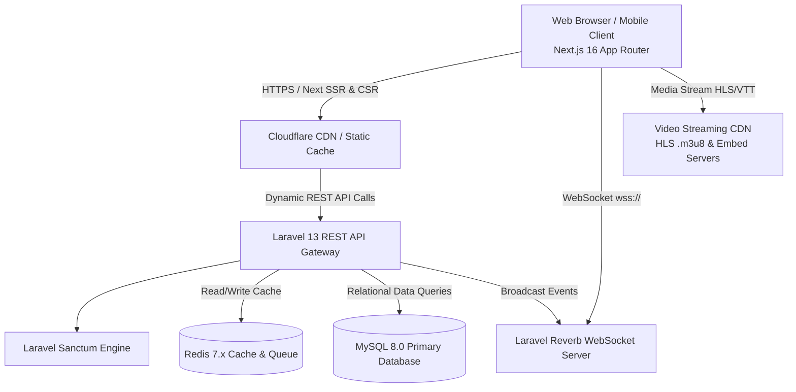
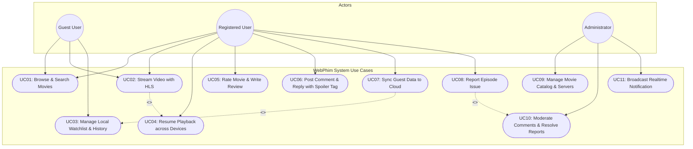

# Software Requirements Specification (SRS)
## Nền Tảng Xem Phim Trực Tuyến WebPhim

---

## Table of Contents

- [1 Introduction](#1-introduction)
  - [1.1 Purpose](#11-purpose)
  - [1.2 Document Conventions](#12-document-conventions)
  - [1.3 Project Scope](#13-project-scope)
  - [1.4 References](#14-references)
- [2 System Description](#2-system-description)
- [3 Functional Requirements](#3-functional-requirements)
  - [3.1 System Features](#31-system-features)
    - [3.1.1 System Feature 1: User Authentication, Account & Guest Mode](#311-system-feature-1-user-authentication-account--guest-mode)
    - [3.1.2 System Feature 2: Movie Catalog, Taxonomy & Realtime Search](#312-system-feature-2-movie-catalog-taxonomy--realtime-search)
    - [3.1.3 System Feature 3: Adaptive Video Streaming & Playback Engine](#313-system-feature-3-adaptive-video-streaming--playback-engine)
    - [3.1.4 System Feature 4: Social Interaction, Reviews, Bookmarks & Engagement](#314-system-feature-4-social-interaction-reviews-bookmarks--engagement)
    - [3.1.5 System Feature 5: Administration, CMS & Realtime Operations](#315-system-feature-5-administration-cms--realtime-operations)
  - [3.2 Use Cases](#32-use-cases)
    - [3.2.1 Use Case Diagrams](#321-use-case-diagrams)
    - [3.2.2 Use Case 1: Stream Movie with Resume Playback & Multi-CDN Fallback](#322-use-case-1-stream-movie-with-resume-playback--multi-cdn-fallback)
    - [3.2.3 Use Case 2: Post Comment & Reply with Spoiler Tag](#323-use-case-2-post-comment--reply-with-spoiler-tag)
    - [3.2.4 Use Case 3: Synchronize Guest Watchlist to Authenticated Account](#324-use-case-3-synchronize-guest-watchlist-to-authenticated-account)
    - [3.2.5 Use Case 4: Manage Episode Servers & Process Issue Reports](#325-use-case-4-manage-episode-servers--process-issue-reports)
  - [3.3 Entity Relationship Diagrams](#33-entity-relationship-diagrams)
  - [3.4 Data Dictionary](#34-data-dictionary)
    - [3.4.1 Entity 1: User (`users`)](#341-entity-1-user-users)
    - [3.4.2 Entity 2: Movie (`movies`)](#342-entity-2-movie-movies)
    - [3.4.3 Entity 3: Episode & EpisodeServer (`episodes`, `episode_servers`)](#343-entity-3-episode--episodeserver-episodes-episode_servers)
    - [3.4.4 Entity 4: WatchHistory (`watch_histories`)](#344-entity-4-watchhistory-watch_histories)
    - [3.4.5 Entity 5: Comment & CommentLike (`comments`, `comment_likes`)](#345-entity-5-comment--commentlike-comments-comment_likes)
    - [3.4.6 Entity 6: Bookmark & Rating (`bookmarks`, `ratings`)](#346-entity-6-bookmark--rating-bookmarks-ratings)
    - [3.4.7 Entity 7: Collection & MovieGalleries (`collections`, `movie_galleries`)](#347-entity-7-collection--moviegalleries-collections-movie_galleries)
    - [3.4.8 Entity 8: EpisodeReport & AuditLog (`episode_reports`, `audit_logs`)](#348-entity-8-episodereport--auditlog-episode_reports-audit_logs)
- [4 External Interface Requirements](#4-external-interface-requirements)
  - [4.1 User Interfaces](#41-user-interfaces)
  - [4.2 Hardware Interfaces](#42-hardware-interfaces)
  - [4.3 Software Interfaces](#43-software-interfaces)
  - [4.4 Communications Interfaces](#44-communications-interfaces)
- [5 Technical Requirements (Non functional)](#5-technical-requirements-non-functional)
  - [5.1 Performance](#51-performance)
  - [5.2 Scalability](#52-scalability)
  - [5.3 Security](#53-security)
  - [5.4 Maintainability](#54-maintainability)
  - [5.5 Usability](#55-usability)
  - [5.6 Multi lingual Support](#56-multi-lingual-support)
  - [5.7 Auditing and Logging](#57-auditing-and-logging)
  - [5.8 Availability](#58-availability)
- [6 Open Issues](#6-open-issues)

---

# 1 Introduction

### 1.1 Purpose
Tài liệu **Đặc tả Yêu cầu Phần mềm (Software Requirements Specification - SRS)** này xác lập các yêu cầu chức năng, yêu cầu kỹ thuật phi chức năng, kiến trúc cơ sở dữ liệu và các ràng buộc hệ thống cho nền tảng xem phim trực tuyến **WebPhim**. Tài liệu đóng vai trò là kim chỉ nam kỹ thuật chuẩn hóa, là cơ sở pháp lý và kỹ thuật thống nhất giữa đội ngũ Kỹ sư Phát triển (Backend & Frontend), Chuyên viên Kiểm thử (QA/QC), Quản trị Hệ thống (DevOps/SRE) và Ban Quản trị Sản phẩm (Product Owner).

### 1.2 Document Conventions
Tài liệu tuân thủ các quy chuẩn định dạng và chuẩn mực quốc tế sau:
* **Chuẩn phân loại từ khóa (RFC 2119)**:
  * **SHALL / MUST**: Bắt buộc phải thực thi; đây là yêu cầu cốt lõi không thể thương lượng.
  * **SHOULD**: Khuyến nghị mạnh mẽ; cần được thực hiện trừ khi có lý do kỹ thuật chính đáng.
  * **MAY**: Tùy chọn; có thể bổ sung trong các giai đoạn nâng cấp tiếp theo.
* **Quy ước định danh mã yêu cầu**:
  * `FR-xxx`: Yêu cầu chức năng (Functional Requirement).
  * `NFR-xxx`: Yêu cầu phi chức năng (Non-Functional Requirement).
  * `UC-xxx`: Kịch bản ca sử dụng (Use Case).
  * `API-xxx`: Điểm cuối giao diện lập trình ứng dụng (API Endpoint).
* **Quy ước công nghệ & định dạng**:
  * Các khối mã nguồn, câu truy vấn SQL và thuộc tính dữ liệu được hiển thị dưới dạng `inline code` hoặc khối code block chuẩn Markdown.
  * Sơ đồ được trực quan hóa bằng định dạng **Mermaid**.

### 1.3 Project Scope
**WebPhim** là nền tảng xem phim trực tuyến đa nền tảng, cung cấp giải pháp truyền phát video theo yêu cầu (Video-on-Demand - VOD) chất lượng cao với độ trễ thấp và trải nghiệm tương tác liền mạch.

* **Phạm vi trong hệ thống (In-Scope)**:
  * Quản lý danh mục nội dung số: Phim lẻ (`single`), phim bộ nhiều tập (`series`), chương trình truyền hình (`tv-shows`), phim hoạt hình (`hoathinh`).
  * Trình phát luồng đa giao thức: Hỗ trợ truyền phát thích ứng HLS (`.m3u8`) với nhiều định dạng phụ đề (VTT), âm thanh (Vietsub, Thuyết minh, Lồng tiếng) và nhúng máy chủ phụ trợ (`embed iframe`).
  * Trải nghiệm cá nhân hóa & Lưu vết: Tủ phim (Yêu thích, Xem sau, Theo dõi), lịch sử xem phim đồng bộ thời gian thực từng giây (Resume Playback) đa thiết bị.
  * Chế độ Khách (Guest Mode): Cho phép lưu trữ tạm lịch sử xem và danh sách phim tại `localStorage` trình duyệt và hỗ trợ tự động hợp nhất (merge) dữ liệu lên tài khoản đám mây khi người dùng đăng nhập.
  * Tương tác cộng đồng: Đánh giá sao (1-10 sao), bình luận phân cấp 2 tầng (Nested Comments), bày tỏ cảm xúc (Like), gắn thẻ cảnh báo tiết lộ nội dung (`is_spoiler`), gửi báo cáo sự cố tập phim.
  * Phân hệ quản trị (Admin Portal): Quản lý vòng đời phim, phân phối tập phim và máy chủ luồng (CDN / Backup Server), kiểm duyệt tương tác, giám sát lưu vết kiểm toán (`audit_logs`) và phát thông báo trực tiếp qua WebSocket (Laravel Reverb).
* **Phạm vi ngoài hệ thống (Out-of-Scope)**:
  * Cụm máy chủ chuyển mã video tự động (Transcoding/Encoding Cluster): Hệ thống tiếp nhận luồng video đã được nén/đóng gói HLS sẵn từ các nguồn CDN/Object Storage.
  * Cổng thanh toán trực tuyến & Hệ thống quản lý bản quyền phần cứng (Hardware DRM Widevine L1 / FairPlay): Giai đoạn hiện tại chuẩn bị cấu trúc cơ sở dữ liệu (`subscription_type`, `subscription_expires_at`), việc tích hợp cổng thanh toán sẽ triển khai ở giai đoạn 2.
  * Ứng dụng di động bản địa (Native iOS/Android App): Tập trung hoàn thiện Responsive Web Application tối ưu cho Mobile Web, Tablet và Desktop.

### 1.4 References
1. **IEEE Std 830-1998**: *IEEE Recommended Practice for Software Requirements Specifications*.
2. **ISO/IEC/IEEE 29148:2018**: *Systems and software engineering — Life cycle processes — Requirements engineering*.
3. **ISO/IEC 25010:2011**: *Systems and software engineering — System and software Quality Requirements and Evaluation (SQuaRE)*.
4. **RFC 8216**: *HTTP Live Streaming (HLS) Specification - IETF*.
5. **RFC 6749**: *The OAuth 2.0 Authorization Framework / Bearer Token Usage*.
6. **Codebase Repository**: Laravel 13 Framework API & Next.js 16 App Router UI.

---

# 2 System Description

Hệ thống **WebPhim** được thiết kế theo mô hình kiến trúc phân tách hoàn toàn (Decoupled Client-Server Architecture), tối ưu hóa tính độc lập, khả năng mở rộng quy mô ngang và tốc độ truyền tải:

### Các thành phần chính trong kiến trúc:
1. **Frontend Presentation Layer (Next.js 16)**:
   * Xây dựng trên nền tảng React 19, TypeScript và Tailwind CSS v4.
   * Ứng dụng Next.js App Router kết hợp Server-Side Rendering (SSR) cho các trang danh mục / thông tin phim nhằm tối ưu SEO vượt trội, và Client-Side Rendering (CSR) cho trình phát video, bình luận thời gian thực và quản lý tài khoản.
   * Tích hợp thư viện `Hls.js` xử lý giải mã luồng video phân đoạn trực tiếp trên thẻ `<video>` HTML5.
2. **Backend Application Layer (Laravel 13 REST API)**:
   * Sử dụng PHP 8.3 chạy trên nền kiến trúc Service - Repository - Controller hướng đối tượng.
   * Định tuyến API không trạng thái (Stateless API), xác thực danh tính thông qua `Laravel Sanctum` Bearer Token.
   * Quản lý tác vụ chạy nền (Queue Worker) cho việc ghi nhận lượt xem, xử lý dữ liệu và gửi thông báo.
3. **Data & Caching Layer (MySQL 8.0 & Redis 7.x)**:
   * **MySQL 8.0**: Lưu trữ toàn bộ dữ liệu quan hệ với bảng mã `utf8mb4_unicode_ci`, chỉ mục Full-Text Search trên tên phim, phân vùng bảng `movie_view_logs` theo tháng.
   * **Redis 7.x**: Làm bộ nhớ đệm tốc độ cao cho danh mục phim, bảng xếp hạng, phiên làm việc và hàng đợi tác vụ bất đồng bộ.
4. **Realtime Broadcast Layer (Laravel Reverb)**:
   * Máy chủ WebSocket thuần PHP hiệu năng cao, đẩy các thông báo hệ thống, bình luận mới và trạng thái bảo trì tới hàng nghìn kết nối đồng thời.
5. **Tác nhân người dùng (Actors)**:
   * **Khách vãng lai (Guest)**: Xem danh mục, tìm kiếm phim, xem video, lưu tủ phim & lịch sử xem tại `localStorage`.
   * **Thành viên đã đăng ký (Registered User)**: Xem phim không giới hạn, đồng bộ dữ liệu đám mây đa thiết bị, đánh giá phim, bình luận, báo cáo sự cố tập.
   * **Quản trị viên (Admin / Content Manager)**: Toàn quyền thêm, sửa, xóa phim, tập phim, máy chủ luồng, kiểm duyệt bình luận, quản trị người dùng và giám sát nhật ký.

---

# 3 Functional Requirements

## 3.1 System Features

### 3.1.1 System Feature 1: User Authentication, Account & Guest Mode
* **Mô tả**: Quản lý toàn bộ quy trình định danh, cấp quyền, bảo vệ tài khoản người dùng và hỗ trợ trải nghiệm không rào cản thông qua Chế độ Khách vãng lai.
* **Chi tiết yêu cầu**:
  * `FR-AUTH-01`: Hệ thống **SHALL** cho phép người dùng đăng ký tài khoản với các trường bắt buộc: `name`, `email`, `password` (tối thiểu 8 ký tự, bao gồm chữ hoa, chữ thường và số). Mật khẩu phải được mã hóa bằng thuật toán `Bcrypt` hoặc `Argon2id`.
  * `FR-AUTH-02`: Hệ thống **SHALL** cấp phát Bearer Token thông qua Laravel Sanctum khi đăng nhập thành công. Token có cơ chế thu hồi (Revocation) khi đăng xuất hoặc hết hạn.
  * `FR-AUTH-03`: Hệ thống **SHALL** tự động kích hoạt Guest Mode cho người dùng chưa xác thực, lưu trữ danh sách Bookmark và Watch History vào `localStorage` của trình duyệt.
  * `FR-AUTH-04`: Khi người dùng Khách đăng ký hoặc đăng nhập tài khoản thành công, hệ thống **SHALL** tự động thực thi tiến trình hợp nhất (Sync & Merge) dữ liệu từ `localStorage` lên cơ sở dữ liệu đám mây mà không ghi đè mất mát lịch sử hiện có.
  * `FR-AUTH-05`: Hệ thống **SHALL** hỗ trợ phân quyền người dùng qua cột `role`: `user` (người dùng tiêu chuẩn) và `admin` (quản trị viên hệ thống).

### 3.1.2 System Feature 2: Movie Catalog, Taxonomy & Realtime Search
* **Mô tả**: Cung cấp cấu trúc dữ liệu phân loại phim phong phú, hiển thị danh mục động và công cụ tìm kiếm tức thì.
* **Chi tiết yêu cầu**:
  * `FR-CAT-01`: Hệ thống **SHALL** phân loại phim thành 4 loại hình chính thông qua trường `type`: Phim lẻ (`single`), Phim bộ (`series`), Chương trình truyền hình (`tv-shows`), Phim hoạt hình/Anime (`hoathinh`).
  * `FR-CAT-02`: Hệ thống **SHALL** hỗ trợ cấu trúc phân cấp phim bộ/mùa thông qua quan hệ tự tham chiếu `parent_id` trong bảng `movies`.
  * `FR-CAT-03`: Hệ thống **SHALL** hỗ trợ gán đa thể loại (`genres`), đa quốc gia (`countries`), đa thẻ từ khóa (`tags`), và liên kết đội ngũ sản xuất (`people`: Diễn viên, Đạo diễn) kèm vai diễn `character_name`.
  * `FR-CAT-04`: Hệ thống **SHALL** cung cấp tính năng tìm kiếm tức thì (Realtime Debounced Search) sử dụng chỉ mục MySQL Fulltext Index trên hai trường `name` và `origin_name`.
  * `FR-CAT-05`: Hệ thống **SHALL** hỗ trợ bộ lọc nâng cao đa tiêu chí: Thể loại, quốc gia, năm phát hành, hình thức phim, tình trạng (`ongoing`, `completed`), định dạng âm thanh (`Vietsub`, `Thuyết minh`, `Lồng tiếng`).

### 3.1.3 System Feature 3: Adaptive Video Streaming & Playback Engine
* **Mô tả**: Cung cấp trải nghiệm phát video tối ưu, tự thích ứng băng thông và ghi nhớ vị trí dừng xem chính xác.
* **Chi tiết yêu cầu**:
  * `FR-STR-01`: Trình phát video **SHALL** hỗ trợ giao thức HTTP Live Streaming (HLS) qua tập tin `.m3u8` và cho phép chuyển đổi dự phòng sang máy chủ nhúng (`embed iframe`).
  * `FR-STR-02`: Hệ thống **SHALL** hỗ trợ nhiều máy chủ nguồn phát (`episode_servers`) cho mỗi tập phim, phân loại rõ định dạng nguồn (`hls` / `embed`) và ngôn ngữ (`lang_type`).
  * `FR-STR-03`: Trình phát video **SHALL** tự động phát hiện tốc độ mạng và điều chỉnh độ phân giải thích ứng (Adaptive Bitrate - ABR) từ 360p, 720p, 1080p đến 4K.
  * `FR-STR-04`: Hệ thống **SHALL** gửi gói tin nhịp tim (Heartbeat) định kỳ 5 giây một lần để đồng bộ tiến trình xem (`progress_seconds`) và tổng thời lượng (`duration_seconds`) vào bảng `watch_histories`.
  * `FR-STR-05`: Khi người dùng mở lại phim đã xem dở, trình phát **SHALL** tự động hỏi hoặc phát tiếp tại mốc thời gian đã lưu gần nhất (Resume Playback). Nếu thời lượng đã xem đạt $\ge 90\%$, hệ thống tự động đánh dấu `is_completed = true`.

### 3.1.4 System Feature 4: Social Interaction, Reviews, Bookmarks & Engagement
* **Mô tả**: Tạo môi trường tương tác cộng đồng sôi nổi, quản lý sở thích cá nhân và phản hồi chất lượng.
* **Chi tiết yêu cầu**:
  * `FR-ENG-01`: Hệ thống **SHALL** cho phép người dùng đã đăng nhập đánh giá điểm phim từ 1 đến 10 sao. Mỗi người dùng chỉ được đánh giá 1 lần duy nhất cho mỗi phim (Ràng buộc UNIQUE `user_id` + `movie_id`).
  * `FR-ENG-02`: Hệ thống **SHALL** tự động tính toán lại và cập nhật trường biến đổi phi chuẩn hóa `rating_avg` và `rating_count` trên bảng `movies` ngay sau khi có lượt đánh giá mới.
  * `FR-ENG-03`: Hệ thống **SHALL** cho phép lưu phim vào Tủ phim với 3 trạng thái phân biệt (`bookmarks.type`): Yêu thích (`favorite`), Xem sau (`watchlater`), Đang theo dõi (`following`).
  * `FR-ENG-04`: Hệ thống **SHALL** hỗ trợ bình luận đa cấp độ lồng nhau (Parent - Reply) với độ sâu khuyến nghị 2 cấp, hỗ trợ gắn nhãn cảnh báo tiết lộ nội dung (`is_spoiler = true`) để làm mờ nội dung trước khi người xem chủ động mở ra.
  * `FR-ENG-05`: Người dùng **SHALL** có quyền thả tim/thích bình luận (`comment_likes`) và gửi báo cáo sự cố tập phim (`episode_reports`: hỏng âm thanh, đứt luồng, lệch phụ đề).

### 3.1.5 System Feature 5: Administration, CMS & Realtime Operations
* **Mô tả**: Bộ công cụ quản trị tập trung dành cho Ban Quản trị nội dung và Kỹ thuật viên hệ thống.
* **Chi tiết yêu cầu**:
  * `FR-ADM-01`: Quản trị viên **SHALL** có quyền thực hiện thêm mới, cập nhật, xóa mềm (Soft Delete) đối với thông tin phim, tập phim, danh sách máy chủ phát và danh mục thể loại.
  * `FR-ADM-02`: Hệ thống **SHALL** ghi lại đầy đủ vết kiểm toán trong bảng `audit_logs` đối với mọi thao tác thay đổi dữ liệu của quản trị viên (chứa `user_id`, `action`, `target_type`, `old_values`, `new_values`, `ip_address`).
  * `FR-ADM-03`: Quản trị viên **SHALL** có giao diện tiếp nhận và chuyển đổi trạng thái xử lý các báo cáo sự cố tập phim (`pending`, `in_progress`, `resolved`, `rejected`).
  * `FR-ADM-04`: Hệ thống **SHALL** tích hợp kênh phát sóng WebSocket Reverb để đẩy thông báo hệ thống trực tiếp đến toàn bộ người dùng đang trực tuyến mà không cần tải lại trang.

---

## 3.2 Use Cases

### 3.2.1 Use Case Diagrams

---

### 3.2.2 Use Case 1: Stream Movie with Resume Playback & Multi-CDN Fallback
* **Mã định danh**: `UC-01`
* **Tác nhân chính**: Người dùng (Khách vãng lai hoặc Thành viên đã xác thực).
* **Mục tiêu**: Xem một tập phim với chất lượng tối ưu và tiếp tục chính xác tại vị trí đã dừng trước đó.
* **Tiền điều kiện (Preconditions)**: Phim và tập phim đang ở trạng thái hoạt động (`status = 'ongoing'` hoặc `'completed'`) và có ít nhất một máy chủ phát hoạt động.
* **Luồng sự kiện chính (Main Success Scenario)**:
  1. Người dùng truy cập trang xem phim `/xem-phim/[slug]/tap-[episode_slug]`.
  2. Hệ thống kiểm tra lịch sử xem của người dùng:
     * *Nếu là thành viên*: Lấy bản ghi `watch_histories` từ API.
     * *Nếu là khách*: Lấy bản ghi từ `localStorage`.
  3. Hệ thống trả về danh sách các `episode_servers` có sẵn (Server HLS VIP, Server HLS Phụ, Server Embed).
  4. Trình phát khởi tạo `Hls.js`, tải tệp tin danh sách phát `.m3u8` từ máy chủ ưu tiên số 1.
  5. Nếu phát hiện `progress_seconds > 30` và chưa hoàn thành (`is_completed = false`), trình phát hiển thị thông báo "Bạn đang xem dở tại phút XX:YY. Bạn có muốn xem tiếp?" hoặc tự động nhảy đến vị trí phát.
  6. Trong suốt quá trình phát, client định kỳ gửi sự kiện heartbeat mỗi 5 giây để ghi nhận tiến trình xem.
* **Luồng rẽ nhánh / Ngoại lệ (Alternative & Exception Flows)**:
  * *Ngoại lệ 4a (Lỗi máy chủ phát 404/500 hoặc rớt mạng)*: Trình phát phát hiện sự kiện `hlsError` dạng `networkError`. Hệ thống tự động chuyển sang máy chủ phát tiếp theo trong danh sách `episode_servers` và phát lại tại đúng timestamp hiện tại mà không làm gián đoạn trải nghiệm của người dùng.
  * *Ngoại lệ 5a (Người dùng xem hết $\ge 90\%$ tập phim)*: Hệ thống tự động đánh dấu cờ `is_completed = true` và hiển thị nút chuyển nhanh sang tập tiếp theo (Next Episode).
* **Hậu điều kiện (Postconditions)**: Tiến trình xem mới nhất được cập nhật bền vững vào cơ sở dữ liệu hoặc `localStorage`.

---

### 3.2.3 Use Case 2: Post Comment & Reply with Spoiler Tag
* **Mã định danh**: `UC-02`
* **Tác nhân chính**: Thành viên đã đăng nhập.
* **Mục tiêu**: Đóng góp ý kiến thảo luận về phim, có khả năng trả lời bình luận của thành viên khác và bảo vệ trải nghiệm của người khác bằng cờ Spoiler.
* **Tiền điều kiện**: Người dùng đã xác thực Bearer Token hợp lệ và tài khoản không bị khóa (`is_active = true`).
* **Luồng sự kiện chính (Main Success Scenario)**:
  1. Người dùng điều hướng đến khung bình luận dưới trang chi tiết phim.
  2. Người dùng nhập nội dung văn bản (độ dài từ 3 đến 2000 ký tự).
  3. Nếu nội dung có chứa tình tiết lộ cốt truyện, người dùng tích chọn ô "Cảnh báo tiết lộ nội dung (Spoiler)".
  4. Nếu là trả lời cho một bình luận khác, người dùng nhấn nút "Trả lời", hệ thống gắn `parent_id` tương ứng.
  5. Người dùng nhấn nút "Gửi bình luận".
  6. Backend kiểm tra tính hợp lệ dữ liệu (Sanitize HTML, chặn liên kết spam, kiểm tra Rate Limit 10 bình luận/phút).
  7. Bản ghi mới được lưu vào bảng `comments`. Biến đếm `comment_count` của phim được tự động tăng lên 1 đơn vị.
  8. Hệ thống phát sự kiện qua Laravel Reverb WebSocket; giao diện người dùng hiển thị bình luận mới ngay lập tức.
* **Ngoại lệ (Exception Flows)**:
  * *Ngoại lệ 6a (Nội dung chứa từ khóa cấm hoặc spam quá nhanh)*: Hệ thống trả mã lỗi `422 Unprocessable Entity` hoặc `429 Too Many Requests`. Giao diện hiển thị cảnh báo tương ứng và giữ nguyên nội dung trong khung soạn thảo để người dùng chỉnh sửa.
* **Hậu điều kiện**: Bình luận được hiển thị công khai; nếu có cờ `is_spoiler`, nội dung mặc định bị làm mờ kèm nút bấm "Xem nội dung tiết lộ".

---

### 3.2.4 Use Case 3: Synchronize Guest Watchlist to Authenticated Account
* **Mã định danh**: `UC-03`
* **Tác nhân chính**: Khách vãng lai chuyển đổi thành Thành viên.
* **Mục tiêu**: Đảm bảo không mất mát dữ liệu xem phim và tủ phim đã lưu trữ cục bộ khi tiến hành đăng nhập.
* **Tiền điều kiện**: Trình duyệt đang chứa danh sách phim trong `localStorage` (`guest_bookmarks` và `guest_watch_history`).
* **Luồng sự kiện chính (Main Success Scenario)**:
  1. Người dùng thực hiện thao tác Đăng nhập hoặc Đăng ký tài khoản thành công.
  2. Client Next.js đọc dữ liệu từ khóa lưu trữ cục bộ `guest_history` và `guest_bookmarks`.
  3. Nếu có dữ liệu hợp lệ, Client gửi một yêu cầu HTTP POST tổng hợp tới `/api/v1/user/sync-guest-data` kèm payload danh sách các mục.
  4. Backend xử lý trong Database Transaction:
     * Với mỗi mục trong `bookmarks`: Thực hiện câu lệnh `UPSERT` vào bảng `bookmarks` với `user_id` hiện tại.
     * Với mỗi mục trong `watch_histories`: So sánh timestamp `watched_at` giữa bản ghi cục bộ và bản ghi đã có trên DB; giữ lại bản ghi có tiến trình phát (`progress_seconds`) mới nhất.
  5. API trả về mã `200 OK` xác nhận hoàn tất đồng bộ.
  6. Client xóa dữ liệu tạm trong `localStorage` để tránh đồng bộ lặp lại.
* **Hậu điều kiện**: Toàn bộ lịch sử xem và danh sách phim yêu thích được lưu vết trên máy chủ, sẵn sàng đồng bộ sang các thiết bị khác của người dùng.

---

### 3.2.5 Use Case 4: Manage Episode Servers & Process Issue Reports
* **Mã định danh**: `UC-04`
* **Tác nhân chính**: Quản trị viên (Admin).
* **Mục tiêu**: Tiếp nhận báo cáo sự cố từ người dùng và cập nhật / thay thế liên kết nguồn phát tập phim hỏng.
* **Luồng sự kiện chính (Main Success Scenario)**:
  1. Quản trị viên truy cập mục "Quản lý Báo cáo Sự cố" trên bảng điều khiển `/admin/reports`.
  2. Hệ thống lọc danh sách các báo cáo có trạng thái `pending`.
  3. Quản trị viên chọn một báo cáo cụ thể (VD: "Tập 5 phim XYZ bị mất tiếng trên Server 1").
  4. Quản trị viên nhấp vào liên kết quản lý máy chủ của tập phim tương ứng.
  5. Quản trị viên kiểm tra, cập nhật lại đường dẫn `link_m3u8` mới cho `episode_servers` hoặc kích hoạt Server dự phòng.
  6. Quản trị viên chuyển trạng thái báo cáo sang `resolved` và nhập ghi chú xử lý.
  7. Hệ thống tự động ghi nhật ký vào bảng `audit_logs` để ghi vết người thực hiện, dữ liệu cũ và mới.
* **Hậu điều kiện**: Luồng phát tập phim được phục hồi bình thường; báo cáo chuyển sang trạng thái đã hoàn tất.

---

## 3.3 Entity Relationship Diagrams

Sơ đồ quan hệ thực thể toàn diện thể hiện đầy đủ các phân hệ của cơ sở dữ liệu WebPhim:

```mermaid
erDiagram
    USERS ||--o{ RATINGS : "rates (1:N)"
    USERS ||--o{ BOOKMARKS : "bookmarks (1:N)"
    USERS ||--o{ WATCH_HISTORIES : "tracks (1:N)"
    USERS ||--o{ COMMENTS : "writes (1:N)"
    USERS ||--o{ COMMENT_LIKES : "likes (1:N)"
    USERS ||--o{ COLLECTIONS : "creates (1:N)"
    USERS ||--o{ EPISODE_REPORTS : "reports (1:N)"
    USERS ||--o{ AUDIT_LOGS : "logs (1:N)"

    MOVIES ||--o{ MOVIES : "parent/seasons (1:N)"
    MOVIES ||--o{ EPISODES : "has (1:N)"
    MOVIES ||--o{ MOVIE_GALLERIES : "galleries (1:N)"
    MOVIES ||--o{ COMMENTS : "receives (1:N)"
    MOVIES ||--o{ RATINGS : "rated (1:N)"
    MOVIES ||--o{ BOOKMARKS : "saved_in (1:N)"
    MOVIES ||--o{ WATCH_HISTORIES : "recorded_in (1:N)"
    MOVIES ||--o{ MOVIE_VIEW_LOGS : "view_logs (1:N)"

    MOVIES }|--|{ GENRES : "movie_genre (N:M)"
    MOVIES }|--|{ COUNTRIES : "movie_country (N:M)"
    MOVIES }|--|{ TAGS : "movie_tag (N:M)"
    MOVIES }|--|{ PEOPLE : "movie_person (N:M)"
    MOVIES }|--|{ COLLECTIONS : "collection_movie (N:M)"

    EPISODES ||--o{ EPISODE_SERVERS : "servers (1:N)"
    EPISODES ||--o{ WATCH_HISTORIES : "history (1:N)"
    EPISODES ||--o{ EPISODE_REPORTS : "reports (1:N)"

    COMMENTS ||--o{ COMMENTS : "replies/parent (1:N)"
    COMMENTS ||--o{ COMMENT_LIKES : "likes (1:N)"
```

---

## 3.4 Data Dictionary

### 3.4.1 Entity 1: User (`users`)
Bảng định danh người dùng trong hệ thống.
* **Khóa chính**: `id` (BIGINT UNSIGNED, Auto Increment)

| Tên Cột | Kiểu Dữ Liệu | Ràng Buộc | Giá Trị Mặc Định | Ý Nghĩa Nghiệp Vụ |
| :--- | :--- | :---: | :--- | :--- |
| `id` | BIGINT UNSIGNED | PK | Auto Increment | Khóa chính duy nhất định danh người dùng |
| `name` | VARCHAR(255) | NOT NULL | | Tên hiển thị người dùng |
| `email` | VARCHAR(255) | UNIQUE, NOT NULL | | Địa chỉ hòm thư dùng để đăng nhập |
| `email_verified_at`| TIMESTAMP | NULL | NULL | Thời điểm xác thực email |
| `password` | VARCHAR(255) | NOT NULL | | Mật khẩu băm (Bcrypt hash) |
| `role` | VARCHAR(20) | NOT NULL | `'user'` | Vai trò: `user`, `admin`, `moderator` |
| `subscription_type`| VARCHAR(20)| NOT NULL | `'free'` | Gói dịch vụ: `free`, `vip`, `premium` |
| `subscription_expires_at` | TIMESTAMP | NULL | NULL | Thời điểm hết hạn gói thành viên |
| `avatar_url` | VARCHAR(1000)| NULL | NULL | Đường dẫn ảnh đại diện người dùng |
| `is_active` | BOOLEAN | NOT NULL | `true` | Cờ trạng thái tài khoản đang hoạt động |
| `remember_token` | VARCHAR(100) | NULL | NULL | Token duy trì phiên đăng nhập |
| `created_at` | TIMESTAMP | NULL | NULL | Thời điểm tạo tài khoản |
| `updated_at` | TIMESTAMP | NULL | NULL | Thời điểm cập nhật tài khoản |

---

### 3.4.2 Entity 2: Movie (`movies`)
Bảng thực thể cốt lõi lưu trữ thông tin các tác phẩm điện ảnh, phim bộ và chương trình truyền hình.
* **Khóa chính**: `id` (BIGINT UNSIGNED, Auto Increment)

| Tên Cột | Kiểu Dữ Liệu | Ràng Buộc | Giá Trị Mặc Định | Ý Nghĩa Nghiệp Vụ |
| :--- | :--- | :---: | :--- | :--- |
| `id` | BIGINT UNSIGNED | PK | Auto Increment | Khóa chính |
| `parent_id` | BIGINT UNSIGNED | FK | NULL | Trỏ tới `movies(id)` ON DELETE SET NULL (dành cho phim mùa/season) |
| `name` | VARCHAR(500) | NOT NULL | | Tên phim tiếng Việt |
| `origin_name` | VARCHAR(500) | NULL | NULL | Tên gốc của phim (tiếng Anh hoặc ngôn ngữ bản địa) |
| `slug` | VARCHAR(500) | UNIQUE, NOT NULL| | Đường dẫn tĩnh chuẩn SEO (VD: `breaking-bad`) |
| `content` | TEXT | NULL | NULL | Mô tả chi tiết / tóm tắt nội dung phim |
| `type` | VARCHAR(20) | NOT NULL | | Phân loại: `single`, `series`, `tv-shows`, `hoathinh` |
| `status` | VARCHAR(20) | NOT NULL | `'ongoing'` | Tình trạng: `ongoing`, `completed`, `trailer` |
| `quality` | VARCHAR(20) | NULL | `'HD'` | Độ phân giải cao nhất: `HD`, `FHD`, `4K`, `CAM` |
| `lang` | VARCHAR(50) | NULL | NULL | Định dạng âm thanh: `Vietsub`, `Thuyết minh`, `Lồng tiếng` |
| `age_rating` | VARCHAR(10) | NULL | `'P'` | Phân loại độ tuổi: `P`, `K`, `T13`, `T16`, `T18`, `C` |
| `is_cinema` | BOOLEAN | NOT NULL | `false` | Đánh dấu phim chiếu rạp |
| `thumb_url` | VARCHAR(1000)| NULL | NULL | Ảnh bìa ngang tỉ lệ 16:9 |
| `poster_url`| VARCHAR(1000)| NULL | NULL | Ảnh áp phích dọc tỉ lệ 2:3 |
| `trailer_url`| VARCHAR(1000)| NULL | NULL | Đường dẫn video trailer (YouTube/HLS) |
| `duration_minutes` | SMALLINT UNSIGNED | NULL | NULL | Thời lượng phim tính theo phút |
| `episode_current` | VARCHAR(50) | NULL | NULL | Trạng thái hiển thị tập (VD: "Tập 12/24", "Hoàn tất") |
| `episode_total` | VARCHAR(50) | NULL | NULL | Tổng số tập dự kiến (VD: "24 Tập") |
| `year` | SMALLINT UNSIGNED | NULL | NULL | Năm phát hành chính thức |
| `view_count` | BIGINT UNSIGNED | NOT NULL | `0` | Tổng lượt xem (Phi chuẩn hóa để tăng tốc độ truy vấn) |
| `rating_avg` | DECIMAL(3,2)| NOT NULL | `0.00` | Điểm đánh giá trung bình từ 1.00 đến 10.00 |
| `rating_count` | INT UNSIGNED | NOT NULL | `0` | Tổng số lượt người dùng đánh giá |
| `comment_count` | INT UNSIGNED | NOT NULL | `0` | Tổng số bình luận của phim |
| `tmdb_id` | VARCHAR(50) | NULL | NULL | Mã định danh trên TheMovieDatabase phục vụ đồng bộ |
| `imdb_id` | VARCHAR(50) | NULL | NULL | Mã định danh trên IMDb |
| `deleted_at` | TIMESTAMP | NULL | NULL | Dấu thời gian xóa mềm (Soft Deletes) |

---

### 3.4.3 Entity 3: Episode & EpisodeServer (`episodes`, `episode_servers`)
Quản lý các tập phim và các đường dẫn luồng phát trực tiếp.

#### Bảng `episodes`:
* **Khóa chính**: `id` (BIGINT UNSIGNED, Auto Increment)
* **Khóa ngoại**: `movie_id` trỏ `movies(id)` ON DELETE CASCADE.

| Tên Cột | Kiểu Dữ Liệu | Ràng Buộc | Ý Nghĩa Nghiệp Vụ |
| :--- | :--- | :---: | :--- |
| `id` | BIGINT UNSIGNED | PK | Khóa chính tập phim |
| `movie_id` | BIGINT UNSIGNED | FK, NOT NULL | Khóa ngoại trỏ đến phim sở hữu |
| `name` | VARCHAR(255) | NOT NULL | Tên hiển thị của tập (VD: "Tập 01", "Tập Đặc Biệt") |
| `slug` | VARCHAR(255) | NOT NULL | Đường dẫn tĩnh của tập (VD: `tap-01`) |
| `episode_number` | DECIMAL(6,2)| NOT NULL | Số thứ tự tập dùng để sắp xếp (VD: `1.00`, `1.50`) |
| `duration_seconds`| INT UNSIGNED | NULL | Tổng thời lượng chính xác của tập phim tính bằng giây |
| `sort_order` | INT | NOT NULL (0) | Thứ tự hiển thị tùy biến trong danh sách tập |

#### Bảng `episode_servers`:
* **Khóa chính**: `id` (BIGINT UNSIGNED, Auto Increment)
* **Khóa ngoại**: `episode_id` trỏ `episodes(id)` ON DELETE CASCADE.

| Tên Cột | Kiểu Dữ Liệu | Ràng Buộc | Ý Nghĩa Nghiệp Vụ |
| :--- | :--- | :---: | :--- |
| `id` | BIGINT UNSIGNED | PK | Khóa chính máy chủ phát |
| `episode_id` | BIGINT UNSIGNED | FK, NOT NULL | Khóa ngoại trỏ đến tập phim |
| `server_name`| VARCHAR(100) | NOT NULL | Tên nhãn máy chủ (VD: "VIP #1 (HLS)", "Dự phòng #2") |
| `server_type`| VARCHAR(20) | NOT NULL | Kiểu nguồn phát: `hls` (m3u8), `embed` (iframe) |
| `link_m3u8` | VARCHAR(2000)| NULL | Đường dẫn tệp tin danh sách phát luồng HLS `.m3u8` |
| `link_embed` | VARCHAR(2000)| NULL | Đường dẫn nhúng iframe của máy chủ phát phụ trợ |
| `lang_type` | VARCHAR(20) | NOT NULL | Phân loại ngôn ngữ: `vietsub`, `thuyetminh`, `longtieng` |
| `subtitles` | JSON | NULL | Danh sách tệp phụ đề ngoài JSON `[{label, src, default}]` |
| `sort_order` | SMALLINT | NOT NULL (0) | Mức độ ưu tiên phát (Số nhỏ ưu tiên trước) |
| `is_active` | BOOLEAN | NOT NULL (true) | Cờ bật/tắt khả dụng của máy chủ phát |

---

### 3.4.4 Entity 4: WatchHistory (`watch_histories`)
Lưu trữ chi tiết tiến trình xem phim của người dùng nhằm phục vụ tiếp tục phát lại.
* **Khóa chính**: `id` (BIGINT UNSIGNED, Auto Increment)
* **Ràng buộc duy nhất (Unique Key)**: `(user_id, movie_id, episode_id)`

| Tên Cột | Kiểu Dữ Liệu | Ràng Buộc | Ý Nghĩa Nghiệp Vụ |
| :--- | :--- | :---: | :--- |
| `id` | BIGINT UNSIGNED | PK | Khóa chính |
| `user_id` | BIGINT UNSIGNED | FK, NOT NULL | Khóa ngoại trỏ tới `users(id)` ON DELETE CASCADE |
| `movie_id` | BIGINT UNSIGNED | FK, NOT NULL | Khóa ngoại trỏ tới `movies(id)` ON DELETE CASCADE |
| `episode_id`| BIGINT UNSIGNED | FK, NOT NULL | Khóa ngoại trỏ tới `episodes(id)` ON DELETE CASCADE |
| `episode_server_id` | BIGINT UNSIGNED | FK, NULL | Khóa ngoại trỏ tới server phát đang xem gần nhất |
| `progress_seconds` | INT UNSIGNED | NOT NULL (0) | Vị trí dừng xem hiện tại (tính bằng giây) |
| `duration_seconds` | INT UNSIGNED | NOT NULL (0) | Tổng thời lượng của tập tại thời điểm xem |
| `is_completed` | BOOLEAN | NOT NULL (false)| Đánh dấu đã xem xong ($\ge 90\%$ thời lượng) |
| `device_type` | VARCHAR(50) | NULL | Loại thiết bị xem: `desktop`, `mobile`, `tablet` |
| `watched_at` | TIMESTAMP | NOT NULL | Dấu thời gian ghi nhận lần xem gần nhất |

---

### 3.4.5 Entity 5: Comment & CommentLike (`comments`, `comment_likes`)
Quản lý bình luận, thảo luận phân tầng và tương tác người dùng.

#### Bảng `comments`:
* **Khóa chính**: `id` (BIGINT UNSIGNED, Auto Increment)
* **Khóa ngoại**: `user_id` trỏ `users(id)`, `movie_id` trỏ `movies(id)`, `parent_id` trỏ `comments(id)` ON DELETE CASCADE.

| Tên Cột | Kiểu Dữ Liệu | Ràng Buộc | Ý Nghĩa Nghiệp Vụ |
| :--- | :--- | :---: | :--- |
| `id` | BIGINT UNSIGNED | PK | Khóa chính bình luận |
| `user_id` | BIGINT UNSIGNED | FK, NOT NULL | Người viết bình luận |
| `movie_id` | BIGINT UNSIGNED | FK, NOT NULL | Phim được bình luận |
| `parent_id` | BIGINT UNSIGNED | FK, NULL | Khóa tự tham chiếu xác định câu trả lời cho bình luận cha |
| `content` | TEXT | NOT NULL | Nội dung bình luận |
| `is_spoiler` | BOOLEAN | NOT NULL (false)| Cờ đánh dấu bình luận có chứa chi tiết lộ nội dung |
| `is_pinned` | BOOLEAN | NOT NULL (false)| Cờ đánh dấu bình luận được quản trị viên ghim lên đầu |
| `like_count` | INT UNSIGNED | NOT NULL (0) | Tổng số lượt thích bình luận (Phi chuẩn hóa) |
| `reply_count`| INT UNSIGNED | NOT NULL (0) | Tổng số câu trả lời của bình luận cha |

#### Bảng `comment_likes`:
* **Khóa chính**: `(user_id, comment_id)` - Phức hợp.

| Tên Cột | Kiểu Dữ Liệu | Ràng Buộc | Ý Nghĩa Nghiệp Vụ |
| :--- | :--- | :---: | :--- |
| `user_id` | BIGINT UNSIGNED | FK, NOT NULL | Người dùng thực hiện thích bình luận |
| `comment_id`| BIGINT UNSIGNED | FK, NOT NULL | Bình luận được thích |
| `created_at`| TIMESTAMP | NULL | Thời điểm bấm thích |

---

### 3.4.6 Entity 6: Bookmark & Rating (`bookmarks`, `ratings`)
Quản lý tủ phim cá nhân và hệ thống đánh giá sao.

#### Bảng `bookmarks`:
* **Ràng buộc duy nhất**: `(user_id, movie_id, type)`

| Tên Cột | Kiểu Dữ Liệu | Ràng Buộc | Ý Nghĩa Nghiệp Vụ |
| :--- | :--- | :---: | :--- |
| `id` | BIGINT UNSIGNED | PK | Khóa chính |
| `user_id` | BIGINT UNSIGNED | FK, NOT NULL | Khóa ngoại người dùng |
| `movie_id` | BIGINT UNSIGNED | FK, NOT NULL | Khóa ngoại phim |
| `type` | VARCHAR(20) | NOT NULL | Phân loại mục lưu: `favorite`, `watchlater`, `following` |
| `created_at`| TIMESTAMP | NULL | Thời điểm lưu phim |

#### Bảng `ratings`:
* **Ràng buộc duy nhất**: `(user_id, movie_id)`

| Tên Cột | Kiểu Dữ Liệu | Ràng Buộc | Ý Nghĩa Nghiệp Vụ |
| :--- | :--- | :---: | :--- |
| `id` | BIGINT UNSIGNED | PK | Khóa chính |
| `user_id` | BIGINT UNSIGNED | FK, NOT NULL | Khóa ngoại người dùng đánh giá |
| `movie_id` | BIGINT UNSIGNED | FK, NOT NULL | Khóa ngoại phim được đánh giá |
| `score` | TINYINT UNSIGNED | NOT NULL | Thang điểm từ 1 đến 10 |
| `review` | TEXT | NULL | Ý kiến nhận xét kèm theo (Tùy chọn) |
| `created_at`| TIMESTAMP | NULL | Thời điểm chấm điểm |

---

### 3.4.7 Entity 7: Collection & MovieGalleries (`collections`, `movie_galleries`)
Quản lý các danh sách phim tuyển chọn và thư viện hình ảnh/trailer.

#### Bảng `collections` & Bảng trung gian `collection_movie`:
* Cho phép tạo các tuyển tập chuyên đề (VD: "Tuyển tập phim đoạt giải Oscar", "Vũ trụ điện ảnh Marvel").
* Bảng trung gian `collection_movie` lưu giữ cặp `(collection_id, movie_id)` kèm thuộc tính `sort_order`.

#### Bảng `movie_galleries`:
* Lưu trữ các tài nguyên đồ họa độ phân giải cao của phim.
* Cột `type`: `backdrop` (ảnh nền màn ảnh rộng), `poster` (áp phích), `still` (ảnh chụp cảnh trong phim), `trailer` (video giới thiệu).

---

### 3.4.8 Entity 8: EpisodeReport & AuditLog (`episode_reports`, `audit_logs`)

#### Bảng `episode_reports`:
* **Khóa chính**: `id` (BIGINT UNSIGNED, Auto Increment)
* Lưu trữ phản ánh của người xem: `user_id` (có thể NULL nếu là khách), `episode_id`, `server_id`, `issue_type` (`video_broken`, `audio_out_of_sync`, `subtitle_error`, `wrong_episode`), `description`, `status` (`pending`, `resolved`, `rejected`), `resolved_by` trỏ tới `users(id)`.

#### Bảng `audit_logs`:
* **Khóa chính**: `id` (BIGINT UNSIGNED, Auto Increment)
* Giám sát toàn vẹn hệ thống: `user_id` (Admin thực thi), `action` (`create`, `update`, `delete`), `target_type` (Tên model, ví dụ `App\Models\Movie`), `target_id`, `old_values` (JSON trạng thái trước chỉnh sửa), `new_values` (JSON trạng thái mới), `ip_address` (VARCHAR 45), `user_agent`.

---

# 4 External Interface Requirements

### 4.1 User Interfaces
1. **Phong cách thiết kế (Design System)**:
   * **Cinematic Dark Theme**: Giao diện tông màu tối cao cấp (màu nền chủ đạo Slate `#0b0f19`, các thẻ nội dung bề mặt `#1e293b`), làm nổi bật hình ảnh poster phim và hạn chế mỏi mắt cho người dùng khi xem phim ban đêm.
   * **Responsive Breakpoints**: Tối ưu hóa mượt mà trên mọi thiết bị: Mobile (sm: 640px), Tablet (md: 768px), Laptop (lg: 1024px), Desktop màn ảnh rộng (xl: 1280px, 2xl: 1536px).
2. **Các màn hình cốt lõi**:
   * **Trang chủ (`/`)**: Hero Banner hiển thị phim nổi bật với trailer tự động chạy thử, danh sách phim thịnh hành (Trending), phim bộ mới cập nhật, bảng xếp hạng xem nhiều theo ngày/tuần/tháng.
   * **Trang chi tiết phim (`/phim/[slug]`)**: Thông tin tổng quan, điểm đánh giá, danh sách diễn viên/đạo diễn, trailer popup, các mùa phim liên quan, danh sách tập và khu vực bình luận.
   * **Trang xem phim (`/xem-phim/[slug]/[episode_slug]`)**: Trình phát video chiếm toàn màn hình rạp chiếu (Theater Mode / Fullscreen), thanh chọn máy chủ nguồn phát, danh sách tập dạng lưới (Grid/List), nút chuyển tập tiếp theo, chức năng tắt đèn và danh sách bình luận trực tiếp dưới trình phát.
   * **Bảng điều khiển Quản trị (`/admin`)**: Thống kê số liệu lượt xem, biểu đồ người dùng hoạt động, cây danh mục phim, công cụ tải lên liên kết HLS hàng loạt và trung tâm xử lý phản hồi sự cố.

### 4.2 Hardware Interfaces
1. **Thiết bị người dùng cuối (Client Devices)**:
   * Các dòng máy tính cá nhân (PC/Laptop), máy tính bảng (iPad/Android Tablet) và điện thoại thông minh.
   * Màn hình hỗ trợ độ phân giải tối thiểu 360x640px (Mobile) và tối đa 3840x2160px (Màn hình 4K Ultra HD).
   * Bộ xử lý thiết bị hỗ trợ giải mã phần cứng các định dạng video thông dụng: H.264 (AVC), H.265 (HEVC), AAC Audio.
2. **Máy chủ triển khai (Server Infrastructure)**:
   * Cấu hình máy chủ ứng dụng khuyến nghị tối thiểu: 4 vCPU, 8GB RAM, 100GB SSD NVMe, card mạng 1Gbps.
   * Cụm máy chủ lưu trữ Redis và Cơ sở dữ liệu MySQL tách rời hoặc gom cụm có cơ chế sao lưu tự động.

### 4.3 Software Interfaces
1. **Hệ điều hành & Môi trường thực thi**:
   * Hệ điều hành máy chủ: Ubuntu Server 24.04 LTS hoặc Linux container (Docker Alpine). Môi trường phát triển cục bộ: Windows 11 + Laragon.
   * Môi trường Backend: PHP phiên bản 8.3+ với các tiện ích mở rộng bắt buộc: `pdo_mysql`, `redis`, `bcmath`, `mbstring`, `curl`, `gd`.
   * Môi trường Frontend: Node.js 24.x LTS, trình quản lý gói `pnpm` phiên bản 11+.
2. **Cơ sở dữ liệu & Hệ thống đệm**:
   * Cơ sở dữ liệu quan hệ: MySQL 8.0 Enterprise / Community Edition hỗ trợ InnoDB Engine và bảng phân vùng Partitioning.
   * Bộ đệm trong bộ nhớ (In-Memory Cache): Redis phiên bản 7.x hỗ trợ cấu trúc dữ liệu chuỗi, băm và cơ chế hết hạn TTL.
3. **Thư viện trình phát ngoại vi**:
   * Thư viện `Hls.js` tương thích với Media Source Extensions (MSE) của trình duyệt W3C.

### 4.4 Communications Interfaces
1. **Giao thức truyền thông mạng**:
   * Toàn bộ kênh truyền giữa Client và Backend **SHALL** được mã hóa thông qua giao thức bảo mật `HTTPS` (TLS 1.3, cổng 443).
   * Giao thức truyền thông hai chiều thời gian thực sử dụng WebSocket bảo mật `WSS://` do máy chủ Laravel Reverb cung cấp.
2. **Định dạng dữ liệu trao đổi**:
   * Toàn bộ API RESTful trao đổi dữ liệu qua định dạng chuẩn `JSON` (MIME type: `application/json; charset=UTF-8`).
   * Mã trạng thái HTTP tuân thủ nghiêm ngặt chuẩn RFC 7231 (`200 OK`, `201 Created`, `204 No Content`, `400 Bad Request`, `401 Unauthorized`, `403 Forbidden`, `404 Not Found`, `422 Unprocessable Entity`, `500 Internal Server Error`).
3. **Giao thức phân phối nội dung video**:
   * Truyền phát video qua HTTP Live Streaming (HLS) qua giao thức HTTP/2 hoặc HTTP/3 để giảm thiểu tối đa độ trễ bắt tay kết nối của các phân đoạn `.ts` / `.m4s`.

---

# 5 Technical Requirements (Non functional)

### 5.1 Performance
* `NFR-PERF-01`: Thời gian phản hồi của API truy vấn danh mục phim và trang chi tiết (khi đã được lưu trong bộ đệm Redis) **SHALL** đạt độ trễ phân vị thứ 95 ($p95$) dưới 100 miligiây.
* `NFR-PERF-02`: Thời gian phản hồi của các truy vấn đọc trực tiếp từ cơ sở dữ liệu (Cache Miss) **SHALL** đạt $p95 < 300$ miligiây với tải 1.000 yêu cầu đồng thời (Concurrent Requests).
* `NFR-PERF-03`: Thời gian bắt đầu phát khung hình đầu tiên (Time-To-First-Frame - TTFF) của trình phát video HLS **SHALL** không vượt quá 1.5 giây trên kết nối mạng băng thông rộng tiêu chuẩn ($\ge 20$ Mbps).
* `NFR-PERF-04`: Chỉ số hiệu năng trang web Frontend (Core Web Vitals) đo lường trên môi trường thực tế **SHALL** đáp ứng:
  * LCP (Largest Contentful Paint) $< 2.0$ giây.
  * INP (Interaction to Next Paint) $< 200$ miligiây.
  * CLS (Cumulative Layout Shift) $< 0.05$.

### 5.2 Scalability
* `NFR-SCAL-01`: Tầng ứng dụng Laravel API **SHALL** được thiết kế hoàn toàn không lưu trạng thái (Stateless), cho phép cắm thêm các phiên bản máy chủ mới (Horizontal Auto-scaling) sau bộ cân bằng tải Nginx / HAProxy mà không yêu cầu đồng bộ session.
* `NFR-SCAL-02`: Bảng nhật ký lượt xem `movie_view_logs` **SHALL** áp dụng cơ chế phân vùng theo tháng (MySQL Range Partitioning) để đảm bảo hiệu năng ghi nhận không bị suy giảm khi quy mô dữ liệu vượt mức 50 triệu bản ghi.
* `NFR-SCAL-03`: Băng thông truyền tải video **SHALL** được tách biệt hoàn toàn khỏi máy chủ API thông qua mạng lưới phân phối nội dung (CDN) chuyên dụng, đảm bảo hệ thống có thể mở rộng đáp ứng trên 100.000 người xem đồng thời.

### 5.3 Security
* `NFR-SEC-01`: Toàn bộ mật khẩu người dùng **SHALL** được băm một chiều sử dụng thuật toán `Bcrypt` hoặc `Argon2id` với hệ số độ phức tạp (Work factor) tối thiểu bằng 12. Không bao giờ lưu mật khẩu dạng bản rõ (Plaintext).
* `NFR-SEC-02`: Cơ chế xác thực sử dụng Laravel Sanctum cấp phát chuỗi Bearer Token được băm bảo vệ trong cơ sở dữ liệu. Token tự động hết hạn sau 60 ngày hoặc khi người dùng chủ động đăng xuất.
* `NFR-SEC-03`: Hệ thống **SHALL** phòng chống triệt để lỗ hổng SQL Injection bằng cách sử dụng Eloquent ORM và PDO Parameterized Queries cho mọi tương tác dữ liệu. Tuyệt đối không ghép chuỗi SQL trần.
* `NFR-SEC-04`: Phòng chống lỗ hổng Cross-Site Scripting (XSS) bằng việc tự động làm sạch (Sanitize) mã HTML trên toàn bộ nội dung bình luận người dùng trước khi ghi vào database; giao diện Next.js tận dụng cơ chế mã hóa ký tự mặc định của React JSX.
* `NFR-SEC-05`: Giới hạn tốc độ truy cập (Rate Limiting) nghiêm ngặt tại tầng API Gateway:
  * Điểm cuối đăng nhập / đăng ký: Tối đa 5 lần thử/phút trên một địa chỉ IP để chống dò mật khẩu (Brute-force).
  * Điểm cuối gửi bình luận: Tối đa 10 bình luận/phút cho mỗi người dùng.
  * Các API đọc thông thường: Tối đa 60 yêu cầu/phút trên mỗi Client.
* `NFR-SEC-06`: Cấu hình chính sách chia sẻ tài nguyên nguồn gốc chéo (CORS) nghiêm ngặt, chỉ cho phép các tên miền Frontend được phê duyệt gửi yêu cầu có xác thực.

### 5.4 Maintainability
* `NFR-MAIN-01`: Mã nguồn Backend **SHALL** tuân thủ chuẩn phong cách mã hóa PSR-12, được kiểm tra và chuẩn hóa tự động thông qua công cụ `Laravel Pint`.
* `NFR-MAIN-02`: Toàn bộ mã nguồn Frontend **SHALL** được viết bằng TypeScript ở chế độ kiểm tra kiểu dữ liệu nghiêm ngặt (`strict: true`), không cho phép sử dụng kiểu `any` tùy tiện và phải vượt qua quy trình kiểm tra `pnpm lint`.
* `NFR-MAIN-03`: Kiến trúc dự án tuân theo nguyên tắc phân lớp rõ ràng (Separation of Concerns): Tách biệt rõ giữa Controllers (điều phối luồng), Form Requests (kiểm thực dữ liệu), Services (nghiệp vụ cốt lõi), Models/Repositories (truy xuất dữ liệu) và API Resources (định dạng phản hồi).
* `NFR-MAIN-04`: Hệ thống **SHALL** có các bài kiểm thử tự động (Automated Unit & Feature Tests) bao phủ các luồng nghiệp vụ quan trọng: Xác thực, tính điểm đánh giá trung bình, hợp nhất dữ liệu khách và kiểm tra quyền quản trị viên.

### 5.5 Usability
* `NFR-USE-01`: Giao diện người dùng **SHALL** hỗ trợ đầy đủ các phím tắt điều khiển trình phát video tiêu chuẩn: Phím `Space` (Tạm dừng / Tiếp tục), Phím mũi tên `Trái / Phải` (Tua lùi / Tiến 5 giây), Phím `F` (Bật / Tắt toàn màn hình), Phím `M` (Bật / Tắt tiếng), Phím `Số 0-9` (Nhảy đến 0% - 90% thời lượng).
* `NFR-USE-02`: Hệ thống cung cấp phản hồi hình ảnh trực quan (Visual Feedback) cho mọi thao tác người dùng: Hiển thị khung xương (Skeleton Loader) khi đang nạp dữ liệu, thông báo nổi (Toast Notification) khi thực hiện lưu tủ phim hoặc gửi bình luận.
* `NFR-USE-03`: Màu sắc và độ tương phản của chữ trên nền tối tuân thủ tiêu chuẩn Khả năng tiếp cận nội dung web WCAG 2.1 cấp độ AA (Tỷ lệ tương phản tối thiểu 4.5:1).

### 5.6 Multi lingual Support
* `NFR-LANG-01`: Hệ thống mặc định sử dụng tiếng Việt chuẩn (`vi-VN`) cho toàn bộ thông báo hệ thống, nhãn giao diện và siêu dữ liệu phim ảnh.
* `NFR-LANG-02`: Trình phát video **SHALL** hỗ trợ phát đồng thời nhiều luồng thuyết minh / lồng tiếng và cho phép người dùng lựa chọn chuyển đổi linh hoạt giữa các định dạng âm thanh (`Vietsub`, `Thuyết minh`, `Lồng tiếng`).
* `NFR-LANG-03`: Hệ thống phụ đề hỗ trợ chuẩn WebVTT (`.vtt`) đa ngôn ngữ (Tiếng Việt, Tiếng Anh, v.v.) được cấu hình thông qua trường JSON `subtitles` của bảng `episode_servers`.

### 5.7 Auditing and Logging
* `NFR-LOG-01`: Hệ thống **SHALL** ghi lại đầy đủ nhật ký kiểm toán (Audit Trail) trong bảng `audit_logs` đối với 100% các hành động thay đổi nhạy cảm của Quản trị viên: Tạo/Sửa/Xóa phim, cập nhật máy chủ phát, khóa tài khoản người dùng và xóa bình luận.
* `NFR-LOG-02`: Nhật ký lỗi ứng dụng (Error Logs) được ghi tự động qua thư viện Monolog vào các tập tin log luân phiên hàng ngày (`storage/logs/laravel-YYYY-MM-DD.log`), kèm theo Stack Trace chi tiết và mã lỗi định danh.
* `NFR-LOG-03`: Mọi thông tin nhận dạng cá nhân nhạy cảm (như mật khẩu người dùng, thông tin thẻ) **SHALL** được lọc bỏ (Masked/Redacted) hoàn toàn trước khi ghi vào các tập tin nhật ký hệ thống.

### 5.8 Availability
* `NFR-AVAIL-01`: Mục tiêu mức độ sẵn sàng của hệ thống (High Availability SLA) **SHALL** đạt tối thiểu 99.9% thời gian hoạt động trong tháng (tương đương tổng thời gian gián đoạn ngoài kế hoạch không quá 43.8 phút mỗi tháng).
* `NFR-AVAIL-02`: Hệ thống cung cấp điểm cuối kiểm tra sức khỏe độc lập `/api/status` trả về trạng thái kết nối tức thời của Cơ sở dữ liệu MySQL và Bộ đệm Redis nhằm phục vụ các công cụ giám sát (Uptime Monitoring) và cơ chế khởi động lại container (Docker Health Check).
* `NFR-AVAIL-03`: Trình phát phía Client tích hợp cơ chế tự phục hồi sự cố kết nối (Graceful Failover): Khi máy chủ phát hiện tại trả về lỗi HTTP 404/5xx hoặc gián đoạn luồng quá 3 giây, client tự động chuyển tiếp liền mạch sang máy chủ phát dự phòng tiếp theo mà không cần người dùng thao tác thủ công.

---

# 6 Open Issues

Dưới đây là các vấn đề kỹ thuật và quyết định kiến trúc còn đang mở, cần được thảo luận và thống nhất giữa các bên liên quan trước khi triển khai các giai đoạn mở rộng tiếp theo:

1. **Cơ chế lưu trữ và chuyển mã Video tự động (Automated Video Transcoding Pipeline)**:
   * *Thực trạng*: Hiện tại hệ thống phụ thuộc hoàn toàn vào việc gắn các liên kết HLS `.m3u8` và Embed Iframe có sẵn do các máy chủ bên ngoài cung cấp.
   * *Đề xuất*: Nghiên cứu xây dựng một cụm Worker riêng sử dụng `FFmpeg` kết hợp AWS S3 / Cloudflare R2 để tiếp nhận video gốc (MP4 4K), tự động cắt phân đoạn HLS và tạo danh sách phát đa độ phân giải thích ứng (Master Playlist 360p, 720p, 1080p). Cần đánh giá bài toán chi phí hạ tầng máy chủ và băng thông lưu trữ.
2. **Triển khai Bản quyền số DRM (Digital Rights Management)**:
   * *Thực trạng*: Các luồng HLS hiện tại truyền phát qua giao thức mở, có thể bị bắt link bởi các công cụ tải video thông thường.
   * *Đề xuất*: Để hợp tác với các nhà phát hành phim bản quyền lớn, cần tích hợp chuẩn bảo vệ DRM cấp phần cứng (Google Widevine Modular cho Android/Chrome và Apple FairPlay cho iOS/Safari) kết hợp máy chủ quản lý khóa mã hóa (Key Management Service).
3. **Cổng thanh toán điện tử & Quản lý chu kỳ gói thành viên (Payment & VIP Subscription)**:
   * *Thực trạng*: Cơ sở dữ liệu đã chuẩn bị các trường `subscription_type` và `subscription_expires_at` trên bảng `users`, nhưng chưa có luồng thanh toán tự động.
   * *Đề xuất*: Tích hợp các cổng thanh toán nội địa phổ biến tại Việt Nam (VNPay, MoMo, ZaloPay) và thẻ quốc tế (Stripe). Xây dựng tác vụ Cronjob định kỳ quét và hạ cấp quyền tài khoản khi hết hạn thuê bao.
4. **Hệ thống thu thập dữ liệu tự động (Automated Crawler / TMDb Sync Worker)**:
   * *Thực trạng*: Bảng `movies` có các trường `tmdb_id`, `imdb_id`, `source_url`, `last_synced_at` nhưng chưa có Job đồng bộ định kỳ.
   * *Đề xuất*: Xây dựng hàng đợi Laravel Queue Worker kết nối tới API chính thức của TMDb để tự động cập nhật điểm số, danh sách diễn viên, hình ảnh hậu trường và thông tin phim mới mà không cần nhân viên nhập liệu thủ công.
5. **Chiến lược ứng dụng di động: PWA vs Mobile Native App**:
   * *Thực trạng*: Đang tập trung giao diện Responsive Web trên Next.js 16.
   * *Đề xuất*: Đánh giá triển khai Progressive Web App (PWA) có hỗ trợ Service Worker để cài đặt trực tiếp lên màn hình chính điện thoại, hoặc xây dựng ứng dụng di động độc lập bằng Flutter/React Native kết nối tới hệ thống API hiện có.
