# ĐẶC TẢ YÊU CẦU PHẦN MỀM (SRS)
## DỰ ÁN: NỀN TẢNG XEM PHIM TRỰC TUYẾN — WEBPHIM

> **Mã tài liệu**: `SRS-WEBPHIM-2026-V3.0`  
> **Ngày phát hành**: 2026-09-16  

---

## MỤC LỤC

1. [Giới thiệu (Introduction)](#1-giới-thiệu-introduction)
   - 1.1 [Mục đích (Purpose)](#11-mục-đích-purpose)
   - 1.2 [Quy ước tài liệu (Document Conventions)](#12-quy-ước-tài-liệu-document-conventions)
   - 1.3 [Phạm vi dự án (Project Scope)](#13-phạm-vi-dự-án-project-scope)
   - 1.4 [Tài liệu tham khảo (References)](#14-tài-liệu-tham-khảo-references)
2. [Mô tả hệ thống (System Description)](#2-mô-tả-hệ-thống-system-description)
   - 2.1 [Cấu trúc tổng quan](#21-cấu-trúc-tổng-quan)
   - 2.2 [Các loại người dùng](#22-các-loại-người-dùng)
3. [Yêu cầu chức năng (Functional Requirements)](#3-yêu-cầu-chức-năng-functional-requirements)
   - 3.1 [Các tính năng hệ thống (System Features)](#31-các-tính-năng-hệ-thống-system-features)
     - 3.1.1 [Phân hệ Xác thực & Tài khoản](#311-phân-hệ-xác-thực--tài-khoản)
     - 3.1.2 [Phân hệ Khám phá & Tìm kiếm](#312-phân-hệ-khám-phá--tìm-kiếm)
     - 3.1.3 [Phân hệ Trình chiếu & Xem phim](#313-phân-hệ-trình-chiếu--xem-phim)
     - 3.1.4 [Phân hệ Bình luận & Tương tác](#314-phân-hệ-bình-luận--tương-tác)
     - 3.1.5 [Phân hệ Tủ phim & Lịch sử](#315-phân-hệ-tủ-phim--lịch-sử)
     - 3.1.6 [Phân hệ Lịch chiếu định kỳ](#316-phân-hệ-lịch-chiếu-định-kỳ)
     - 3.1.7 [Phân hệ Thông báo & Báo lỗi](#317-phân-hệ-thông-báo--báo-lỗi)
     - 3.1.8 [Phân hệ Quản trị hệ thống](#318-phân-hệ-quản-trị-hệ-thống)
   - 3.2 [Use Cases](#32-use-cases)
     - 3.2.1 [Sơ đồ Use Case tổng quát (Use Case Diagrams)](#321-sơ-đồ-use-case-tổng-quát-use-case-diagrams)
     - 3.2.2 [UC01: Đăng ký tài khoản](#322-uc01-đăng-ký-tài-khoản)
     - 3.2.3 [UC02: Đăng nhập](#323-uc02-đăng-nhập)
     - 3.2.4 [UC03: Xem thông tin cá nhân](#324-uc03-xem-thông-tin-cá-nhân)
     - 3.2.5 [UC04: Đăng xuất](#325-uc04-đăng-xuất)
     - 3.2.6 [UC05: Xem trang chủ](#326-uc05-xem-trang-chủ)
     - 3.2.7 [UC06: Lọc phim theo nhiều tiêu chí](#327-uc06-lọc-phim-theo-nhiều-tiêu-chí)
     - 3.2.8 [UC07: Tìm kiếm phim nhanh](#328-uc07-tìm-kiếm-phim-nhanh)
     - 3.2.9 [UC08: Xem chi tiết phim](#329-uc08-xem-chi-tiết-phim)
     - 3.2.10 [UC09: Phát video xem phim](#3210-uc09-phát-video-xem-phim)
     - 3.2.11 [UC10: Xem danh sách bình luận](#3211-uc10-xem-danh-sách-bình-luận)
     - 3.2.12 [UC11: Viết bình luận và trả lời](#3212-uc11-viết-bình-luận-và-trả-lời)
     - 3.2.13 [UC12: Sửa và xóa bình luận](#3213-uc12-sửa-và-xóa-bình-luận)
     - 3.2.14 [UC13: Thả tim bình luận](#3214-uc13-thả-tim-bình-luận)
     - 3.2.15 [UC14: Lưu phim vào tủ cá nhân](#3215-uc14-lưu-phim-vào-tủ-cá-nhân)
     - 3.2.16 [UC15: Xem tiếp phim dở dang (Resume)](#3216-uc15-xem-tiếp-phim-dở-dang-resume)
     - 3.2.17 [UC16: Gộp dữ liệu khách vào tài khoản](#3217-uc16-gộp-dữ-liệu-khách-vào-tài-khoản)
     - 3.2.18 [UC17: Xem lịch chiếu phim](#3218-uc17-xem-lịch-chiếu-phim)
     - 3.2.19 [UC18: Xem danh sách thông báo](#3219-uc18-xem-danh-sách-thông-báo)
     - 3.2.20 [UC19: Nhận thông báo tức thì](#3220-uc19-nhận-thông-báo-tức-thì)
     - 3.2.21 [UC20: Báo lỗi tập phim](#3221-uc20-báo-lỗi-tập-phim)
     - 3.2.22 [UC21: Quản lý phim và tập phim](#3222-uc21-quản-lý-phim-và-tập-phim)
     - 3.2.23 [UC22: Quản lý danh mục](#3223-uc22-quản-lý-danh-mục)
     - 3.2.24 [UC23: Kiểm duyệt bình luận](#3224-uc23-kiểm-duyệt-bình-luận)
     - 3.2.25 [UC24: Quản lý người dùng](#3225-uc24-quản-lý-người-dùng)
     - 3.2.26 [UC25: Xử lý báo lỗi tập phim](#3226-uc25-xử-lý-báo-lỗi-tập-phim)
     - 3.2.27 [UC26: Gửi thông báo toàn hệ thống](#3227-uc26-gửi-thông-báo-toàn-hệ-thống)
     - 3.2.28 [UC27: Xem bảng thống kê tổng quan](#3228-uc27-xem-bảng-thống-kê-tổng-quan)
   - 3.3 [Sơ đồ quan hệ thực thể (Entity Relationship Diagrams)](#33-sơ-đồ-quan-hệ-thực-thể-entity-relationship-diagrams)
   - 3.4 [Từ điển dữ liệu (Data Dictionary)](#34-từ-điển-dữ-liệu-data-dictionary)
     - 3.4.1 [Bảng users (Người dùng)](#341-bảng-users-người-dùng)
     - 3.4.2 [Bảng movies (Phim)](#342-bảng-movies-phim)
     - 3.4.3 [Bảng genres (Thể loại phim)](#343-bảng-genres-thể-loại-phim)
     - 3.4.4 [Bảng movie_genre (Liên kết Phim - Thể loại)](#344-bảng-movie_genre-liên-kết-phim---thể-loại)
     - 3.4.5 [Bảng countries (Quốc gia)](#345-bảng-countries-quốc-gia)
     - 3.4.6 [Bảng movie_country (Liên kết Phim - Quốc gia)](#346-bảng-movie_country-liên-kết-phim---quốc-gia)
     - 3.4.7 [Bảng tags (Thẻ tag)](#347-bảng-tags-thẻ-tag)
     - 3.4.8 [Bảng movie_tag (Liên kết Phim - Tag)](#348-bảng-movie_tag-liên-kết-phim---tag)
     - 3.4.9 [Bảng people (Diễn viên / Đạo diễn)](#349-bảng-people-diễn-viên--đạo-diễn)
     - 3.4.10 [Bảng movie_person (Liên kết Phim - Nhân sự)](#3410-bảng-movie_person-liên-kết-phim---nhân-sự)
     - 3.4.11 [Bảng episodes (Tập phim)](#3411-bảng-episodes-tập-phim)
     - 3.4.12 [Bảng episode_servers (Nguồn phát video)](#3412-bảng-episode_servers-nguồn-phát-video)
     - 3.4.13 [Bảng comments (Bình luận)](#3413-bảng-comments-bình-luận)
     - 3.4.14 [Bảng comment_likes (Lượt thích bình luận)](#3414-bảng-comment_likes-lượt-thích-bình-luận)
     - 3.4.15 [Bảng ratings (Đánh giá điểm phim)](#3415-bảng-ratings-đánh-giá-điểm-phim)
     - 3.4.16 [Bảng bookmarks (Tủ phim cá nhân)](#3416-bảng-bookmarks-tủ-phim-cá-nhân)
     - 3.4.17 [Bảng watch_histories (Lịch sử xem phim)](#3417-bảng-watch_histories-lịch-sử-xem-phim)
     - 3.4.18 [Bảng collections (Bộ sưu tập phim)](#3418-bảng-collections-bộ-sưu-tập-phim)
     - 3.4.19 [Bảng collection_movie (Liên kết BST - Phim)](#3419-bảng-collection_movie-liên-kết-bst---phim)
     - 3.4.20 [Bảng episode_reports (Báo lỗi tập phim)](#3420-bảng-episode_reports-báo-lỗi-tập-phim)
     - 3.4.21 [Bảng movie_view_logs (Nhật ký lượt xem)](#3421-bảng-movie_view_logs-nhật-ký-lượt-xem)
     - 3.4.22 [Bảng movie_galleries (Thư viện ảnh phim)](#3422-bảng-movie_galleries-thư-viện-ảnh-phim)
     - 3.4.23 [Bảng notifications (Thông báo)](#3423-bảng-notifications-thông-báo)
     - 3.4.24 [Bảng audit_logs (Nhật ký thao tác quản trị)](#3424-bảng-audit_logs-nhật-ký-thao-tác-quản-trị)
4. [Yêu cầu giao diện ngoại vi (External Interface Requirements)](#4-yêu-cầu-giao-diện-ngoại-vi-external-interface-requirements)
   - 4.1 [Danh sách các trang giao diện](#41-danh-sách-các-trang-giao-diện)
   - 4.2 [Quy tắc trải nghiệm giao diện](#42-quy-tắc-trải-nghiệm-giao-diện)
5. [Yêu cầu phi chức năng (Technical Requirements - Non functional)](#5-yêu-cầu-phi-chức-năng-technical-requirements---non-functional)
   - 5.1 [Hiệu năng (Performance)](#51-hiệu-năng-performance)
   - 5.2 [Khả năng mở rộng (Scalability)](#52-khả-năng-mở-rộng-scalability)
   - 5.3 [Bảo mật (Security)](#53-bảo-mật-security)
   - 5.4 [Khả năng bảo trì (Maintainability)](#54-khả-năng-bảo-trì-maintainability)
   - 5.5 [Khả năng sử dụng (Usability)](#55-khả-năng-sử-dụng-usability)
   - 5.6 [Hỗ trợ đa ngôn ngữ (Multi lingual Support)](#56-hỗ-trợ-đa-ngôn-ngữ-multi-lingual-support)
   - 5.7 [Kiểm toán và Ghi nhật ký (Auditing and Logging)](#57-kiểm-toán-và-ghi-nhật-ký-auditing-and-logging)
   - 5.8 [Tính sẵn sàng (Availability)](#58-tính-sẵn-sàng-availability)
6. [Các vấn đề mở (Open Issues)](#6-các-vấn-đề-mở-open-issues)

---

## 1. Giới thiệu (Introduction)

### 1.1 Mục đích (Purpose)

Tài liệu Đặc tả Yêu cầu Phần mềm (SRS) này mô tả toàn diện và chi tiết các yêu cầu chức năng, yêu cầu phi chức năng cùng cấu trúc dữ liệu của hệ thống xem phim trực tuyến **WebPhim**. Tài liệu được biên soạn với ngôn từ trực quan, dễ hiểu, nhằm mục đích:
- Giúp **Khách hàng (Product Owner / Khách hàng dự án)** nắm bắt chính xác các tính năng, cách vận hành của hệ thống mà không cần hiểu sâu về kỹ thuật lập trình.
- Cung cấp cho **Người kiểm thử (Tester / QA)** cơ sở rõ ràng để viết kịch bản kiểm thử (Test Case), kiểm tra tính năng và nghiệm thu bàn giao sản phẩm.
- Làm kim chỉ nam cho **Đội ngũ phát triển (Developers)** xây dựng hệ thống đúng phạm vi và quy tắc nghiệp vụ.

### 1.2 Quy ước tài liệu (Document Conventions)

| Ký hiệu | Ý nghĩa | Giải thích |
| :--- | :--- | :--- |
| **[Bắt buộc]** | Yêu cầu cốt lõi | Bắt buộc phải có để hệ thống hoạt động ổn định |
| **[Nên có]** | Yêu cầu quan trọng | Cần thiết để đảm bảo trải nghiệm người dùng đầy đủ |
| **[Tùy chọn]** | Yêu cầu mở rộng | Có thể phát triển bổ sung ở các giai đoạn tiếp theo |

### 1.3 Phạm vi dự án (Project Scope)

**WebPhim** là nền tảng xem phim trực tuyến hiện đại hoạt động trên trình duyệt web:

**Các tính năng nằm trong phạm vi phát triển:**
- Phục vụ nhiều định dạng nội dung: Phim lẻ, phim bộ, chương trình truyền hình (TV Shows), phim hoạt hình/anime.
- Trình phát video thích ứng đa nguồn: Nguồn chất lượng cao HLS (m3u8) và nguồn nhúng iframe dự phòng.
- Bộ công cụ khám phá: Tìm kiếm nhanh thời gian thực, lọc phim đa tiêu chí (thể loại, quốc gia, năm, sắp xếp).
- Tương tác cộng đồng: Bình luận 2 cấp, bày tỏ cảm xúc (thả tim), gắn cờ cảnh báo tiết lộ cốt truyện (spoiler).
- Cá nhân hóa đa thiết bị: Tủ phim cá nhân (Yêu thích, Xem sau, Đang theo dõi), lịch sử xem phim và tính năng xem tiếp (Resume Playback) chính xác đến từng giây.
- Chế độ khách (Guest Mode): Lưu trữ tạm tại trình duyệt khi chưa đăng nhập, tự động gộp dữ liệu vào tài khoản khi đăng nhập thành công.
- Lịch chiếu phim: Theo dõi lịch phát sóng các tập phim mới trong tuần theo từng ngày cụ thể.
- Thông báo thời gian thực: Nhận thông báo đẩy tức thì qua WebSocket khi có tương tác hoặc tin khẩn từ ban quản trị.
- Bảng điều khiển quản trị (Admin Portal): Quản lý nội dung phim, tập phim, nguồn phát, danh mục phân loại, tài khoản người dùng, kiểm duyệt bình luận và xử lý báo lỗi.

**Các nội dung KHÔNG thuộc phạm vi dự án:**
- Máy chủ nén và chuyển đổi định dạng video (Transcoding/Encoding Cluster) — hệ thống chỉ lưu trữ liên kết phát đã được xử lý sẵn.
- Cổng thanh toán trực tuyến và bản quyền phần cứng DRM.
- Ứng dụng di động bản địa (Native App Android/iOS).
- Hệ thống tự động quét và thu thập dữ liệu (Web Scraper/Crawler).

### 1.4 Tài liệu tham khảo (References)

1. Tiêu chuẩn quốc tế IEEE Std 830-1998 — Khuyến nghị thực hành đặc tả yêu cầu phần mềm.
2. Mã nguồn dự án: Thư mục `D:\APP\laragon\www\webphim`.
3. Thư mục lược đồ cơ sở dữ liệu: `database/migrations/` (toàn bộ các tệp di chuyển dữ liệu).

---

## 2. Mô tả hệ thống (System Description)

### 2.1 Cấu trúc tổng quan

Hệ thống được thiết kế theo mô hình tách biệt 2 tầng rõ ràng:

| Thành phần | Công nghệ chủ đạo | Vai trò và nhiệm vụ |
| :--- | :--- | :--- |
| **Giao diện người dùng (Frontend)** | Next.js 16, React 19, Tailwind CSS 4 | Hiển thị giao diện web, trình phát video, tiếp nhận thao tác và phản hồi cho người dùng |
| **Máy chủ dịch vụ (Backend & Database)** | Laravel 13, PHP 8.3, MySQL 8, Redis 7 | Xử lý logic nghiệp vụ, xác thực bảo mật, quản lý bộ nhớ đệm và lưu trữ cơ sở dữ liệu |

### 2.2 Các loại người dùng

| Loại người dùng | Mô tả đối tượng | Quyền hạn trong hệ thống |
| :--- | :--- | :--- |
| **Khách (Guest)** | Người dùng truy cập tự do, chưa đăng nhập | - Xem phim, xem chi tiết và danh sách tập.<br>- Tìm kiếm nhanh và lọc phim.<br>- Đọc các bình luận công khai.<br>- Lưu phim yêu thích và lịch sử tạm thời trên trình duyệt.<br>- Gửi báo lỗi tập phim (tối đa 6 lần/phút). |
| **Thành viên (Member)** | Người đã đăng ký và đăng nhập tài khoản | - Toàn bộ quyền của Khách.<br>- Đăng bình luận, trả lời bình luận, thả tim.<br>- Lưu tủ phim đồng bộ trên tài khoản cá nhân.<br>- Ghi nhớ tiến trình xem và tự động tiếp tục xem trên mọi thiết bị.<br>- Nhận thông báo thời gian thực khi có người phản hồi hoặc thích bình luận. |
| **Quản trị viên (Admin)** | Ban quản trị vận hành hệ thống | - Toàn bộ quyền của Thành viên.<br>- Truy cập trang quản trị hệ thống (`/admin`).<br>- Thêm, sửa, xóa phim, tập phim và các server phát sóng.<br>- Quản lý danh mục: Thể loại, Quốc gia, Diễn viên, Đạo diễn.<br>- Kiểm duyệt, ẩn/hiện, ghim hoặc xóa bình luận.<br>- Quản lý người dùng, khóa tài khoản vi phạm.<br>- Xử lý báo lỗi phim và phát thông báo khẩn toàn hệ thống. |

---

## 3. Yêu cầu chức năng (Functional Requirements)

### 3.1 Các tính năng hệ thống (System Features)

#### 3.1.1 Phân hệ Xác thực & Tài khoản
Cung cấp khả năng đăng ký tài khoản thành viên mới, đăng nhập an toàn bằng Email và Mật khẩu, xem thông tin hồ sơ cá nhân và đăng xuất an toàn.

#### 3.1.2 Phân hệ Khám phá & Tìm kiếm
Cung ứng dữ liệu trang chủ theo từng khối nội dung chọn lọc, cung cấp bộ lọc phim đa chiều (thể loại, quốc gia, năm, tình trạng, sắp xếp) và ô tìm kiếm tức thì cho kết quả theo từng phím gõ.

#### 3.1.3 Phân hệ Trình chiếu & Xem phim
Hiển thị trang chi tiết phim với đầy đủ siêu dữ liệu (poster, tóm tắt, diễn viên, đạo diễn, thư viện ảnh); trình phát video thích ứng tự động chuyển sang server dự phòng khi gặp sự cố; ghi nhận lượt xem tự động có chống gian lận.

#### 3.1.4 Phân hệ Bình luận & Tương tác
Cho phép thành viên thảo luận, gửi bình luận phân cấp 2 tầng (bình luận gốc và câu trả lời), gắn cờ cảnh báo tiết lộ cốt truyện (spoiler), bày tỏ cảm xúc thả tim và hiển thị điểm đánh giá trung bình.

#### 3.1.5 Phân hệ Tủ phim & Lịch sử
Quản lý 3 ngăn tủ cá nhân (Yêu thích, Xem sau, Đang theo dõi); ghi nhớ vị trí dừng xem chính xác đến từng giây (Resume Playback); hỗ trợ cơ chế lưu tạm cho khách và tự động gộp dữ liệu vào tài khoản khi đăng nhập.

#### 3.1.6 Phân hệ Lịch chiếu định kỳ
Trình bày bảng lịch phát sóng các tập phim mới trong tuần theo từng ngày cụ thể (Thứ 2 đến Chủ nhật) dành cho các bộ phim đang chiếu.

#### 3.1.7 Phân hệ Thông báo & Báo lỗi
Trung tâm thông báo người dùng tích hợp đẩy tin thời gian thực qua WebSocket; tính năng tiếp nhận báo lỗi tập phim bị hỏng từ người xem để ban quản trị xử lý kịp thời.

#### 3.1.8 Phân hệ Quản trị hệ thống
Bảng điều khiển số liệu thống kê tổng quan; quản trị toàn diện vòng đời phim, tập phim, nguồn phát video, danh mục phân loại, tài khoản thành viên, kiểm duyệt bình luận và phát thông báo toàn sàn.

---

### 3.2 Use Cases

#### 3.2.1 Sơ đồ Use Case tổng quát (Use Case Diagrams)

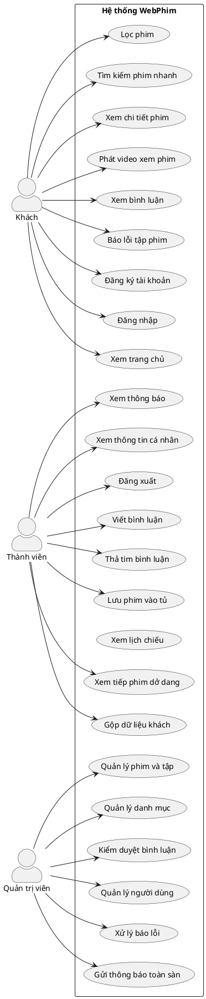

---

#### 3.2.2 UC01: Đăng ký tài khoản


| Hạng mục | Nội dung đặc tả |
| :--- | :--- |
| **Mã Use Case** | UC01 |
| **Tên Use Case** | Đăng ký tài khoản mới |
| **Tác nhân** | Khách (người chưa có tài khoản) |
| **Điều kiện tiên quyết** | Người dùng đang ở trạng thái chưa đăng nhập và mở trang `/dang-ky` |
| **Điều kiện sau** | Bản ghi người dùng mới được tạo trong hệ thống; người dùng nhận được mã xác thực đăng nhập tự động |
| **Luồng chính** | 1. Người dùng mở màn hình Đăng ký tài khoản.<br>2. Nhập các thông tin: Tên hiển thị, Địa chỉ Email, Mật khẩu và Nhập lại mật khẩu.<br>3. Nhấn nút "Đăng ký".<br>4. Hệ thống kiểm tra tính hợp lệ của toàn bộ thông tin.<br>5. Hệ thống mã hóa mật khẩu an toàn và tạo tài khoản mới với vai trò thành viên thông thường.<br>6. Hệ thống tự động cấp phát mã phiên đăng nhập.<br>7. Trả về thông tin tài khoản và chuyển hướng người dùng vào hệ thống. |
| **Luồng thay thế** | Không có. |
| **Luồng ngoại lệ** | 4a. Tên hiển thị dưới 2 ký tự hoặc vượt quá 255 ký tự → Hệ thống hiển thị thông báo yêu cầu nhập tên hợp lệ.<br>4b. Email không đúng định dạng hoặc đã có người khác đăng ký → Hệ thống hiển thị thông báo "Email này đã được sử dụng".<br>4c. Mật khẩu ngắn hơn 6 ký tự → Hệ thống hiển thị thông báo yêu cầu mật khẩu tối thiểu 6 ký tự.<br>4d. Mật khẩu nhập lại không trùng khớp → Hệ thống hiển thị thông báo "Mật khẩu xác nhận không khớp".<br>4e. Thao tác đăng ký quá 10 lần trong 1 phút từ cùng một địa chỉ → Hệ thống tạm thời chặn và yêu cầu chờ thử lại sau. |

---

#### 3.2.3 UC02: Đăng nhập

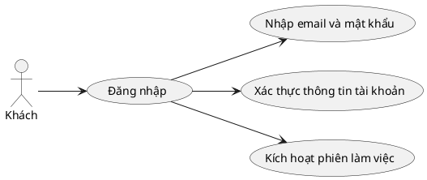

| Hạng mục | Nội dung đặc tả |
| :--- | :--- |
| **Mã Use Case** | UC02 |
| **Tên Use Case** | Đăng nhập hệ thống |
| **Tác nhân** | Khách (người đã có tài khoản trên hệ thống) |
| **Điều kiện tiên quyết** | Người dùng mở giao diện trang `/dang-nhap` |
| **Điều kiện sau** | Người dùng đăng nhập thành công, chuyển sang vai trò Thành viên hoặc Quản trị viên tương ứng |
| **Luồng chính** | 1. Người dùng truy cập trang Đăng nhập.<br>2. Nhập Email và Mật khẩu đã đăng ký.<br>3. Nhấn nút "Đăng nhập".<br>4. Hệ thống kiểm tra sự tồn tại của Email trong cơ sở dữ liệu.<br>5. Hệ thống đối soát mật khẩu băm.<br>6. Hệ thống kiểm tra trạng thái kích hoạt của tài khoản (tài khoản không bị khóa).<br>7. Cấp mã phiên làm việc mới cho thiết bị đăng nhập hiện tại.<br>8. Trả về thông tin người dùng và chuyển hướng vào trang chính. |
| **Luồng thay thế** | 8a. Nếu trên trình duyệt máy khách đang lưu trữ danh sách phim yêu thích hoặc lịch sử xem dở dang của chế độ khách → Tự động kích hoạt luồng UC16 (Gộp dữ liệu khách vào tài khoản). |
| **Luồng ngoại lệ** | 4a. Email không tồn tại trong hệ thống → Hiển thị thông báo "Thông tin đăng nhập không chính xác".<br>5a. Nhập sai mật khẩu → Hiển thị thông báo "Thông tin đăng nhập không chính xác".<br>6a. Tài khoản đang bị khóa bởi ban quản trị → Hiển thị thông báo "Tài khoản của bạn đã bị vô hiệu hóa, vui lòng liên hệ hỗ trợ".<br>3a. Nhập sai liên tục quá 10 lần trong 1 phút → Tạm khóa chức năng gửi yêu cầu trong 60 giây. |

---

#### 3.2.4 UC03: Xem thông tin cá nhân

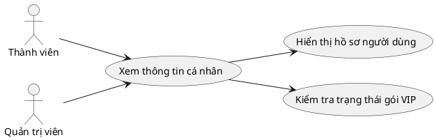

| Hạng mục | Nội dung đặc tả |
| :--- | :--- |
| **Mã Use Case** | UC03 |
| **Tên Use Case** | Xem thông tin cá nhân |
| **Tác nhân** | Thành viên, Quản trị viên |
| **Điều kiện tiên quyết** | Người dùng đã đăng nhập thành công vào hệ thống |
| **Điều kiện sau** | Thông tin hồ sơ được hiển thị chi tiết trên giao diện |
| **Luồng chính** | 1. Người dùng mở trang cá nhân hoặc nhấn vào hình đại diện trên thanh điều hướng.<br>2. Hệ thống kiểm tra tính hợp lệ của phiên đăng nhập.<br>3. Truy vấn thông tin người dùng từ cơ sở dữ liệu.<br>4. Hiển thị thông tin: Họ tên, Email, Ảnh đại diện, Vai trò và Gói dịch vụ. |
| **Luồng thay thế** | Không có. |
| **Luồng ngoại lệ** | 2a. Phiên đăng nhập hết hạn hoặc bị thu hồi → Chuyển hướng người dùng về trang Đăng nhập và hiển thị thông báo. |

---

#### 3.2.5 UC04: Đăng xuất

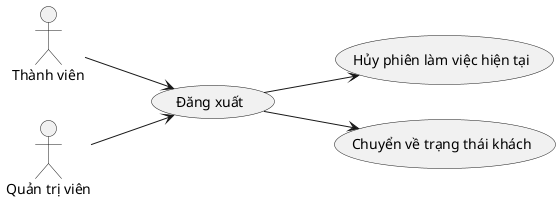

| Hạng mục | Nội dung đặc tả |
| :--- | :--- |
| **Mã Use Case** | UC04 |
| **Tên Use Case** | Đăng xuất khỏi hệ thống |
| **Tác nhân** | Thành viên, Quản trị viên |
| **Điều kiện tiên quyết** | Người dùng đang trong trạng thái đăng nhập |
| **Điều kiện sau** | Mã phiên đăng nhập bị hủy bỏ hoàn toàn; người dùng trở về trạng thái Khách |
| **Luồng chính** | 1. Người dùng nhấn nút "Đăng xuất" tại thanh menu.<br>2. Hệ thống hủy mã phiên đăng nhập hiện hành trên máy chủ.<br>3. Trình duyệt xóa thông tin tài khoản đang lưu tạm.<br>4. Hiển thị thông báo đăng xuất thành công và đưa người dùng về trang chủ. |
| **Luồng thay thế** | Không có. |
| **Luồng ngoại lệ** | Không có. |

---

#### 3.2.6 UC05: Xem trang chủ

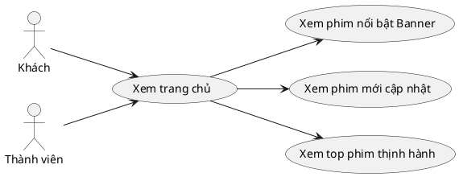

| Hạng mục | Nội dung đặc tả |
| :--- | :--- |
| **Mã Use Case** | UC05 |
| **Tên Use Case** | Xem trang chủ giới thiệu phim |
| **Tác nhân** | Khách, Thành viên |
| **Điều kiện tiên quyết** | Người dùng mở địa chỉ trang chủ `/` |
| **Điều kiện sau** | Giao diện trang chủ hiển thị đầy đủ các khối nội dung phim |
| **Luồng chính** | 1. Người dùng truy cập vào trang chủ.<br>2. Hệ thống kiểm tra dữ liệu trong bộ nhớ đệm tốc độ cao.<br>3. Hiển thị khối Banner đầu trang gồm 5 bộ phim nổi bật.<br>4. Hiển thị khối 12 bộ phim mới cập nhật tập gần nhất.<br>5. Hiển thị khối 10 bộ phim thịnh hành được xem nhiều nhất.<br>6. Hiển thị danh mục chọn lọc: 10 phim bộ đang chiếu và 10 phim lẻ đặc sắc. |
| **Luồng thay thế** | 2a. Nếu bộ nhớ đệm hết hạn → Hệ thống tự động truy vấn lại cơ sở dữ liệu và nạp mới dữ liệu đệm trong nền. |
| **Luồng ngoại lệ** | 2b. Sự cố kết nối máy chủ dữ liệu → Hiển thị thông báo xin lỗi kèm nút bấm thử tải lại trang. |

---

#### 3.2.7 UC06: Lọc phim theo nhiều tiêu chí

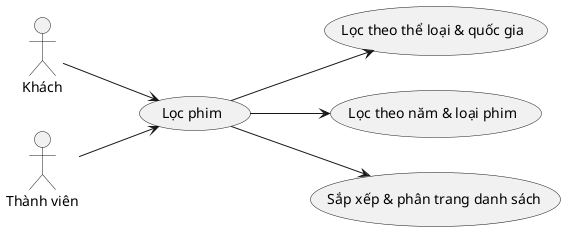

| Hạng mục | Nội dung đặc tả |
| :--- | :--- |
| **Mã Use Case** | UC06 |
| **Tên Use Case** | Lọc danh sách phim theo nhiều tiêu chí |
| **Tác nhân** | Khách, Thành viên |
| **Điều kiện tiên quyết** | Người dùng mở trang danh sách phim hoặc trang tìm kiếm nâng cao |
| **Điều kiện sau** | Danh sách phim thỏa mãn các điều kiện lọc được hiển thị phân trang |
| **Luồng chính** | 1. Người dùng truy cập trang danh mục hoặc tìm kiếm.<br>2. Chọn một hoặc kết hợp nhiều tiêu chí: Loại phim (phim lẻ/phim bộ/hoạt hình), Thể loại, Quốc gia, Năm phát hành, Tiêu chí sắp xếp.<br>3. Hệ thống lọc các bộ phim đang được hiển thị và khớp chính xác các tiêu chí.<br>4. Trả về kết quả phân trang (tối đa 48 phim/trang) kèm thanh phân trang phía dưới. |
| **Luồng thay thế** | 2a. Người dùng nhập kèm từ khóa tìm kiếm: Nếu từ khóa từ 3 ký tự trở lên → Sử dụng cơ chế tìm kiếm toàn văn chính xác; nếu dưới 3 ký tự → Tìm kiếm gần đúng. |
| **Luồng ngoại lệ** | 4a. Không có bộ phim nào khớp với bộ lọc đã chọn → Hiển thị thông báo "Không tìm thấy bộ phim phù hợp với bộ lọc đã chọn". |

---

#### 3.2.8 UC07: Tìm kiếm phim nhanh

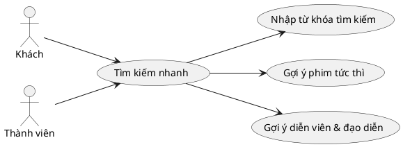

| Hạng mục | Nội dung đặc tả |
| :--- | :--- |
| **Mã Use Case** | UC07 |
| **Tên Use Case** | Tìm kiếm phim nhanh |
| **Tác nhân** | Khách, Thành viên |
| **Điều kiện tiên quyết** | Người dùng nhấn vào ô tìm kiếm trên thanh điều hướng |
| **Điều kiện sau** | Cửa sổ tìm kiếm hiển thị danh sách gợi ý phim và nhân vật phù hợp tức thì |
| **Luồng chính** | 1. Người dùng bấm vào thanh tìm kiếm.<br>2. Gõ từ khóa cần tìm.<br>3. Hệ thống lập tức tìm kiếm trong cơ sở dữ liệu theo từng ký tự gõ vào (không cần nhấn phím Enter).<br>4. Hiển thị tối đa 5 bộ phim phù hợp nhất kèm ảnh nhỏ và năm phát hành.<br>5. Hiển thị tối đa 5 diễn viên hoặc đạo diễn có tên trùng khớp. |
| **Luồng thay thế** | 4a. Người dùng nhấn chọn vào một bộ phim trong danh sách gợi ý → Điều hướng sang trang chi tiết phim đó.<br>5a. Người dùng nhấn vào diễn viên → Điều hướng sang trang các phim của diễn viên đó. |
| **Luồng ngoại lệ** | 4b. Không tìm thấy bất kỳ phim hay nhân vật nào trùng khớp → Hiển thị thông báo "Không có kết quả phù hợp". |

---

#### 3.2.9 UC08: Xem chi tiết phim

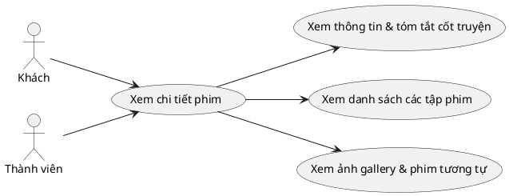

| Hạng mục | Nội dung đặc tả |
| :--- | :--- |
| **Mã Use Case** | UC08 |
| **Tên Use Case** | Xem chi tiết phim |
| **Tác nhân** | Khách, Thành viên |
| **Điều kiện tiên quyết** | Bộ phim tồn tại và đang được kích hoạt hiển thị trong hệ thống |
| **Điều kiện sau** | Màn hình hiển thị đầy đủ thông tin chi tiết phim; lượt xem được tự động ghi nhận |
| **Luồng chính** | 1. Người dùng nhấn vào một bộ phim từ bất kỳ danh sách nào.<br>2. Hệ thống tải toàn bộ thông tin phim.<br>3. Hiển thị: Poster, Tên tiếng Việt, Tên gốc, Thể loại, Quốc gia, Thời lượng, Chất lượng, Năm phát hành, Tóm tắt nội dung, Đạo diễn, Dàn diễn viên, Thư viện ảnh và Điểm đánh giá trung bình.<br>4. Hiển thị danh sách các tập phim sẵn có.<br>5. Hiển thị khối 6 bộ phim tương tự cùng thể loại.<br>6. Hệ thống tự động ghi nhận lượt xem phân tích ngầm mà không làm chậm việc hiển thị. |
| **Luồng thay thế** | Không có. |
| **Luồng ngoại lệ** | 2a. Phim không tồn tại hoặc đã bị ban quản trị ẩn/xóa → Hiển thị trang báo lỗi "Không tìm thấy bộ phim này". |

---

#### 3.2.10 UC09: Phát video xem phim

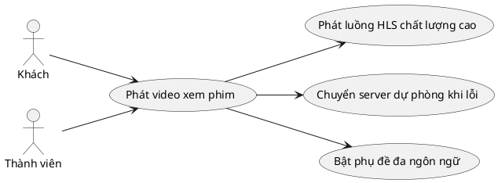

| Hạng mục | Nội dung đặc tả |
| :--- | :--- |
| **Mã Use Case** | UC09 |
| **Tên Use Case** | Phát video xem phim |
| **Tác nhân** | Khách, Thành viên |
| **Điều kiện tiên quyết** | Phim có ít nhất một tập và có nguồn máy chủ phát hợp lệ |
| **Điều kiện sau** | Trình phát video tải và phát nội dung mượt mà trên trình duyệt |
| **Luồng chính** | 1. Người dùng nhấn nút "Xem ngay" hoặc chọn một tập phim trong danh sách.<br>2. Hệ thống đọc danh sách máy chủ phát sóng của tập phim đó.<br>3. Trình phát ưu tiên khởi chạy luồng video chất lượng cao HLS (m3u8).<br>4. Tự động nạp danh sách phụ đề có sẵn (Vietsub, Thuyết minh, Tiếng Anh).<br>5. Video bắt đầu phát trên màn hình. |
| **Luồng thay thế** | 2a. Người dùng chủ động đổi sang máy chủ phát khác hoặc đổi loại thuyết minh → Trình phát nạp nguồn phát mới tương ứng.<br>3a. Luồng phát HLS chính gặp sự cố đứt kết nối hoặc lỗi mạng → Trình phát tự động thử lại 3 lần; nếu vẫn lỗi, tự động chuyển sang máy chủ nguồn nhúng (iframe) dự phòng mà không làm gián đoạn trải nghiệm. |
| **Luồng ngoại lệ** | 3b. Toàn bộ các máy chủ phát của tập phim đều không thể kết nối → Hiển thị thông báo "Tập phim đang bảo trì nguồn phát, vui lòng bấm Báo lỗi để quản trị viên khắc phục". |

---

#### 3.2.11 UC10: Xem danh sách bình luận

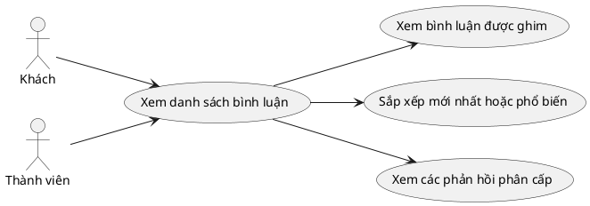

| Hạng mục | Nội dung đặc tả |
| :--- | :--- |
| **Mã Use Case** | UC10 |
| **Tên Use Case** | Xem danh sách bình luận |
| **Tác nhân** | Khách, Thành viên |
| **Điều kiện tiên quyết** | Người dùng đang mở trang chi tiết phim hoặc trang xem phim |
| **Điều kiện sau** | Danh sách bình luận công khai được hiển thị đúng phân cấp |
| **Luồng chính** | 1. Người dùng cuộn xuống khu vực Thảo luận bên dưới phim.<br>2. Hệ thống tải danh sách các bình luận đang hoạt động.<br>3. Các bình luận được Quản trị viên ghim sẽ hiển thị nổi bật ở vị trí đầu tiên.<br>4. Mặc định sắp xếp bình luận theo thời gian mới nhất.<br>5. Hiển thị các câu phản hồi lùi dòng phía dưới bình luận gốc.<br>6. Nếu người dùng đang đăng nhập: Hiển thị trạng thái mình đã thả tim bình luận đó hay chưa. |
| **Luồng thay thế** | 4a. Người dùng bấm chuyển sang tab sắp xếp "Nhiều lượt thích nhất" → Danh sách sắp xếp lại theo độ phổ biến. |
| **Luồng ngoại lệ** | 2a. Phim chưa có bình luận nào → Hiển thị thông điệp "Chưa có bình luận nào, hãy là người đầu tiên chia sẻ cảm nghĩ!". |

---

#### 3.2.12 UC11: Viết bình luận và trả lời

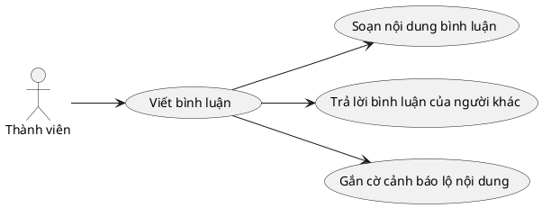

| Hạng mục | Nội dung đặc tả |
| :--- | :--- |
| **Mã Use Case** | UC11 |
| **Tên Use Case** | Viết bình luận và phản hồi |
| **Tác nhân** | Thành viên (bắt buộc đã đăng nhập) |
| **Điều kiện tiên quyết** | Đã đăng nhập tài khoản hợp lệ |
| **Điều kiện sau** | Bình luận mới được lưu vào cơ sở dữ liệu và xuất hiện ngay trên giao diện |
| **Luồng chính** | 1. Người dùng nhập nội dung vào khung soạn thảo bình luận (từ 2 đến 2000 ký tự).<br>2. Tùy chọn: Nhấn chọn cờ "Tiết lộ nội dung phim (Spoiler)" nếu bình luận có chứa chi tiết cốt truyện.<br>3. Bấm nút "Gửi bình luận".<br>4. Hệ thống kiểm tra tính hợp lệ của nội dung.<br>5. Lưu bình luận vào hệ thống với trạng thái hoạt động.<br>6. Tăng tổng số lượng bình luận của bộ phim thêm 1 đơn vị.<br>7. Bình luận mới lập tức hiển thị trên danh sách. |
| **Luồng thay thế** | 1a. Người dùng bấm nút "Trả lời" dưới bình luận của người khác → Hệ thống ghi nhận đây là bình luận cấp 2 (phản hồi) → Tăng số câu trả lời của bình luận cha → Tự động gửi thông báo thời gian thực đến người sở hữu bình luận cha. |
| **Luồng ngoại lệ** | 4a. Nội dung để trống hoặc dưới 2 ký tự → Hiển thị cảnh báo "Nội dung bình luận quá ngắn".<br>4b. Nội dung vượt quá 2000 ký tự → Cảnh báo nội dung vượt độ dài cho phép.<br>3a. Thành viên gửi quá 15 bình luận trong vòng 1 phút → Bị giới hạn tần suất tạm thời để chống spam. |

---

#### 3.2.13 UC12: Sửa và xóa bình luận

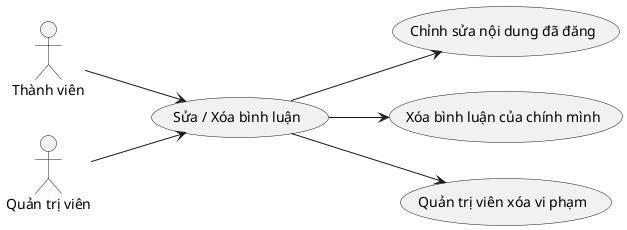

| Hạng mục | Nội dung đặc tả |
| :--- | :--- |
| **Mã Use Case** | UC12 |
| **Tên Use Case** | Chỉnh sửa và xóa bình luận |
| **Tác nhân** | Thành viên (chỉ bình luận do mình tạo), Quản trị viên (toàn bộ bình luận) |
| **Điều kiện tiên quyết** | Người dùng đã đăng nhập; bình luận cần sửa/xóa đang tồn tại |
| **Điều kiện sau** | Nội dung bình luận được cập nhật hoặc bình luận bị xóa mềm khỏi danh sách |
| **Luồng chính** | **Trường hợp chỉnh sửa:**<br>1. Người dùng bấm vào biểu tượng "Sửa" trên bình luận của mình.<br>2. Thay đổi nội dung trong ô soạn thảo và bấm "Lưu".<br>3. Hệ thống kiểm tra quyền sở hữu bình luận.<br>4. Cập nhật nội dung mới vào cơ sở dữ liệu và hiển thị ngay.<br><br>**Trường hợp xóa:**<br>1. Người dùng bấm biểu tượng "Xóa" trên bình luận của mình.<br>2. Xác nhận đồng ý xóa trong hộp thoại xác nhận.<br>3. Hệ thống thực hiện xóa mềm (bảo toàn cấu trúc phản hồi con phía dưới). |
| **Luồng thay thế** | 1a. Quản trị viên phát hiện bình luận vi phạm tiêu chuẩn cộng đồng → Có quyền bấm xóa bất kỳ bình luận nào của bất kỳ người dùng nào. |
| **Luồng ngoại lệ** | 3a. Người dùng cố tình gửi lệnh sửa/xóa bình luận của người khác → Hệ thống từ chối và báo lỗi "Bạn không có quyền thao tác trên bình luận này". |

---

#### 3.2.14 UC13: Thả tim bình luận

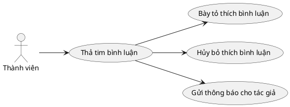

| Hạng mục | Nội dung đặc tả |
| :--- | :--- |
| **Mã Use Case** | UC13 |
| **Tên Use Case** | Thả tim bày tỏ cảm xúc trên bình luận |
| **Tác nhân** | Thành viên (bắt buộc đã đăng nhập) |
| **Điều kiện tiên quyết** | Đã đăng nhập; bình luận đang hiển thị |
| **Điều kiện sau** | Số lượt thích của bình luận được cập nhật chính xác |
| **Luồng chính** | 1. Người dùng nhấn vào nút hình trái tim dưới một bình luận.<br>2. Hệ thống kiểm tra người dùng chưa từng thích bình luận này.<br>3. Tạo bản ghi lượt thích trong cơ sở dữ liệu.<br>4. Tăng số lượt thích của bình luận lên 1 đơn vị.<br>5. Đổi màu biểu tượng trái tim sang trạng thái đã thích.<br>6. Tự động gửi thông báo thời gian thực đến tác giả của bình luận. |
| **Luồng thay thế** | 2a. Người dùng nhấn vào bình luận mà mình đã từng thích trước đó → Hệ thống thực hiện hủy thích (Unlike), giảm số lượt thích đi 1 đơn vị, đổi biểu tượng về trạng thái ban đầu và không gửi thông báo. |
| **Luồng ngoại lệ** | 1a. Thao tác bấm tim quá 60 lần trong vòng 1 phút → Hệ thống tạm thời chặn gửi yêu cầu trong ít phút.<br>1b. Người dùng chưa đăng nhập bấm nút tim → Hiển thị thông báo yêu cầu đăng nhập. |

---

#### 3.2.15 UC14: Lưu phim vào tủ cá nhân

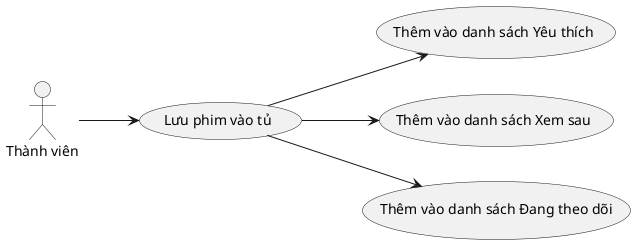

| Hạng mục | Nội dung đặc tả |
| :--- | :--- |
| **Mã Use Case** | UC14 |
| **Tên Use Case** | Quản lý lưu phim vào tủ cá nhân |
| **Tác nhân** | Thành viên |
| **Điều kiện tiên quyết** | Đã đăng nhập vào hệ thống |
| **Điều kiện sau** | Bộ phim được bổ sung vào hoặc xóa khỏi danh mục tủ phim tương ứng |
| **Luồng chính** | 1. Người dùng bấm nút "Lưu phim" tại trang chi tiết hoặc thẻ phim.<br>2. Chọn một trong 3 loại danh mục: Yêu thích (`favorite`), Xem sau (`watchlater`), hoặc Đang theo dõi (`following`).<br>3. Hệ thống kiểm tra phim chưa có trong danh mục đã chọn.<br>4. Thêm bản ghi mới vào tủ phim cá nhân.<br>5. Hiển thị thông báo nổi "Đã lưu phim vào tủ thành công". |
| **Luồng thay thế** | 3a. Bộ phim đã có trong danh mục được chọn từ trước → Bấm nút sẽ gỡ bộ phim đó ra khỏi tủ, hiển thị thông báo "Đã xóa khỏi tủ phim".<br>1a. Người dùng truy cập trang `/thu-vien` → Xem toàn bộ danh sách các phim đã lưu, có thể chuyển đổi giữa các tab danh mục, tìm kiếm trong tủ và bấm xóa từng phim hoặc xóa trắng toàn bộ tủ. |
| **Luồng ngoại lệ** | Không có. |

---

#### 3.2.16 UC15: Xem tiếp phim dở dang (Resume)

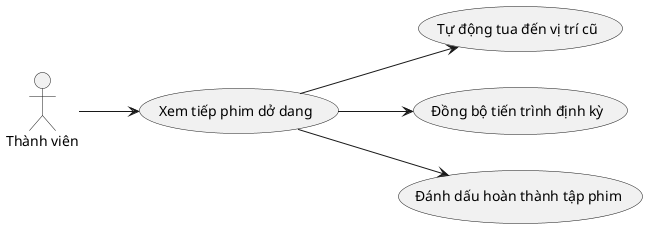

| Hạng mục | Nội dung đặc tả |
| :--- | :--- |
| **Mã Use Case** | UC15 |
| **Tên Use Case** | Ghi nhớ tiến trình và tiếp tục xem (Resume Playback) |
| **Tác nhân** | Thành viên |
| **Điều kiện tiên quyết** | Đã đăng nhập; người dùng từng mở xem bộ phim này trước đó |
| **Điều kiện sau** | Trình phát tự động tua đến đúng vị trí dừng xem; lịch sử xem mới được đồng bộ liên tục |
| **Luồng chính** | 1. Người dùng nhấn mở xem một bộ phim.<br>2. Hệ thống tự động truy vấn vị trí dừng xem gần nhất của người dùng đối với bộ phim này.<br>3. Trình phát tự động phát đúng tập phim và tua đến chính xác số giây đã dừng lần trước.<br>4. Trong quá trình phát video, cứ định kỳ mỗi 15 giây hoặc khi người dùng tạm dừng/chuyển trang, hệ thống tự động gửi tiến trình xem hiện tại lên máy chủ để cập nhật.<br>5. Khi người dùng xem đạt từ 90% thời lượng tập phim trở lên → Hệ thống tự động bật cờ đánh dấu "Đã xem hết". |
| **Luồng thay thế** | 2a. Người dùng chưa từng xem bộ phim này trước đó → Trình phát phát từ đầu tập 1 (giây thứ 0). |
| **Luồng ngoại lệ** | 4a. Mất kết nối mạng tạm thời trong lúc xem → Trình duyệt tự lưu tiến trình vào bộ nhớ tạm máy khách và gửi bù lên máy chủ ngay khi có kết nối trở lại. |

---

#### 3.2.17 UC16: Gộp dữ liệu khách vào tài khoản

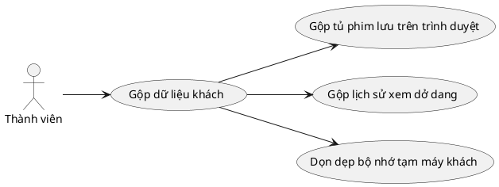

| Hạng mục | Nội dung đặc tả |
| :--- | :--- |
| **Mã Use Case** | UC16 |
| **Tên Use Case** | Hợp nhất dữ liệu chế độ khách vào tài khoản thành viên |
| **Tác nhân** | Thành viên (người dùng vừa hoàn tất Đăng nhập hoặc Đăng ký) |
| **Điều kiện tiên quyết** | Đăng nhập/Đăng ký thành công; trình duyệt có lưu trữ dữ liệu tủ phim hoặc lịch sử xem từ phiên khách vãng lai trước đó |
| **Điều kiện sau** | Toàn bộ dữ liệu xem phim tạm thời trên máy khách được đưa lên tài khoản đám mây an toàn; bộ nhớ tạm trình duyệt được dọn sạch |
| **Luồng chính** | 1. Ngay sau khi nhận mã đăng nhập thành công, trình duyệt tự động kiểm tra bộ nhớ lưu trữ cục bộ (`localStorage`).<br>2. Nếu phát hiện có danh sách phim đã lưu trong tủ tạm thời: Tự động gửi danh sách lên máy chủ; máy chủ bổ sung các phim chưa có vào tài khoản thành viên mà không ghi đè dữ liệu cũ.<br>3. Nếu phát hiện có lịch sử xem tạm thời: Tự động gửi tiến trình lên máy chủ; máy chủ cập nhật các tập phim có mốc thời gian xem mới hơn.<br>4. Sau khi máy chủ xác nhận gộp dữ liệu thành công: Trình duyệt xóa bỏ toàn bộ các khóa dữ liệu tạm của chế độ khách.<br>5. Màn hình hiển thị đầy đủ tủ phim và lịch sử hợp nhất. |
| **Luồng thay thế** | 1a. Trình duyệt không có dữ liệu tạm nào → Bỏ qua bước hợp nhất, hoàn tất chu trình đăng nhập thông thường. |
| **Luồng ngoại lệ** | 2a. Xảy ra lỗi mạng gián đoạn trong quá trình gửi dữ liệu gộp → Giữ nguyên dữ liệu tạm trên trình duyệt và tự động thử gộp lại ở lần mở trang tiếp theo. |

---

#### 3.2.18 UC17: Xem lịch chiếu phim

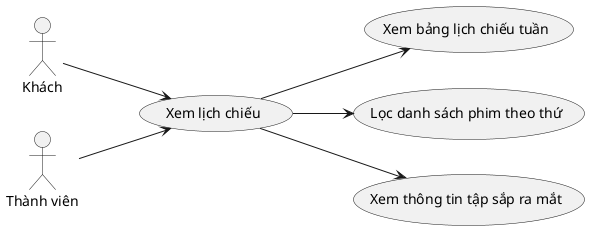

| Hạng mục | Nội dung đặc tả |
| :--- | :--- |
| **Mã Use Case** | UC17 |
| **Tên Use Case** | Xem lịch chiếu phim định kỳ trong tuần |
| **Tác nhân** | Khách, Thành viên |
| **Điều kiện tiên quyết** | Người dùng truy cập trang `/lich-chieu` |
| **Điều kiện sau** | Bảng lịch chiếu phân chia theo các thứ trong tuần được hiển thị trực quan |
| **Luồng chính** | 1. Người dùng mở trang Lịch chiếu phim.<br>2. Hệ thống tải danh sách các bộ phim bộ đang phát sóng có thiết lập lịch chiếu.<br>3. Trình bày danh sách phim phân loại thành 7 cột tương ứng từ Thứ 2 đến Chủ nhật.<br>4. Mỗi mục phim hiển thị: Tên phim, ảnh nhỏ, tập mới nhất vừa chiếu và giờ phát sóng dự kiến. |
| **Luồng thay thế** | 3a. Người dùng bấm vào nút chọn 1 thứ cụ thể (ví dụ: Thứ 6) → Màn hình thu gọn và chỉ hiển thị danh sách các phim chiếu vào ngày hôm đó. |
| **Luồng ngoại lệ** | 2a. Không có bộ phim nào đang trong trạng thái phát sóng có lịch chiếu → Hiển thị thông báo "Hiện chưa có lịch chiếu mới cho tuần này". |

---

#### 3.2.19 UC18: Xem danh sách thông báo

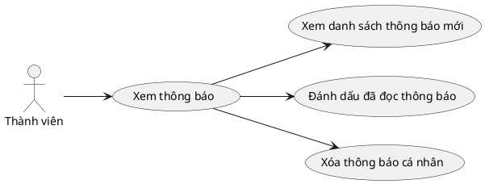

| Hạng mục | Nội dung đặc tả |
| :--- | :--- |
| **Mã Use Case** | UC18 |
| **Tên Use Case** | Quản lý và xem danh sách thông báo |
| **Tác nhân** | Thành viên |
| **Điều kiện tiên quyết** | Người dùng đã đăng nhập tài khoản |
| **Điều kiện sau** | Người dùng nắm được các biến động tương tác; trạng thái đã đọc được cập nhật |
| **Luồng chính** | 1. Người dùng bấm vào biểu tượng chiếc Chuông trên thanh điều hướng hoặc truy cập trang `/thong-bao`.<br>2. Hệ thống tải danh sách thông báo (sắp xếp giảm dần theo thời gian tạo, phân trang 20 mục/trang).<br>3. Hiển thị rõ: Người gửi, Hành động (thích bình luận, trả lời bình luận, thông báo toàn sàn), Tên phim liên quan và Thời gian nhận.<br>4. Hiển thị số lượng thông báo chưa đọc bằng con số nổi bật trên biểu tượng chuông. |
| **Luồng thay thế** | 3a. Người dùng bấm vào một thông báo cụ thể → Hệ thống đánh dấu thông báo đó là "Đã đọc", giảm số đếm chưa đọc đi 1 và tự động chuyển hướng đến vị trí bình luận liên quan.<br>3b. Người dùng bấm nút "Đánh dấu tất cả đã đọc" → Toàn bộ thông báo được chuyển sang trạng thái đã đọc, số đếm chưa đọc về 0.<br>3c. Người dùng bấm nút "Xóa" trên một mục thông báo → Bản ghi thông báo đó bị xóa khỏi danh sách. |
| **Luồng ngoại lệ** | 2a. Người dùng chưa từng có tương tác nào → Hiển thị thông điệp "Hộp thông báo của bạn đang trống". |

---

#### 3.2.20 UC19: Nhận thông báo tức thì

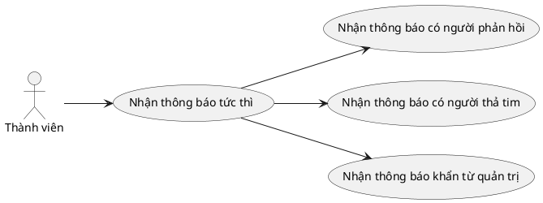

| Hạng mục | Nội dung đặc tả |
| :--- | :--- |
| **Mã Use Case** | UC19 |
| **Tên Use Case** | Nhận thông báo tức thì qua kênh thời gian thực |
| **Tác nhân** | Thành viên (đang mở trang web trên trình duyệt) |
| **Điều kiện tiên quyết** | Thành viên đã đăng nhập và đang duy trì kết nối mạng |
| **Điều kiện sau** | Thông báo nổi xuất hiện ngay trên màn hình mà không cần bấm tải lại trang |
| **Luồng chính** | 1. Khi có sự kiện phát sinh: Ai đó phản hồi bình luận của bạn, ai đó thả tim bình luận của bạn, hoặc Quản trị viên phát tin khẩn.<br>2. Máy chủ phát sóng gói tin sự kiện qua kênh kết nối WebSocket riêng tư của thành viên.<br>3. Trình duyệt máy khách nhận được gói tin trong vòng chưa đầy 1 giây.<br>4. Tự động bật thông báo nổi (Sonner Toast) ở góc màn hình kèm âm báo nhẹ.<br>5. Số đếm thông báo chưa đọc trên biểu tượng chuông tự động tăng thêm 1 đơn vị. |
| **Luồng thay thế** | Không có. |
| **Luồng ngoại lệ** | 2a. Mất kết nối WebSocket do mạng chập chờn → Thông báo được lưu an toàn trong cơ sở dữ liệu và sẽ được hiển thị khi người dùng tải lại trang hoặc có mạng trở lại. |

---

#### 3.2.21 UC20: Báo lỗi tập phim

```plantuml
@startuml
left to right direction
actor "Khách" as Guest
actor "Thành viên" as Member

Guest --> (Báo lỗi tập phim)
Member --> (Báo lỗi tập phim)

(Báo lỗi tập phim) --> (Chọn loại sự cố gặp phải)
(Báo lỗi tập phim) --> (Nhập mô tả chi tiết lỗi)
(Báo lỗi tập phim) --> (Gửi báo lỗi đến quản trị)
@enduml
```

| Hạng mục | Nội dung đặc tả |
| :--- | :--- |
| **Mã Use Case** | UC20 |
| **Tên Use Case** | Báo cáo sự cố tập phim |
| **Tác nhân** | Khách, Thành viên |
| **Điều kiện tiên quyết** | Người dùng đang mở xem một tập phim cụ thể |
| **Điều kiện sau** | Bản ghi báo lỗi được gửi lên hệ thống và chuyển vào hàng đợi xử lý của Ban quản trị |
| **Luồng chính** | 1. Người dùng bấm nút "Báo lỗi" nằm bên cạnh trình phát video.<br>2. Cửa sổ báo lỗi hiển thị với các lựa chọn: Lỗi không xem được video (`video_error`), Lỗi mất tiếng/lệch tiếng (`audio_error`), Lỗi sai phụ đề (`subtitle_error`), Lỗi khác (`other`).<br>3. Người dùng chọn loại lỗi và nhập thêm mô tả chi tiết (tối đa 1000 ký tự).<br>4. Bấm nút "Gửi báo lỗi".<br>5. Hệ thống ghi nhận báo lỗi kèm thông tin tập phim, địa chỉ IP và đưa về trạng thái Chờ xử lý (`pending`).<br>6. Hiển thị thông báo cảm ơn người xem đã phản hồi sự cố. |
| **Luồng thay thế** | Không có. |
| **Luồng ngoại lệ** | 4a. Người dùng gửi liên tiếp quá 6 lần báo lỗi trong vòng 1 phút → Hệ thống chặn lại và thông báo "Bạn thao tác quá nhanh, vui lòng thử lại sau giây lát". |

---

#### 3.2.22 UC21: Quản lý phim và tập phim

```plantuml
@startuml
left to right direction
actor "Quản trị viên" as Admin

Admin --> (Quản lý phim & tập)
(Quản lý phim & tập) --> (Thêm, sửa, xóa thông tin phim)
(Quản lý phim & tập) --> (Quản lý các tập phim)
(Quản lý phim & tập) --> (Quản lý các nguồn máy chủ phát)
@enduml
```

| Hạng mục | Nội dung đặc tả |
| :--- | :--- |
| **Mã Use Case** | UC21 |
| **Tên Use Case** | Quản lý thông tin phim, tập phim và nguồn phát |
| **Tác nhân** | Quản trị viên (Admin) |
| **Điều kiện tiên quyết** | Đăng nhập tài khoản có quyền `role = 'admin'` |
| **Điều kiện sau** | Dữ liệu phim, tập phim, nguồn máy chủ được tạo mới hoặc cập nhật; bộ nhớ đệm trang người dùng được làm mới tự động |
| **Luồng chính** | 1. Quản trị viên truy cập mục `/admin/movies`.<br>2. Xem danh sách toàn bộ phim trong hệ thống kèm bộ lọc trạng thái và ô tìm kiếm.<br>3. Thêm mới phim: Điền tên phim, đường dẫn thân thiện (slug), loại phim, gán thể loại, quốc gia, diễn viên, đạo diễn, ảnh poster, mô tả và thiết lập SEO.<br>4. Chỉnh sửa phim: Cập nhật bất kỳ thông số nào của bộ phim.<br>5. Quản lý tập phim: Bấm vào chi tiết phim để xem danh sách tập; có thể thêm từng tập mới, sửa tên tập, hoặc dùng công cụ đồng bộ hàng loạt tập.<br>6. Quản lý nguồn phát: Đối với từng tập, thêm các máy chủ phát video (tên server, loại thuyết minh/vietsub, link m3u8, link embed). |
| **Luồng thay thế** | 2a. Bật/tắt nhanh trạng thái hiển thị phim (`is_active`) trực tiếp trên bảng danh sách bằng một cú nhấp chuột.<br>2b. Thao tác hàng loạt: Tích chọn nhiều phim cùng lúc và thực hiện: Ẩn hàng loạt, Hiện hàng loạt hoặc Xóa mềm hàng loạt. |
| **Luồng ngoại lệ** | 3a. Nhập trùng đường dẫn thân thiện (slug) đã có phim khác sử dụng → Hệ thống hiển thị cảnh báo yêu cầu đổi slug duy nhất.<br>1a. Tài khoản không có quyền Admin cố truy cập đường dẫn quản trị → Hệ thống từ chối truy cập và báo lỗi 403 Forbidden. |

---

#### 3.2.23 UC22: Quản lý danh mục

```plantuml
@startuml
left to right direction
actor "Quản trị viên" as Admin

Admin --> (Quản lý danh mục)
(Quản lý danh mục) --> (Quản lý thể loại phim)
(Quản lý danh mục) --> (Quản lý quốc gia sản xuất)
(Quản lý danh mục) --> (Quản lý diễn viên & đạo diễn)
@enduml
```

| Hạng mục | Nội dung đặc tả |
| :--- | :--- |
| **Mã Use Case** | UC22 |
| **Tên Use Case** | Quản lý danh mục phân loại và nhân sự điện ảnh |
| **Tác nhân** | Quản trị viên |
| **Điều kiện tiên quyết** | Đã đăng nhập với vai trò Quản trị viên |
| **Điều kiện sau** | Danh sách thể loại, quốc gia, nhân sự được cập nhật và hiển thị đồng bộ trên hệ thống |
| **Luồng chính** | 1. Quản trị viên truy cập các phân mục quản trị: `/admin/genres` (Thể loại), `/admin/countries` (Quốc gia), `/admin/people` (Diễn viên/Đạo diễn).<br>2. Xem danh sách hiện có kèm số lượng phim đang thuộc danh mục đó.<br>3. Thêm danh mục mới: Nhập tên, đường dẫn (slug) và mô tả.<br>4. Chỉnh sửa thông tin: Thay đổi tên hoặc thông tin của danh mục.<br>5. Xóa danh mục: Gỡ bỏ danh mục không còn sử dụng. |
| **Luồng thay thế** | Không có. |
| **Luồng ngoại lệ** | 5a. Danh mục đang có phim liên kết chặt chẽ → Hệ thống hiển thị cảnh báo xác nhận rõ ràng trước khi thực hiện xóa liên kết. |

---

#### 3.2.24 UC23: Kiểm duyệt bình luận

```plantuml
@startuml
left to right direction
actor "Quản trị viên" as Admin

Admin --> (Kiểm duyệt bình luận)
(Kiểm duyệt bình luận) --> (Lọc danh sách bình luận toàn sàn)
(Kiểm duyệt bình luận) --> (Chuyển trạng thái: Hoạt động / Ẩn / Spam)
(Kiểm duyệt bình luận) --> (Ghim bình luận lên đầu trang phim)
@enduml
```

| Hạng mục | Nội dung đặc tả |
| :--- | :--- |
| **Mã Use Case** | UC23 |
| **Tên Use Case** | Kiểm duyệt và xử lý vi phạm bình luận |
| **Tác nhân** | Quản trị viên |
| **Điều kiện tiên quyết** | Đã đăng nhập với vai trò Quản trị viên |
| **Điều kiện sau** | Trạng thái hiển thị của các bình luận được cập nhật trên trang phim |
| **Luồng chính** | 1. Quản trị viên truy cập trang `/admin/comments`.<br>2. Xem danh sách toàn bộ bình luận của các phim, có thể lọc theo: Bình thường (`active`), Đã ẩn (`hidden`), hoặc Spam (`spam`).<br>3. Chọn một hoặc nhiều bình luận cần xử lý.<br>4. Thực hiện chuyển trạng thái: Ẩn bình luận vi phạm hoặc đánh dấu Spam.<br>5. Chọn tính năng "Ghim bình luận" đối với các bình luận chất lượng cao để hiển thị trên cùng trang phim. |
| **Luồng thay thế** | 4a. Thực hiện xóa vĩnh viễn hoặc xóa mềm các bình luận vi phạm pháp luật hoặc từ ngữ thô tục.<br>3a. Tích chọn nhiều bình luận cùng lúc và duyệt hoặc ẩn hàng loạt chỉ trong một thao tác. |
| **Luồng ngoại lệ** | Không có. |

---

#### 3.2.25 UC24: Quản lý người dùng

```plantuml
@startuml
left to right direction
actor "Quản trị viên" as Admin

Admin --> (Quản lý người dùng)
(Quản lý người dùng) --> (Xem & tìm kiếm danh sách người dùng)
(Quản lý người dùng) --> (Phân quyền quản trị & nâng cấp VIP)
(Quản lý người dùng) --> (Khóa tài khoản vi phạm hoặc xóa bỏ)
@enduml
```

| Hạng mục | Nội dung đặc tả |
| :--- | :--- |
| **Mã Use Case** | UC24 |
| **Tên Use Case** | Quản trị tài khoản người dùng và phân quyền |
| **Tác nhân** | Quản trị viên |
| **Điều kiện tiên quyết** | Đã đăng nhập với vai trò Quản trị viên |
| **Điều kiện sau** | Quyền hạn, gói dịch vụ hoặc trạng thái hoạt động của tài khoản người dùng được cập nhật |
| **Luồng chính** | 1. Quản trị viên truy cập trang `/admin/users`.<br>2. Xem danh sách người dùng trong hệ thống (hỗ trợ tìm kiếm theo Tên, Email và lọc theo Vai trò).<br>3. Mở xem chi tiết một tài khoản người dùng.<br>4. Thay đổi phân quyền vai trò: Chuyển giữa Thành viên thông thường (`user`) và Quản trị viên (`admin`).<br>5. Điều chỉnh gói dịch vụ: Chuyển giữa gói Miễn phí (`free`) và gói VIP (`vip`), gia hạn mốc ngày hết hạn VIP.<br>6. Bật/tắt trạng thái hoạt động: Khóa tài khoản vi phạm để chặn người đó đăng nhập. |
| **Luồng thay thế** | 6a. Quản trị viên thực hiện xóa vĩnh viễn tài khoản người dùng: Hệ thống tự động xóa sạch dữ liệu cá nhân (tủ phim, lịch sử xem, đánh giá, thông báo) và ẩn danh hóa tác giả của các bình luận cũ đã đăng (chuyển `user_id = NULL`). |
| **Luồng ngoại lệ** | 6b. Quản trị viên vô tình bấm xóa chính tài khoản đang đăng nhập của mình → Hệ thống chặn lại và báo lỗi "Không thể tự xóa tài khoản đang thực hiện phiên làm việc". |

---

#### 3.2.26 UC25: Xử lý báo lỗi tập phim

```plantuml
@startuml
left to right direction
actor "Quản trị viên" as Admin

Admin --> (Xử lý báo lỗi tập)
(Xử lý báo lỗi tập) --> (Xem danh sách các sự cố đang chờ)
(Xử lý báo lỗi tập) --> (Khắc phục nguồn phát hoặc tập phim)
(Xử lý báo lỗi tập) --> (Cập nhật trạng thái: Đã giải quyết)
@enduml
```

| Hạng mục | Nội dung đặc tả |
| :--- | :--- |
| **Mã Use Case** | UC25 |
| **Tên Use Case** | Tiếp nhận và xử lý báo cáo sự cố tập phim |
| **Tác nhân** | Quản trị viên |
| **Điều kiện tiên quyết** | Đã đăng nhập với vai trò Quản trị viên; có báo cáo lỗi từ người xem |
| **Điều kiện sau** | Sự cố được sửa chữa trên máy chủ; trạng thái báo lỗi chuyển sang Đã giải quyết |
| **Luồng chính** | 1. Quản trị viên truy cập trang `/admin/reports`.<br>2. Xem danh sách các báo cáo sự cố (lọc theo trạng thái Đang chờ / Đang xử lý / Đã giải quyết).<br>3. Nhấn vào một báo cáo để xem thông tin chi tiết: Tên phim, Tập phim bị lỗi, Loại lỗi (video/tiếng/phụ đề), Mô tả từ người xem và Thời điểm báo.<br>4. Quản trị viên mở trang chỉnh sửa tập phim để cập nhật lại đường dẫn phát video hoặc thay thế máy chủ mới.<br>5. Sau khi khắc phục xong, cập nhật trạng thái báo cáo sang Đã giải quyết (`resolved`).<br>6. Hệ thống tự động ghi nhận mã quản trị viên xử lý và thời gian hoàn tất. |
| **Luồng thay thế** | 5a. Báo cáo không có căn cứ hoặc kiểm tra thấy nguồn phát vẫn hoạt động bình thường → Quản trị viên chuyển trạng thái báo cáo sang Từ chối (`dismissed`) kèm ghi chú lý do. |
| **Luồng ngoại lệ** | Không có. |

---

#### 3.2.27 UC26: Gửi thông báo toàn hệ thống

```plantuml
@startuml
left to right direction
actor "Quản trị viên" as Admin

Admin --> (Gửi thông báo toàn sàn)
(Gửi thông báo toàn sàn) --> (Soạn tiêu đề & nội dung thông báo)
(Gửi thông báo toàn sàn) --> (Đính kèm liên kết điều hướng)
(Gửi thông báo toàn sàn) --> (Phát sóng thời gian thực đến toàn bộ user)
@enduml
```

| Hạng mục | Nội dung đặc tả |
| :--- | :--- |
| **Mã Use Case** | UC26 |
| **Tên Use Case** | Phát sóng thông báo khẩn toàn hệ thống |
| **Tác nhân** | Quản trị viên |
| **Điều kiện tiên quyết** | Đã đăng nhập với vai trò Quản trị viên |
| **Điều kiện sau** | Thông báo được lưu trữ vào hệ thống và hiển thị ngay lập tức tới tất cả người dùng đang trực tuyến |
| **Luồng chính** | 1. Quản trị viên truy cập mục `/admin/notifications`.<br>2. Nhập Tiêu đề thông báo (ví dụ: "Bảo trì nâng cấp cụm máy chủ phát phim").<br>3. Nhập Nội dung thông báo chi tiết.<br>4. Tùy chọn: Nhập đường dẫn liên kết điều hướng kèm theo.<br>5. Bấm nút "Phát sóng thông báo".<br>6. Hệ thống lưu bản ghi thông báo vào cơ sở dữ liệu.<br>7. Máy chủ kích hoạt phát sóng gói tin qua kênh WebSocket chung tới toàn bộ người dùng đang mở trang web.<br>8. Màn hình của mọi người dùng lập tức xuất hiện thông báo nổi. |
| **Luồng thay thế** | Không có. |
| **Luồng ngoại lệ** | 2a. Tiêu đề hoặc nội dung để trống → Hệ thống hiển thị nhắc nhở "Vui lòng nhập đầy đủ tiêu đề và nội dung". |

---

#### 3.2.28 UC27: Xem bảng thống kê tổng quan

```plantuml
@startuml
left to right direction
actor "Quản trị viên" as Admin

Admin --> (Xem thống kê tổng quan)
(Xem thống kê tổng quan) --> (Thống kê số lượng phim & tập phim)
(Xem thống kê tổng quan) --> (Thống kê tổng lượt xem & người dùng)
(Xem thống kê tổng quan) --> (Theo dõi báo cáo sự cố cần xử lý)
@enduml
```

| Hạng mục | Nội dung đặc tả |
| :--- | :--- |
| **Mã Use Case** | UC27 |
| **Tên Use Case** | Xem bảng số liệu thống kê tổng quan (Dashboard) |
| **Tác nhân** | Quản trị viên |
| **Điều kiện tiên quyết** | Đã đăng nhập với vai trò Quản trị viên |
| **Điều kiện sau** | Toàn bộ các chỉ số vận hành then chốt của hệ thống được hiển thị đầy đủ |
| **Luồng chính** | 1. Quản trị viên đăng nhập vào trang chủ quản trị `/admin`.<br>2. Hệ thống tổng hợp các số liệu thời gian thực từ cơ sở dữ liệu.<br>3. Hiển thị các thẻ chỉ số chính: Tổng số phim đang hoạt động, Tổng số tập phim, Tổng lượt xem tích lũy, Tổng số tài khoản thành viên.<br>4. Hiển thị số lượng báo cáo sự cố tập phim đang chờ xử lý.<br>5. Hiển thị danh sách 5 bộ phim có lượt xem cao nhất và 5 sự cố tập phim mới nhất cần chú ý. |
| **Luồng thay thế** | Không có. |
| **Luồng ngoại lệ** | Không có. |

---

### 3.3 Sơ đồ quan hệ thực thể (Entity Relationship Diagrams)

```plantuml
@startuml
!theme plain
skinparam linetype ortho

entity "users\n(Người dùng)" as users {
  * id : số tự tăng
  --
  name : tên hiển thị
  email : email duy nhất
  password : mật khẩu mã hóa
  role : vai trò (user/admin)
  is_active : trạng thái kích hoạt
}

entity "movies\n(Phim)" as movies {
  * id : số tự tăng
  --
  name : tên phim tiếng Việt
  slug : đường dẫn duy nhất
  type : loại (single/series/...)
  status : tình trạng phát sóng
  view_count : tổng lượt xem
  rating_avg : điểm trung bình
  is_active : trạng thái hiển thị
}

entity "episodes\n(Tập phim)" as episodes {
  * id : số tự tăng
  --
  movie_id : mã phim tham chiếu
  name : tên tập phim
  slug : đường dẫn tập
  sort_order : thứ tự sắp xếp
}

entity "episode_servers\n(Nguồn phát)" as servers {
  * id : số tự tăng
  --
  episode_id : mã tập tham chiếu
  server_name : tên máy chủ phát
  lang_type : thuyết minh/vietsub
  link_m3u8 : link phát HLS
  link_embed : link nhúng iframe
}

entity "genres\n(Thể loại phim)" as genres {
  * id : số tự tăng
  --
  name : tên thể loại
  slug : đường dẫn thể loại
}

entity "countries\n(Quốc gia)" as countries {
  * id : số tự tăng
  --
  name : tên quốc gia
  slug : đường dẫn quốc gia
}

entity "people\n(Diễn viên & Đạo diễn)" as people {
  * id : số tự tăng
  --
  name : họ tên nghệ sĩ
  slug : đường dẫn nhân sự
  type : diễn viên/đạo diễn
}

entity "comments\n(Bình luận)" as comments {
  * id : số tự tăng
  --
  user_id : mã người bình luận
  movie_id : mã phim được bình luận
  parent_id : mã bình luận cha
  content : nội dung văn bản
  status : trạng thái duyệt
  is_spoiler : cờ lộ nội dung
  is_pinned : cờ ghim bình luận
  likes_count : số lượt thích
}

entity "comment_likes\n(Lượt thích BL)" as likes {
  * user_id : mã người thích
  * comment_id : mã bình luận
}

entity "bookmarks\n(Tủ phim cá nhân)" as bookmarks {
  * id : số tự tăng
  --
  user_id : mã người dùng
  movie_id : mã phim được lưu
  type : yêu thích/xem sau/theo dõi
}

entity "watch_histories\n(Lịch sử xem)" as histories {
  * id : số tự tăng
  --
  user_id : mã người xem
  movie_id : mã phim đã xem
  episode_id : mã tập đã xem
  progress_seconds : giây dừng xem
  duration_seconds : tổng thời lượng
  is_completed : cờ đã xem xong
}

entity "ratings\n(Đánh giá)" as ratings {
  * id : số tự tăng
  --
  user_id : mã người đánh giá
  movie_id : mã phim được đánh giá
  score : điểm chấm (1 đến 10)
}

entity "episode_reports\n(Báo lỗi tập)" as reports {
  * id : số tự tăng
  --
  episode_id : mã tập gặp sự cố
  user_id : mã người gửi báo lỗi
  report_type : phân loại sự cố
  status : trạng thái xử lý
}

entity "notifications\n(Thông báo)" as notif {
  * id : số tự tăng
  --
  user_id : mã người nhận
  title : tiêu đề thông báo
  message : nội dung thông báo
  read_at : thời điểm đã đọc
}

entity "movie_view_logs\n(Nhật ký lượt xem)" as viewlogs {
  * id : số tự tăng
  --
  movie_id : mã phim
  ip_address : địa chỉ IP
  viewed_at : thời điểm xem
}

movies ||--o{ episodes : "một phim có nhiều tập"
episodes ||--o{ servers : "một tập có nhiều nguồn phát"
movies }o--o{ genres : "phim thuộc nhiều thể loại"
movies }o--o{ countries : "phim thuộc nhiều quốc gia"
movies }o--o{ people : "phim có nhiều nhân sự"
users ||--o{ comments : "người dùng viết bình luận"
movies ||--o{ comments : "phim có nhiều bình luận"
comments ||--o{ comments : "bình luận có phản hồi con"
comments ||--o{ likes : "bình luận nhận lượt thích"
users ||--o{ likes : "người dùng thả tim"
users ||--o{ bookmarks : "người dùng lưu tủ phim"
movies ||--o{ bookmarks : "phim được lưu vào tủ"
users ||--o{ histories : "người dùng có lịch sử xem"
movies ||--o{ histories : "phim được ghi nhận lịch sử"
users ||--o{ ratings : "người dùng chấm điểm"
movies ||--o{ ratings : "phim nhận điểm đánh giá"
users ||--o{ reports : "người dùng gửi báo lỗi"
episodes ||--o{ reports : "tập phim bị báo lỗi"
users ||--o{ notif : "người dùng nhận thông báo"
movies ||--o{ viewlogs : "phim ghi nhận lượt xem"
@enduml
```

---

### 3.4 Từ điển dữ liệu (Data Dictionary)

#### 3.4.1 Bảng `users` (Người dùng)

| STT | Tên thuộc tính | Kiểu dữ liệu | Ràng buộc | Mô tả |
| :---: | :--- | :--- | :--- | :--- |
| 1 | **id** | Bigint | Khóa chính | Mã định danh duy nhất của người dùng |
| 2 | **name** | Varchar (255) | Bắt buộc | Tên hiển thị của người dùng |
| 3 | **email** | Varchar (255) | Bắt buộc, Duy nhất | Địa chỉ thư điện tử dùng để đăng nhập |
| 4 | **email_verified_at** | Timestamp | Có thể trống | Thời điểm hoàn tất xác minh email |
| 5 | **password** | Varchar (255) | Bắt buộc | Mật khẩu đã được mã hóa an toàn |
| 6 | **remember_token** | Varchar (100) | Có thể trống | Mã ghi nhớ phiên đăng nhập trên máy |
| 7 | **role** | Enum ('user', 'admin') | Mặc định: 'user' | Vai trò người dùng trong hệ thống |
| 8 | **avatar_url** | Varchar (500) | Có thể trống | Đường dẫn ảnh đại diện của người dùng |
| 9 | **subscription_type** | Enum ('free', 'vip') | Mặc định: 'free' | Loại gói dịch vụ (Miễn phí hoặc VIP) |
| 10 | **subscription_expires_at** | Timestamp | Có thể trống | Mốc thời gian hết hạn gói dịch vụ VIP |
| 11 | **is_active** | Boolean | Mặc định: true | Trạng thái tài khoản (hoạt động / bị khóa) |
| 12 | **created_at** | Timestamp | Có thể trống | Ngày giờ tài khoản được khởi tạo |
| 13 | **updated_at** | Timestamp | Có thể trống | Ngày giờ thông tin được cập nhật gần nhất |

---

#### 3.4.2 Bảng `movies` (Phim)

| STT | Tên thuộc tính | Kiểu dữ liệu | Ràng buộc | Mô tả |
| :---: | :--- | :--- | :--- | :--- |
| 1 | **id** | Bigint | Khóa chính | Mã định danh duy nhất của bộ phim |
| 2 | **name** | Varchar (500) | Bắt buộc | Tên chính thức của phim (tiếng Việt) |
| 3 | **slug** | Varchar (500) | Bắt buộc, Duy nhất | Đường dẫn thân thiện dùng cho liên kết trang |
| 4 | **origin_name** | Varchar (500) | Có thể trống | Tên gốc của phim (tiếng nước ngoài) |
| 5 | **type** | Enum | Mặc định: 'single' | Hình thức: phim lẻ, phim bộ, tv-shows, hoạt hình |
| 6 | **status** | Enum | Mặc định: 'ongoing' | Tình trạng: đang chiếu, đã hoàn thành, trailer, sắp chiếu |
| 7 | **content** | Text | Có thể trống | Văn bản tóm tắt nội dung cốt truyện phim |
| 8 | **thumb_url** | Varchar (1000) | Có thể trống | Đường dẫn ảnh đại diện nhỏ (Thumbnail) |
| 9 | **poster_url** | Varchar (1000) | Có thể trống | Đường dẫn ảnh áp phích lớn (Poster / Banner) |
| 10 | **trailer_url** | Varchar (500) | Có thể trống | Đường dẫn video đoạn giới thiệu (Trailer) |
| 11 | **quality** | Varchar (50) | Có thể trống | Chất lượng hình ảnh (HD, FHD, 4K) |
| 12 | **lang** | Varchar (100) | Có thể trống | Định dạng ngôn ngữ (Vietsub, Thuyết minh, Lồng tiếng) |
| 13 | **duration** | Varchar (50) | Có thể trống | Thời lượng phim hiển thị (ví dụ: 120 phút) |
| 14 | **episode_current** | Varchar (50) | Có thể trống | Số tập hiện tại (ví dụ: Tập 12/24 hoặc Hoàn tất) |
| 15 | **episode_total** | Varchar (50) | Có thể trống | Tổng số tập dự kiến phát sóng |
| 16 | **year** | Smallint | Có thể trống | Năm phát hành chính thức của bộ phim |
| 17 | **view_count** | Bigint | Mặc định: 0 | Tổng số lượt xem tích lũy |
| 18 | **rating_avg** | Decimal (3,1) | Mặc định: 0.0 | Điểm đánh giá trung bình (thang điểm 10) |
| 19 | **rating_count** | Int | Mặc định: 0 | Tổng số lượt tham gia đánh giá |
| 20 | **comment_count** | Int | Mặc định: 0 | Tổng số lượng bình luận của phim |
| 21 | **is_active** | Boolean | Mặc định: true | Cờ cho phép phim hiển thị công khai |
| 22 | **is_featured** | Boolean | Mặc định: false | Cờ đánh dấu phim nổi bật trên trang chủ |
| 23 | **tmdb_id** | Int | Có thể trống | Mã phim trên cơ sở dữ liệu điện ảnh TMDb |
| 24 | **imdb_id** | Varchar (20) | Có thể trống | Mã phim trên cơ sở dữ liệu điện ảnh IMDb |
| 25 | **source_url** | Varchar (1000) | Có thể trống | Liên kết nguồn dữ liệu gốc tham chiếu |
| 26 | **last_synced_at** | Timestamp | Có thể trống | Thời điểm đồng bộ dữ liệu lần gần nhất |
| 27 | **notify_schedule** | Text | Có thể trống | Mô tả lịch chiếu dạng chữ thông báo |
| 28 | **seo_title** | Varchar (255) | Có thể trống | Tiêu đề tối ưu hóa công cụ tìm kiếm |
| 29 | **seo_description** | Text | Có thể trống | Mô tả tóm tắt cho công cụ tìm kiếm |
| 30 | **seo_keywords** | Varchar (500) | Có thể trống | Các từ khóa chính phục vụ tìm kiếm |
| 31 | **parent_id** | Bigint | Có thể trống, → movies(id) | Mã phim liên kết phần trước hoặc mùa trước |
| 32 | **season_number** | Tinyint | Có thể trống | Số thứ tự mùa phim (Season) |
| 33 | **schedule_days** | JSON | Có thể trống | Mảng số các ngày phát sóng trong tuần [0 đến 6] |
| 34 | **deleted_at** | Timestamp | Có thể trống | Thời điểm bản ghi bị xóa mềm |
| 35 | **created_at** | Timestamp | Có thể trống | Thời điểm bản ghi được tạo |
| 36 | **updated_at** | Timestamp | Có thể trống | Thời điểm cập nhật dữ liệu gần nhất |

---

#### 3.4.3 Bảng `genres` (Thể loại phim)

| STT | Tên thuộc tính | Kiểu dữ liệu | Ràng buộc | Mô tả |
| :---: | :--- | :--- | :--- | :--- |
| 1 | **id** | Bigint | Khóa chính | Mã định danh thể loại |
| 2 | **name** | Varchar (100) | Bắt buộc | Tên thể loại (Hành động, Tình cảm, Viễn tưởng...) |
| 3 | **slug** | Varchar (100) | Bắt buộc, Duy nhất | Đường dẫn thân thiện dùng cho danh mục thể loại |
| 4 | **created_at** | Timestamp | Có thể trống | Thời điểm tạo bản ghi |
| 5 | **updated_at** | Timestamp | Có thể trống | Thời điểm cập nhật bản ghi |

---

#### 3.4.4 Bảng `movie_genre` (Liên kết Phim - Thể loại)

| STT | Tên thuộc tính | Kiểu dữ liệu | Ràng buộc | Mô tả |
| :---: | :--- | :--- | :--- | :--- |
| 1 | **movie_id** | Bigint | Khóa chính kép, → movies(id) | Mã bộ phim được gán thể loại |
| 2 | **genre_id** | Bigint | Khóa chính kép, → genres(id) | Mã thể loại được gán cho bộ phim |

---

#### 3.4.5 Bảng `countries` (Quốc gia)

| STT | Tên thuộc tính | Kiểu dữ liệu | Ràng buộc | Mô tả |
| :---: | :--- | :--- | :--- | :--- |
| 1 | **id** | Bigint | Khóa chính | Mã định danh quốc gia |
| 2 | **name** | Varchar (100) | Bắt buộc | Tên quốc gia (Việt Nam, Hàn Quốc, Mỹ, Nhật Bản...) |
| 3 | **slug** | Varchar (100) | Bắt buộc, Duy nhất | Đường dẫn thân thiện dùng cho danh mục quốc gia |
| 4 | **created_at** | Timestamp | Có thể trống | Thời điểm tạo bản ghi |
| 5 | **updated_at** | Timestamp | Có thể trống | Thời điểm cập nhật bản ghi |

---

#### 3.4.6 Bảng `movie_country` (Liên kết Phim - Quốc gia)

| STT | Tên thuộc tính | Kiểu dữ liệu | Ràng buộc | Mô tả |
| :---: | :--- | :--- | :--- | :--- |
| 1 | **movie_id** | Bigint | Khóa chính kép, → movies(id) | Mã bộ phim |
| 2 | **country_id** | Bigint | Khóa chính kép, → countries(id) | Mã quốc gia sản xuất bộ phim |

---

#### 3.4.7 Bảng `tags` (Thẻ tag)

| STT | Tên thuộc tính | Kiểu dữ liệu | Ràng buộc | Mô tả |
| :---: | :--- | :--- | :--- | :--- |
| 1 | **id** | Bigint | Khóa chính | Mã định danh thẻ tag |
| 2 | **name** | Varchar (100) | Bắt buộc | Tên hiển thị của thẻ tag từ khóa |
| 3 | **slug** | Varchar (100) | Bắt buộc, Duy nhất | Đường dẫn thân thiện dùng cho trang tag |
| 4 | **created_at** | Timestamp | Có thể trống | Thời điểm tạo thẻ tag |
| 5 | **updated_at** | Timestamp | Có thể trống | Thời điểm cập nhật thẻ tag |

---

#### 3.4.8 Bảng `movie_tag` (Liên kết Phim - Tag)

| STT | Tên thuộc tính | Kiểu dữ liệu | Ràng buộc | Mô tả |
| :---: | :--- | :--- | :--- | :--- |
| 1 | **movie_id** | Bigint | Khóa chính kép, → movies(id) | Mã bộ phim |
| 2 | **tag_id** | Bigint | Khóa chính kép, → tags(id) | Mã thẻ tag được gắn cho phim |

---

#### 3.4.9 Bảng `people` (Diễn viên / Đạo diễn)

| STT | Tên thuộc tính | Kiểu dữ liệu | Ràng buộc | Mô tả |
| :---: | :--- | :--- | :--- | :--- |
| 1 | **id** | Bigint | Khóa chính | Mã định danh nhân sự điện ảnh |
| 2 | **name** | Varchar (255) | Bắt buộc | Họ và tên chính thức của nghệ sĩ |
| 3 | **slug** | Varchar (255) | Bắt buộc, Duy nhất | Đường dẫn thân thiện dùng cho trang nghệ sĩ |
| 4 | **type** | Enum | Mặc định: 'actor' | Loại vai trò: diễn viên, đạo diễn, biên kịch |
| 5 | **avatar_url** | Varchar (500) | Có thể trống | Đường dẫn ảnh chân dung đại diện |
| 6 | **bio** | Text | Có thể trống | Tóm tắt tiểu sử hoạt động nghệ thuật |
| 7 | **created_at** | Timestamp | Có thể trống | Thời điểm khởi tạo bản ghi |
| 8 | **updated_at** | Timestamp | Có thể trống | Thời điểm cập nhật bản ghi gần nhất |

---

#### 3.4.10 Bảng `movie_person` (Liên kết Phim - Nhân sự)

| STT | Tên thuộc tính | Kiểu dữ liệu | Ràng buộc | Mô tả |
| :---: | :--- | :--- | :--- | :--- |
| 1 | **movie_id** | Bigint | Khóa chính kép, → movies(id) | Mã bộ phim |
| 2 | **person_id** | Bigint | Khóa chính kép, → people(id) | Mã nghệ sĩ tham gia bộ phim |
| 3 | **role** | Varchar (50) | Có thể trống | Tên nhân vật hoặc vai trò đảm nhiệm |
| 4 | **sort_order** | Int | Mặc định: 0 | Thứ tự sắp xếp ưu tiên hiển thị trong dàn cast |

---

#### 3.4.11 Bảng `episodes` (Tập phim)

| STT | Tên thuộc tính | Kiểu dữ liệu | Ràng buộc | Mô tả |
| :---: | :--- | :--- | :--- | :--- |
| 1 | **id** | Bigint | Khóa chính | Mã định danh tập phim |
| 2 | **movie_id** | Bigint | Bắt buộc, → movies(id) | Mã bộ phim sở hữu tập này |
| 3 | **name** | Varchar (255) | Bắt buộc | Tên hiển thị của tập (ví dụ: Tập 01, Tập Full) |
| 4 | **slug** | Varchar (255) | Bắt buộc, Duy nhất trong phim | Đường dẫn nhận diện tập trên thanh địa chỉ |
| 5 | **sort_order** | Int | Mặc định: 0 | Thứ tự sắp xếp các tập theo trình tự xem |
| 6 | **created_at** | Timestamp | Có thể trống | Thời điểm tạo tập phim |
| 7 | **updated_at** | Timestamp | Có thể trống | Thời điểm cập nhật thông tin tập |

---

#### 3.4.12 Bảng `episode_servers` (Nguồn phát video)

| STT | Tên thuộc tính | Kiểu dữ liệu | Ràng buộc | Mô tả |
| :---: | :--- | :--- | :--- | :--- |
| 1 | **id** | Bigint | Khóa chính | Mã định danh máy chủ phát video |
| 2 | **episode_id** | Bigint | Bắt buộc, → episodes(id) | Mã tập phim tham chiếu |
| 3 | **server_name** | Varchar (100) | Bắt buộc | Tên hiển thị của nguồn phát (Server 1, VIP...) |
| 4 | **lang_type** | Enum | Mặc định: 'vietsub' | Phân loại: Vietsub, Thuyết minh, Lồng tiếng, Gốc |
| 5 | **link_m3u8** | Text | Có thể trống | Đường dẫn luồng phát trực tiếp định dạng HLS |
| 6 | **link_embed** | Text | Có thể trống | Đường dẫn mã nhúng phát video dự phòng (Iframe) |
| 7 | **subtitles** | JSON | Có thể trống | Dữ liệu danh sách phụ đề đa ngôn ngữ đính kèm |
| 8 | **sort_order** | Int | Mặc định: 0 | Thứ tự ưu tiên giữa các máy chủ phát |
| 9 | **created_at** | Timestamp | Có thể trống | Thời điểm tạo nguồn phát |
| 10 | **updated_at** | Timestamp | Có thể trống | Thời điểm cập nhật nguồn phát |

---

#### 3.4.13 Bảng `comments` (Bình luận)

| STT | Tên thuộc tính | Kiểu dữ liệu | Ràng buộc | Mô tả |
| :---: | :--- | :--- | :--- | :--- |
| 1 | **id** | Bigint | Khóa chính | Mã định danh bình luận |
| 2 | **user_id** | Bigint | Có thể trống, → users(id) | Mã người viết bình luận (trống nếu ẩn danh) |
| 3 | **movie_id** | Bigint | Bắt buộc, → movies(id) | Mã bộ phim được bình luận |
| 4 | **parent_id** | Bigint | Có thể trống, → comments(id) | Mã bình luận gốc (nếu đây là câu trả lời) |
| 5 | **content** | Text | Bắt buộc | Toàn văn nội dung ý kiến thảo luận |
| 6 | **status** | Enum | Mặc định: 'active' | Trạng thái: Hoạt động, Đã ẩn, hoặc Đánh dấu Spam |
| 7 | **is_spoiler** | Boolean | Mặc định: false | Cờ cảnh báo bình luận chứa tình tiết lộ cốt truyện |
| 8 | **is_pinned** | Boolean | Mặc định: false | Cờ ghim bình luận hiển thị lên vị trí đầu tiên |
| 9 | **likes_count** | Int | Mặc định: 0 | Tổng số lượt thích bình luận nhận được |
| 10 | **replies_count** | Int | Mặc định: 0 | Tổng số lượng câu trả lời cho bình luận này |
| 11 | **deleted_at** | Timestamp | Có thể trống | Thời điểm bình luận bị xóa mềm |
| 12 | **created_at** | Timestamp | Có thể trống | Thời điểm đăng bình luận |
| 13 | **updated_at** | Timestamp | Có thể trống | Thời điểm chỉnh sửa bình luận gần nhất |

---

#### 3.4.14 Bảng `comment_likes` (Lượt thích bình luận)

| STT | Tên thuộc tính | Kiểu dữ liệu | Ràng buộc | Mô tả |
| :---: | :--- | :--- | :--- | :--- |
| 1 | **user_id** | Bigint | Khóa chính kép, → users(id) | Mã người dùng đã thực hiện thả tim |
| 2 | **comment_id** | Bigint | Khóa chính kép, → comments(id) | Mã bình luận nhận được lượt thả tim |
| 3 | **created_at** | Timestamp | Có thể trống | Thời điểm nhấn thích |

---

#### 3.4.15 Bảng `ratings` (Đánh giá điểm phim)

| STT | Tên thuộc tính | Kiểu dữ liệu | Ràng buộc | Mô tả |
| :---: | :--- | :--- | :--- | :--- |
| 1 | **id** | Bigint | Khóa chính | Mã định danh bản ghi đánh giá |
| 2 | **user_id** | Bigint | Bắt buộc, → users(id) | Mã người dùng thực hiện chấm điểm |
| 3 | **movie_id** | Bigint | Bắt buộc, → movies(id) | Mã bộ phim được chấm điểm |
| 4 | **score** | Decimal (3,1) | Bắt buộc | Điểm số đánh giá (thang điểm từ 1.0 đến 10.0) |
| 5 | **created_at** | Timestamp | Có thể trống | Thời điểm thực hiện đánh giá |
| 6 | **updated_at** | Timestamp | Có thể trống | Thời điểm sửa điểm đánh giá gần nhất |

> **Ràng buộc:** Mỗi người dùng chỉ được chấm điểm duy nhất 1 lần cho mỗi bộ phim (`UNIQUE(user_id, movie_id)`).

---

#### 3.4.16 Bảng `bookmarks` (Tủ phim cá nhân)

| STT | Tên thuộc tính | Kiểu dữ liệu | Ràng buộc | Mô tả |
| :---: | :--- | :--- | :--- | :--- |
| 1 | **id** | Bigint | Khóa chính | Mã định danh bản ghi lưu phim |
| 2 | **user_id** | Bigint | Bắt buộc, → users(id) | Mã người dùng sở hữu tủ phim |
| 3 | **movie_id** | Bigint | Bắt buộc, → movies(id) | Mã bộ phim được lưu lại |
| 4 | **type** | Enum | Mặc định: 'favorite' | Loại ngăn tủ: Yêu thích, Xem sau, Đang theo dõi |
| 5 | **created_at** | Timestamp | Có thể trống | Thời điểm lưu phim vào tủ |
| 6 | **updated_at** | Timestamp | Có thể trống | Thời điểm cập nhật danh mục tủ |

> **Ràng buộc:** Không cho phép lưu trùng lặp cùng một bộ phim vào cùng một ngăn tủ (`UNIQUE(user_id, movie_id, type)`).

---

#### 3.4.17 Bảng `watch_histories` (Lịch sử xem phim)

| STT | Tên thuộc tính | Kiểu dữ liệu | Ràng buộc | Mô tả |
| :---: | :--- | :--- | :--- | :--- |
| 1 | **id** | Bigint | Khóa chính | Mã định danh bản ghi lịch sử xem |
| 2 | **user_id** | Bigint | Bắt buộc, → users(id) | Mã người dùng xem phim |
| 3 | **movie_id** | Bigint | Bắt buộc, → movies(id) | Mã bộ phim đã xem |
| 4 | **episode_id** | Bigint | Có thể trống, → episodes(id) | Mã tập phim cụ thể đã xem |
| 5 | **server_id** | Bigint | Có thể trống | Mã máy chủ phát đã lựa chọn xem |
| 6 | **progress_seconds** | Int | Mặc định: 0 | Vị trí dừng xem tính chính xác theo giây |
| 7 | **duration_seconds** | Int | Mặc định: 0 | Tổng độ dài thời lượng tập phim (giây) |
| 8 | **is_completed** | Boolean | Mặc định: false | Cờ đánh dấu người xem đã hoàn tất tập phim |
| 9 | **created_at** | Timestamp | Có thể trống | Thời điểm bắt đầu xem |
| 10 | **updated_at** | Timestamp | Có thể trống | Thời điểm cập nhật tiến trình xem gần nhất |

> **Ràng buộc:** Mỗi tập phim chỉ duy trì một bản ghi tiến trình duy nhất cho mỗi tài khoản (`UNIQUE(user_id, movie_id, episode_id)`).

---

#### 3.4.18 Bảng `collections` (Bộ sưu tập phim)

| STT | Tên thuộc tính | Kiểu dữ liệu | Ràng buộc | Mô tả |
| :---: | :--- | :--- | :--- | :--- |
| 1 | **id** | Bigint | Khóa chính | Mã định danh bộ sưu tập phim |
| 2 | **user_id** | Bigint | Bắt buộc, → users(id) | Mã người tạo bộ sưu tập |
| 3 | **name** | Varchar (255) | Bắt buộc | Tiêu đề tên bộ sưu tập |
| 4 | **description** | Text | Có thể trống | Lời mô tả tóm tắt chủ đề tuyển tập |
| 5 | **is_public** | Boolean | Mặc định: false | Cờ công khai (Công khai hay chỉ mình xem) |
| 6 | **created_at** | Timestamp | Có thể trống | Thời điểm tạo bộ sưu tập |
| 7 | **updated_at** | Timestamp | Có thể trống | Thời điểm cập nhật bộ sưu tập |

---

#### 3.4.19 Bảng `collection_movie` (Liên kết BST - Phim)

| STT | Tên thuộc tính | Kiểu dữ liệu | Ràng buộc | Mô tả |
| :---: | :--- | :--- | :--- | :--- |
| 1 | **collection_id** | Bigint | Khóa chính kép, → collections(id) | Mã bộ sưu tập |
| 2 | **movie_id** | Bigint | Khóa chính kép, → movies(id) | Mã bộ phim được đưa vào bộ sưu tập |
| 3 | **sort_order** | Int | Mặc định: 0 | Thứ tự sắp xếp vị trí các phim trong tuyển tập |

---

#### 3.4.20 Bảng `episode_reports` (Báo lỗi tập phim)

| STT | Tên thuộc tính | Kiểu dữ liệu | Ràng buộc | Mô tả |
| :---: | :--- | :--- | :--- | :--- |
| 1 | **id** | Bigint | Khóa chính | Mã định danh bản ghi báo lỗi |
| 2 | **episode_id** | Bigint | Bắt buộc, → episodes(id) | Mã tập phim gặp sự cố |
| 3 | **user_id** | Bigint | Có thể trống, → users(id) | Mã người gửi báo lỗi (trống nếu là khách) |
| 4 | **report_type** | Enum | Bắt buộc | Phân loại lỗi: video, tiếng, phụ đề, khác |
| 5 | **description** | Text | Có thể trống | Nội dung mô tả chi tiết sự cố gặp phải |
| 6 | **status** | Enum | Mặc định: 'pending' | Trạng thái: Chờ xử lý, Đang xử lý, Đã xong, Từ chối |
| 7 | **resolved_by** | Bigint | Có thể trống, → users(id) | Mã quản trị viên đã xử lý sự cố |
| 8 | **resolved_at** | Timestamp | Có thể trống | Mốc thời gian hoàn tất xử lý sự cố |
| 9 | **admin_note** | Text | Có thể trống | Ghi chú kỹ thuật nội bộ của quản trị viên |
| 10 | **ip_address** | Varchar (45) | Có thể trống | Địa chỉ IP của máy khách gửi báo lỗi |
| 11 | **user_agent** | Varchar (500) | Có thể trống | Thông tin trình duyệt và hệ điều hành người báo |
| 12 | **created_at** | Timestamp | Có thể trống | Thời điểm gửi báo lỗi |
| 13 | **updated_at** | Timestamp | Có thể trống | Thời điểm cập nhật trạng thái xử lý |

---

#### 3.4.21 Bảng `movie_view_logs` (Nhật ký lượt xem)

| STT | Tên thuộc tính | Kiểu dữ liệu | Ràng buộc | Mô tả |
| :---: | :--- | :--- | :--- | :--- |
| 1 | **id** | Bigint | Khóa chính | Mã định danh dòng nhật ký xem |
| 2 | **movie_id** | Bigint | Bắt buộc | Mã bộ phim được xem |
| 3 | **ip_address** | Varchar (45) | Bắt buộc | Địa chỉ IP của người xem |
| 4 | **user_agent** | Varchar (500) | Có thể trống | Chuỗi nhận dạng trình duyệt của người xem |
| 5 | **viewed_at** | Timestamp | Bắt buộc | Thời điểm thực hiện hành vi xem phim |

> **Lưu ý tối ưu:** Bảng này được phân vùng dữ liệu vật lý (Partitioning) theo từng tháng để đảm bảo truy vấn kiểm tra trùng lặp lượt xem diễn ra siêu tốc khi dữ liệu tăng cao.

---

#### 3.4.22 Bảng `movie_galleries` (Thư viện ảnh phim)

| STT | Tên thuộc tính | Kiểu dữ liệu | Ràng buộc | Mô tả |
| :---: | :--- | :--- | :--- | :--- |
| 1 | **id** | Bigint | Khóa chính | Mã định danh hình ảnh |
| 2 | **movie_id** | Bigint | Bắt buộc, → movies(id) | Mã bộ phim sở hữu hình ảnh |
| 3 | **image_url** | Varchar (1000) | Bắt buộc | Đường dẫn tải hình ảnh chất lượng cao |
| 4 | **caption** | Varchar (255) | Có thể trống | Lời chú thích tóm tắt về bức ảnh |
| 5 | **sort_order** | Int | Mặc định: 0 | Thứ tự sắp xếp hiển thị trong thư viện |
| 6 | **created_at** | Timestamp | Có thể trống | Thời điểm tải ảnh lên |
| 7 | **updated_at** | Timestamp | Có thể trống | Thời điểm cập nhật thông tin ảnh |

---

#### 3.4.23 Bảng `notifications` (Thông báo)

| STT | Tên thuộc tính | Kiểu dữ liệu | Ràng buộc | Mô tả |
| :---: | :--- | :--- | :--- | :--- |
| 1 | **id** | Bigint | Khóa chính | Mã định danh thông báo |
| 2 | **user_id** | Bigint | Bắt buộc, → users(id) | Mã thành viên nhận thông báo |
| 3 | **type** | Varchar (50) | Bắt buộc | Phân loại sự kiện thông báo |
| 4 | **title** | Varchar (255) | Bắt buộc | Tiêu đề thông báo hiển thị ngắn gọn |
| 5 | **message** | Text | Bắt buộc | Nội dung thông điệp chi tiết |
| 6 | **link_url** | Varchar (500) | Có thể trống | Đường dẫn điều hướng khi người dùng nhấn xem |
| 7 | **sender_id** | Bigint | Có thể trống, → users(id) | Mã người gửi (nếu là tương tác giữa người dùng) |
| 8 | **related_type** | Varchar (100) | Có thể trống | Tên đối tượng liên quan (ví dụ: Bình luận, Phim) |
| 9 | **related_id** | Bigint | Có thể trống | Mã đối tượng liên quan |
| 10 | **read_at** | Timestamp | Có thể trống | Thời điểm người dùng đã bấm đọc thông báo |
| 11 | **created_at** | Timestamp | Có thể trống | Thời điểm hệ thống phát thông báo |
| 12 | **updated_at** | Timestamp | Có thể trống | Thời điểm cập nhật bản ghi |

---

#### 3.4.24 Bảng `audit_logs` (Nhật ký thao tác quản trị)

| STT | Tên thuộc tính | Kiểu dữ liệu | Ràng buộc | Mô tả |
| :---: | :--- | :--- | :--- | :--- |
| 1 | **id** | Bigint | Khóa chính | Mã định danh dòng nhật ký kiểm toán |
| 2 | **user_id** | Bigint | Có thể trống, → users(id) | Mã tài khoản quản trị viên thực hiện thao tác |
| 3 | **action** | Varchar (50) | Bắt buộc | Hành động thực hiện: Thêm, Sửa, Xóa |
| 4 | **model_type** | Varchar (100) | Bắt buộc | Tên loại dữ liệu bị tác động (Phim, Người dùng...) |
| 5 | **model_id** | Bigint | Bắt buộc | Mã bản ghi cụ thể bị tác động |
| 6 | **old_values** | JSON | Có thể trống | Dữ liệu cũ trước khi thực hiện chỉnh sửa |
| 7 | **new_values** | JSON | Có thể trống | Dữ liệu mới sau khi chỉnh sửa |
| 8 | **ip_address** | Varchar (45) | Có thể trống | Địa chỉ IP của quản trị viên thao tác |
| 9 | **url** | Varchar (500) | Có thể trống | Địa chỉ trang web quản trị nơi phát sinh thao tác |
| 10 | **created_at** | Timestamp | Có thể trống | Thời điểm ghi nhận thao tác |
| 11 | **updated_at** | Timestamp | Có thể trống | Thời điểm cập nhật dòng nhật ký |

---

## 4. Yêu cầu giao diện ngoại vi (External Interface Requirements)

### 4.1 Danh sách các trang giao diện

Hệ thống bao gồm 24 trang giao diện chức năng phục vụ 3 nhóm đối tượng:

#### Phân vùng 1: Trang công khai (Mọi người đều truy cập được)

| STT | Đường dẫn (URL) | Tên trang giao diện | Mô tả nội dung hiển thị |
| :---: | :--- | :--- | :--- |
| 1 | `/` | Trang chủ | Banner phim nổi bật, khay phim mới, phim xem nhiều, phim bộ và phim lẻ chọn lọc. |
| 2 | `/phim/[slug]` | Chi tiết phim | Ảnh poster, tóm tắt nội dung, thông số phân loại, danh sách tập, ảnh và bình luận. |
| 3 | `/xem/[slug]/[episode]` | Xem phim | Khung phát video, danh sách chọn máy chủ phát, danh sách tập và nút báo lỗi. |
| 4 | `/danh-sach/[type]` | Danh mục phân loại | Danh sách phim lọc theo hình thức: Phim lẻ, Phim bộ, TV-Shows, Phim hoạt hình. |
| 5 | `/the-loai/[slug]` | Trang thể loại | Danh sách toàn bộ các phim thuộc một thể loại nhất định (Hành động, Tình cảm...). |
| 6 | `/quoc-gia/[slug]` | Trang quốc gia | Danh sách toàn bộ các phim theo xuất xứ quốc gia (Việt Nam, Hàn Quốc, Mỹ...). |
| 7 | `/tim-kiem` | Tìm kiếm nâng cao | Thanh công cụ lọc đa chiều kết hợp từ khóa, thể loại, quốc gia, năm và sắp xếp. |
| 8 | `/lich-chieu` | Lịch phát sóng | Bảng theo dõi lịch chiếu các tập phim mới trong tuần theo từng ngày. |
| 9 | `/ket-noi` | Kiểm tra máy chủ | Trang hỗ trợ kiểm tra đường truyền và tình trạng kết nối tới máy chủ dịch vụ. |

#### Phân vùng 2: Trang dành cho thành viên (Bắt buộc đăng nhập)

| STT | Đường dẫn (URL) | Tên trang giao diện | Mô tả nội dung hiển thị |
| :---: | :--- | :--- | :--- |
| 10 | `/dang-nhap` | Đăng nhập | Khung nhập Email, Mật khẩu và ghi nhớ phiên đăng nhập. |
| 11 | `/dang-ky` | Đăng ký | Biểu mẫu khởi tạo tài khoản thành viên mới trên hệ thống. |
| 12 | `/thu-vien` | Tủ phim cá nhân | Quản lý 3 tab phim đã lưu: Yêu thích, Xem sau, Đang theo dõi. |
| 13 | `/lich-su` | Lịch sử xem phim | Danh sách các phim đã xem kèm thanh đo tiến trình xem tiếp và nút xóa lịch sử. |
| 14 | `/thong-bao` | Trung tâm thông báo | Hộp thư thông báo các tương tác mới, nút đánh dấu đã đọc và xóa thông báo. |

#### Phân vùng 3: Trang quản trị hệ thống (Chỉ dành riêng cho Admin)

| STT | Đường dẫn (URL) | Tên trang giao diện | Mô tả nội dung hiển thị |
| :---: | :--- | :--- | :--- |
| 15 | `/admin` | Bảng điều khiển | Thống kê số lượng phim, tập, lượt xem, người dùng và danh sách sự cố mới. |
| 16 | `/admin/movies` | Danh sách phim | Bảng tra cứu, lọc trạng thái, bật/tắt hiển thị và xóa phim hàng loạt. |
| 17 | `/admin/movies/create` | Thêm phim mới | Biểu mẫu nhập toàn diện thông tin siêu dữ liệu phim, poster và cấu hình SEO. |
| 18 | `/admin/movies/[id]` | Chỉnh sửa phim | Cập nhật thông tin chi tiết phim, quản lý danh sách tập và nguồn phát video. |
| 19 | `/admin/comments` | Kiểm duyệt bình luận | Danh sách bình luận toàn sàn, công cụ ẩn/hiện, ghim nổi bật và xử lý spam. |
| 20 | `/admin/genres` | Quản lý thể loại | Thêm, sửa, xóa các thể loại phim trong hệ thống. |
| 21 | `/admin/countries` | Quản lý quốc gia | Thêm, sửa, xóa các quốc gia sản xuất phim. |
| 22 | `/admin/users` | Quản trị người dùng | Danh sách tài khoản, phân quyền quản trị, nâng cấp gói VIP và khóa tài khoản. |
| 23 | `/admin/reports` | Trung tâm báo lỗi | Tiếp nhận danh sách sự cố tập phim từ người xem và cập nhật tiến độ khắc phục. |
| 24 | `/admin/notifications` | Phát tin toàn sàn | Soạn thảo và gửi thông báo khẩn cấp tức thì tới toàn bộ người dùng trực tuyến. |

### 4.2 Quy tắc trải nghiệm giao diện

- **Khung xương chờ tải (Loading Skeleton):** Khi dữ liệu đang được tải từ máy chủ, màn hình phải hiển thị các khối khung xương giả lập bố cục; tuyệt đối không để màn hình trắng gây khó chịu cho người xem.
- **Phản hồi tức thì (Toast Feedback):** Mọi hành động tương tác (Lưu phim, xóa lịch sử, gửi bình luận, báo lỗi thành công) đều xuất hiện thông báo nổi nhỏ gọn ở góc màn hình.
- **Tương thích mọi kích thước màn hình (Responsive):** Giao diện tự động co giãn và hiển thị tối ưu trên màn hình điện thoại (chiều ngang từ 360px trở lên), máy tính bảng và màn hình máy tính để bàn.
- **Phím bấm thân thiện ngón tay:** Trên màn hình cảm ứng điện thoại, tất cả các nút bấm tương tác chính (nút Play, chuyển tập, nút tim, nút lưu) có diện tích tiếp xúc tối thiểu 44px × 44px để tránh thao tác bấm nhầm.

---

## 5. Yêu cầu phi chức năng (Technical Requirements - Non functional)

### 5.1 Hiệu năng (Performance)

- **Thời gian phản hồi dữ liệu trang chủ:** Dưới 0.5 giây khi có sẵn bộ nhớ đệm và dưới 1.2 giây khi nạp mới.
- **Thời gian phản hồi bộ lọc phim:** Dưới 0.5 giây đối với các tiêu chí lọc phổ biến.
- **Thời gian phản hồi tìm kiếm nhanh:** Dưới 0.8 giây cho mỗi ký tự nhập vào.
- **Thời gian bắt đầu phát video (Time-to-First-Frame):** Dưới 3.0 giây trên đường truyền mạng Internet gia đình tiêu chuẩn.
- **Độ trễ thao tác cá nhân (Lưu tủ phim, đồng bộ lịch sử):** Dưới 0.3 giây.

### 5.2 Khả năng mở rộng (Scalability)

- Hệ thống ứng dụng công nghệ bộ đệm đa tầng bằng Redis giúp giảm tải trực tiếp đến 90% các truy vấn lặp lại vào cơ sở dữ liệu.
- Bảng nhật ký lượt xem `movie_view_logs` được cấu hình phân vùng dữ liệu vật lý theo từng tháng, giúp hệ thống vận hành mượt mà ngay cả khi số lượng bản ghi tích lũy lên tới hàng triệu dòng.
- Thao tác đếm lượt xem và gửi thông báo được xử lý chạy ngầm, không làm tăng thời gian chờ của người dùng khi thưởng thức phim.

### 5.3 Bảo mật (Security)

- **Xác thực phiên làm việc an toàn:** Toàn bộ các yêu cầu từ thành viên và ban quản trị đều bắt buộc phải mang theo mã xác thực phiên (Token) hợp lệ.
- **Phân quyền chặt chẽ:** Toàn bộ khu vực quản trị `/admin` và các API quản trị bắt buộc phải có quyền Quản trị viên (`role = 'admin'`); mọi truy cập trái phép từ người dùng thường đều bị từ chối với thông báo không có quyền truy cập.
- **Hàng rào chống phá hoại (Rate Limiting):**
  - Đăng ký / Đăng nhập: Tối đa 10 lần thử trong 1 phút để chống dò mật khẩu.
  - Viết bình luận: Tối đa 15 bình luận trong 1 phút.
  - Thả tim bình luận: Tối đa 60 lượt trong 1 phút.
  - Gửi báo lỗi tập phim: Tối đa 6 lần trong 1 phút nhằm triệt tiêu nguy cơ cố tình spam làm nghẽn máy chủ.
- **Lọc dữ liệu độc hại:** Mọi văn bản người dùng nhập vào (tên, bình luận, báo lỗi) đều được kiểm tra và làm sạch để ngăn ngừa triệt để các nguy cơ chèn mã độc hại (XSS, SQL Injection).
- **Che giấu lỗi nội bộ:** Khi phát sinh sự cố kỹ thuật ngoài ý muốn, hệ thống chỉ thông báo ngắn gọn tới người dùng; tuyệt đối không để lộ thông tin cấu hình hay mã lỗi kỹ thuật ra bên ngoài.

### 5.4 Khả năng bảo trì (Maintainability)

- Toàn bộ mã nguồn được xây dựng theo kiến trúc phân tầng chuẩn mực, tách biệt rõ ràng giữa phần tiếp nhận giao diện, phần xử lý nghiệp vụ và phần lưu trữ cơ sở dữ liệu.
- Mã nguồn tuân thủ các quy tắc định dạng chung, giúp các kỹ sư mới dễ dàng tiếp cận và mở rộng tính năng.
- Hệ thống duy trì bộ kiểm thử tự động đạt tỷ lệ vượt qua 100% trước khi triển khai các phiên bản nâng cấp lên môi trường hoạt động thực tế.

### 5.5 Khả năng sử dụng (Usability)

- Độ tương phản của chữ và các nút bấm trên nền giao diện tối (Dark Mode) đạt tiêu chuẩn tiếp cận Web WCAG 2.1 cấp độ AA (tỷ lệ tương phản tối thiểu 4.5:1), giúp người dùng không bị mỏi mắt khi xem phim vào ban đêm.
- Các thông báo hướng dẫn, thông báo lỗi được diễn đạt bằng tiếng Việt tự nhiên, ngắn gọn, dễ hiểu đối với mọi lứa tuổi khán giả.

### 5.6 Hỗ trợ đa ngôn ngữ (Multi lingual Support)

- Cơ sở dữ liệu và giao diện được thiết kế hỗ trợ bảng mã tiếng Việt chuẩn UTF-8 toàn diện (hỗ trợ đầy đủ dấu tiếng Việt, tên phim nước ngoài và các biểu tượng cảm xúc Emoji).
- Trình phát video hỗ trợ linh hoạt các định dạng ngôn ngữ âm thanh và phụ đề: Vietsub (Phụ đề tiếng Việt), Thuyết minh, Lồng tiếng và bản âm thanh gốc.
- Hệ thống hỗ trợ nạp tệp phụ đề đa ngôn ngữ định dạng chuẩn WebVTT để khán giả dễ dàng bật/tắt khi xem.

### 5.7 Kiểm toán và Ghi nhật ký (Auditing and Logging)

- Mọi thao tác trọng yếu của Quản trị viên (Thêm phim, Sửa tập, Xóa phim, Khóa tài khoản người dùng, Đổi quyền) đều được tự động lưu vết chi tiết trong bảng `audit_logs` (ghi rõ ai thực hiện, làm gì, lúc nào, địa chỉ IP nào, giá trị trước và sau khi đổi).
- Dữ liệu nhật ký kiểm toán đóng vai trò làm căn cứ đối soát an ninh khi có sự cố phát sinh.

### 5.8 Tính sẵn sàng (Availability)

- **Cơ chế phục hồi bộ đệm:** Nếu hệ thống bộ nhớ đệm Redis tạm thời gián đoạn kết nối, hệ thống vẫn duy trì vận hành ổn định và thông báo lỗi có kiểm soát, không để tiến trình máy chủ bị treo vô hạn.
- **Cơ chế tự động chuyển nguồn phát:** Khi luồng video chính gặp lỗi phân đoạn hoặc mất tín hiệu từ nhà cung cấp ngoại vi, trình phát video tự động thử lại 3 lần và âm thầm chuyển sang máy chủ nguồn nhúng dự phòng để khán giả tiếp tục xem phim không bị gián đoạn.
- **Toàn vẹn cơ sở dữ liệu:** Các mối liên kết giữa Phim, Tập, Thể loại, Quốc gia và Bình luận được ràng buộc chặt chẽ bằng các khóa ngoại cấp cơ sở dữ liệu, đảm bảo không có dữ liệu mồ côi hoặc sai lệch sau thời gian dài sử dụng.
- **Chính sách tiếp nhận và xử lý gỡ bỏ nội dung (Bản quyền):** Hệ thống chỉ lưu trữ siêu dữ liệu và liên kết phát mở, không lưu trữ tệp tin video gốc trên máy chủ. Khi nhận được yêu cầu hợp lệ từ chủ sở hữu quyền, ban quản trị có thể vô hiệu hóa hiển thị bộ phim ngay lập tức chỉ bằng một cú nhấp chuột trong vòng tối đa 48 giờ.

---

## 6. Các vấn đề mở (Open Issues)

Dưới đây là danh mục các tính năng tiềm năng đã được quy hoạch sẵn cấu trúc trong cơ sở dữ liệu nhưng chưa kích hoạt giao diện, sẵn sàng triển khai trong các giai đoạn tiếp theo:

| STT | Tên tính năng mở rộng | Hiện trạng chuẩn bị trong hệ thống | Kế hoạch triển khai giai đoạn tiếp theo |
| :---: | :--- | :--- | :--- |
| 1 | **Khán giả tự chấm sao đánh giá phim** | Bảng `ratings` với ràng buộc mỗi tài khoản chỉ chấm 1 lần/phim đã được thiết lập sẵn trong CSDL. | Mở biểu mẫu cho phép thành viên chấm từ 1 đến 10 sao trên giao diện xem phim; tự động tính lại điểm trung bình của bộ phim. |
| 2 | **Tự động đồng bộ thông tin từ TMDb/IMDb** | Bảng `movies` đã có sẵn các trường định danh `tmdb_id`, `imdb_id` và thời điểm đồng bộ `last_synced_at`. | Xây dựng công cụ tự động lấy tóm tắt, ảnh poster và danh sách diễn viên chính xác từ kho dữ liệu điện ảnh quốc tế. |
| 3 | **Gói xem phim cao cấp (VIP Subscription)** | Bảng `users` đã có sẵn trường phân loại `subscription_type` (`free`/`vip`) và ngày hết hạn `subscription_expires_at`. | Tích hợp cổng thanh toán trực tuyến (VNPAY / MoMo) và tính năng giới hạn các tập phim đặc sắc chỉ dành cho gói VIP. |
| 4 | **Bộ sưu tập phim công khai của người dùng** | Bảng `collections` và bảng liên kết `collection_movie` đã được khởi tạo sẵn sàng trong cơ sở dữ liệu. | Cho phép người dùng tự tạo các tuyển tập phim yêu thích theo chủ đề riêng và chia sẻ liên kết cho bạn bè cùng xem. |
